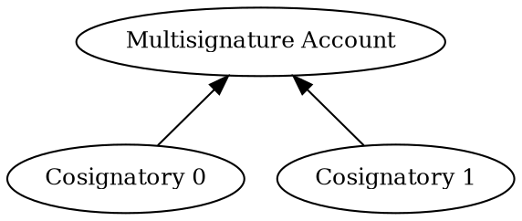

# Configuring a Multisignature Account

A <multisignature account:>, also called _multisig_, cannot initiate transactions on its own.
Instead, it relies on _cosignatory_ accounts to create transactions and sign them on its behalf.

This tutorial shows how to convert a regular account into a multisig account that requires approval from one of two
cosignatories.
If the account is already multisig, the tutorial instead demonstrates how to remove the cosignatories and revert the
account to a regular account.

The multisignature structure used in this tutorial is shown below:



## Prerequisites

Before you start, make sure to:

* Set up your development environment.
    See [Setting Up a Development Environment](../start/setup.md).
* Create 3 <accounts:>: one to turn into a multisig, and the other two to act as cosignatories.
    You can do this either [from code](./create-from-private-key.md) or
    [by using a wallet](../../userbook/wallet/create-account.md).
* Obtain <XEM:> for the account being converted into a multisig to pay for the transaction fees.
    See [Getting Testnet Funds from the Faucet](./testnet-faucet.md).

Additionally, review the [Transfer XEM](../transactions/transfer-xem.md) tutorial to understand how transactions are
announced and confirmed.

## Full Code



{{ tutorial.code_full_tagged('devbook/accounts/configure_multisig', ['py', 'js']) }}

## Code Explanation

The code defines two helper functions, for announcing a transaction and waiting for its confirmation.
For details on how these work, see the [Transfer XEM](../transactions/transfer-xem.md) tutorial.
The remaining helper functions are described in the sections below.

The tutorial then proceeds to [set up the required keys](#setting-up-the-accounts),
[fetch the current network time](#fetching-network-time), and
[detect the current configuration](#determining-the-multisig-operation) of the multisig account.

Depending on whether the account is already configured as a multisig,
transactions are created to [enable](#enabling-the-multisig) or [disable](#disabling-the-multisig) it as appropriate.
Finally, the transactions are [announced and confirmed](#submitting-the-transactions).

### Setting Up the Accounts

{{ tutorial.code_snippet_tagged('step-1') }}

The tutorial requires three separate accounts.
Their <private keys:> can be provided through environment variables.
If not set, default values are used:

| Environment Variable       | Default value | Purpose                    |
|----------------------------|---------------|----------------------------|
| `MULTISIG_PRIVATE_KEY`     | `0000..0001`  | Multisig account           |
| `COSIGNATORY0_PRIVATE_KEY` | `0000..0002`  | First cosignatory account  |
| `COSIGNATORY1_PRIVATE_KEY` | `0000..0003`  | Second cosignatory account |

Each private key is a 64-character hexadecimal string.

The multisig account must hold enough funds to pay the transaction fees.
If the default values are used, this account may already be funded.

The snippet above derives and stores the <key pair:> and <address:> of each account for later use.

### Fetching Network Time

{{ tutorial.code_snippet_tagged('step-2') }}

Network time is fetched from <get:/time-sync/network-time>, and the transactions' `timestamp` and `deadline` fields
are derived from it, following the process described in the [Transfer XEM](../transactions/transfer-xem.md) tutorial.

### Determining the Multisig Operation

{{ tutorial.code_snippet_tagged('step-3') }}

This helper retrieves the list of current cosignatories for a given address using the <get:/account/get> endpoint.
If it returns an empty list, the account is not currently configured as a multisig account.

!!! warning "Check the existing multisig configuration"

    For simplicity, the tutorial assumes that if the list of cosignatories is _not_ empty, then the account is a
    multisig configured by the tutorial itself.

    If the configuration is not the expected one, for example, because the cosignatories are different,
    the removal transactions will be rejected.

    Applications should always check the current configuration before trying to modify it, including the full list of
    cosignatories and the minimum number of signatures required.

{{ tutorial.code_snippet_tagged('step-4') }}

The returned cosignatories determine whether the account is configured as a multisig account, and therefore whether to
create the transactions to enable or disable multisig.

The functions that build them and the delta values they use are described in the next two sections.

### Enabling the Multisig

{{ tutorial.code_snippet_tagged('step-5') }}

All changes to the multisig configuration of an account, including adding or removing cosignatories,
are performed using a <ser:MultisigAccountModificationTransactionV2>.

The transaction specifies:

* {{ tutorial.var('type') }}: Multisig configuration changes use the type
    <ser:MultisigAccountModificationTransactionV2>.

* {{ tutorial.var('signer_public_key') }}: <public key:> of the account whose multisig configuration will be modified.

* {{ tutorial.var('timestamp') }} and {{ tutorial.var('deadline') }}: The values computed in the network time step.

* {{ tutorial.var('min_approval_delta') }}: difference between the _desired value_ and the _current value_ of the
    number of cosignatures required to approve transactions from the multisig account.

    In this case, the account is initially a regular account, so the current number of required cosignatures is `0`.
    To convert it into a multisig account that requires one signature from one of its cosignatories,
    the delta is set to `1`.

    The delta value can be negative to _reduce_ the current value, as shown in the next section.

* {{ tutorial.var('modifications') }}: list of changes to the account's cosignatories.
    Each modification adds or removes one cosignatory, identified by its <public key:>.

    In this case, two `add_cosignatory` modifications add the cosignatories prepared during the
    [setup phase](#setting-up-the-accounts).

!!! note "Safety measures"

    The protocol includes safety mechanisms that help prevent locking an account into an invalid state.
    Transactions that would result in an invalid multisig configuration are rejected with an error.
    For example, when:

    * The number of cosignatories is lower than the number of required cosignatures
    * An account that is already a cosignatory is added
    * An account that is not a cosignatory is removed
    * More than one cosignatory is removed in a single transaction
    * A multisig account is added as a cosignatory

{{ tutorial.code_snippet_tagged('step-6') }}

The transaction fee is calculated with <dy:FeeCalculator.calculateTransactionFee> and attached to the transaction.
Multisig account modification transactions pay a fixed transaction fee of 0.5 XEM, as shown in the
[fee schedule](../../textbook/transactions.md#fee-schedule).

{{ tutorial.code_snippet_tagged('step-7') }}

Finally, the transaction is signed.
In this case, only the signature of the account being converted into a multisig is required.
The cosignatories do not sign the conversion transaction.

!!! info "From now on, cosignatories must initiate transactions"

    Once an account has multisig enabled, its own signature is no longer accepted.
    Any transaction sent from that account, such as a transfer or a further multisig modification,
    must instead be initiated and signed by its cosignatories, as shown in the next section.

### Disabling the Multisig

Disabling a multisig configuration requires removing all cosignatories.
The process is similar to enabling it, with two key differences:
cosignatories must be removed one by one, and the multisig account itself cannot sign the transactions.

{{ tutorial.code_snippet_tagged('step-8') }}

This helper builds a <ser:MultisigAccountModificationTransactionV2> that removes a cosignatory.
It takes the cosignatory to remove and the approval delta to apply as parameters.
{{ tutorial.var('signer_public_key') }} is set to the multisig account's public key because its configuration is being
modified.

As shown in [Determining the Multisig Operation](#determining-the-multisig-operation), the helper is called twice.

The first call removes {{ tutorial.var('cosignatory_key_pairs[1]') }} with an approval delta of `0`, because one
cosignatory still remains.

The second removes the remaining cosignatory with an approval delta of `-1`, reducing the approval requirement from `1`
back to `0`.

{{ tutorial.code_snippet_tagged('step-9') }}

Since a multisig account cannot sign transactions on its own, each modification is wrapped in a
<ser:MultisigTransactionV1>.

The inner modification transaction is converted with <dy:TransactionFactory.toNonVerifiableTransaction> so it can be
embedded in the wrapping multisig transaction.

{{ tutorial.code_snippet_tagged('step-10') }}

Both the inner transaction and the wrapper pay a transaction fee: 0.5 XEM for the modification and 0.15 XEM for the
multisig wrapper, as shown in the [fee schedule](../../textbook/transactions.md#fee-schedule).
Both fees are deducted from the multisig account.
Cosignatories never pay fees for the transactions they initiate on behalf of a multisig.

{{ tutorial.code_snippet_tagged('step-11') }}

Finally, the multisig transaction is signed by a cosignatory.
In this case, both multisig transactions are initiated by {{ tutorial.var('cosignatory_key_pairs[0]') }}, whose
signature alone is enough to approve them without additional cosignatures.

The cosignatories could also have been removed in the opposite order.
The only difference would be which cosignatory initiates and signs each transaction.

### Submitting the Transactions

{{ tutorial.code_snippet_tagged('step-12') }}

The final step is to announce the transactions and wait for their confirmation, as described in the
[Transfer XEM](../transactions/transfer-xem.md) tutorial.

When disabling the multisig, the two multisig transactions are announced sequentially.
The code waits for the first transaction to be confirmed before announcing the second one, because the second removal is
only valid once the first one has been processed.

## Output

The output shown below corresponds to two typical runs of the program.

=== ":material-plus-thick: Enabling the Multisig"

    ```text linenums="1" hl_lines="2-4 8 24 30 34"
    --8<-- 'devbook/accounts/configure_multisig_enable.log'
    ```

    Key points in the output:

    * **Lines 2-4**: Addresses and public keys of all involved accounts.
    * **Line 8** (`Response: No cosignatories`): No cosignatories are currently configured.
    * **Lines 24 and 30** (`cosignatory_public_key`): Public keys of the cosignatories that will be added.
    * **Line 34** (`"min_approval_delta": 1`): The number of required cosignatures will be increased by one.

=== ":material-minus-thick: Disabling the Multisig"

    ```text linenums="1" hl_lines="2-4 8 29-37 61-69"
    --8<-- 'devbook/accounts/configure_multisig_disable.log'
    ```

    Key points in the output:

    * **Lines 2-4**: Addresses and public keys of all involved accounts.
    * **Line 8** (`Response: [ ... ]`): Existing cosignatories have been detected.
    * **Lines 29-37** (First multisig transaction): The number of required cosignatures will remain unchanged and one
        existing cosignatory will be removed.
    * **Lines 61-69** (Second multisig transaction): The number of required cosignatures will be decreased by one and
        the last remaining cosignatory will be removed.

The transaction hashes shown in the output can be used to look up the transactions in the
[NEM testnet explorer](https://testnet.nem.fyi/).

## Conclusion

This tutorial showed how to:

| Step                                                                               | Related documentation                          |
|------------------------------------------------------------------------------------|------------------------------------------------|
| [Retrieve the current multisig configuration](#determining-the-multisig-operation) | <get:/account/get>                             |
| [Enable a multisig account](#enabling-the-multisig)                                | <ser:MultisigAccountModificationTransactionV2> |
| [Disable a multisig account](#disabling-the-multisig)                              | <ser:MultisigAccountModificationTransactionV2> |
| Wrap a modification in a multisig transaction                                      | <ser:MultisigTransactionV1>                    |
