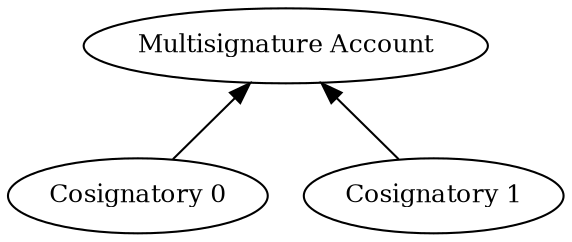

# Signing a Transaction from a Multisignature Account

This tutorial transfers 1 <XEM:> from an <account:> to itself, mirroring the
[Transfer XEM](../transactions/transfer-xem.md) tutorial.

However, in this case, the source account is a <multisignature account:>, also called _multisig_,
and therefore it cannot initiate or sign transactions on its own.
Instead, it relies on its cosignatory accounts to create transactions and sign them on its behalf.

The multisig account used in this tutorial is configured as a **2-of-2** multisig.
It has two cosignatories, and both signatures are required to approve a transaction.

**Cosignatory 0** initiates the transfer, and **Cosignatory 1** provides the second required cosignature:



## Prerequisites

Before you start, make sure to:

* Set up your development environment.
    See [Setting Up a Development Environment](../start/setup.md).

* Complete the [Configuring a Multisignature Account](../accounts/configure-multisig.md) tutorial.

    !!! note "Configure a 2-of-2 multisig"

        The multisig configured in that tutorial is a **1-of-2**, where a single cosignatory signature is enough.
        This tutorial instead requires the stricter **2-of-2** configuration described above.

        To create it, set `min_approval_delta` to `2` instead of `1` when
        [enabling the multisig](../accounts/configure-multisig.md#enabling-the-multisig).

Additionally, review the [Transfer XEM](../transactions/transfer-xem.md) tutorial to understand how transactions are
announced and confirmed.

## Full Code



{{ tutorial.code_full_tagged('devbook/transactions/sign_multisig', ['py', 'js']) }}

## Code Explanation

Signing a transaction on behalf of a multisig account involves wrapping it in a <ser:MultisigTransactionV1> and
collecting the required cosignatures.

In this tutorial, the wrapped transaction is a transfer, with the multisig account as its signer,
since this is the origin of the funds.
Cosignatory 0 signs and announces the wrapper, and the transaction remains pending until Cosignatory 1 provides the
second required cosignature.

The code defines two helper functions for announcing a transaction and waiting for its confirmation.
For details on how these work, see the [Transfer XEM](../transactions/transfer-xem.md) tutorial.

### Setting Up the Accounts

{{ tutorial.code_snippet_tagged('step-1') }}

The tutorial requires three separate accounts, configured through environment variables.
If not set, default values are used:

| Environment Variable       | Default value | Purpose                                      |
|----------------------------|---------------|----------------------------------------------|
| `MULTISIG_PUBLIC_KEY`      | `D656..ACF2`  | 2-of-2 multisig account                      |
| `COSIGNATORY0_PRIVATE_KEY` | `0000..0002`  | First cosignatory account, the **initiator** |
| `COSIGNATORY1_PRIVATE_KEY` | `0000..0003`  | Second cosignatory account                   |

Each key is a 64-character hexadecimal string.

Unlike a regular account, the multisig account cannot initiate transactions itself.
Instead, its cosignatories sign on its behalf.
Its <private key:> is therefore never needed, and its <public key:> is enough to identify the account.

The multisig account must hold enough funds to pay the transaction fees.
If the default values are used, this account may already be funded.

The snippet above derives and stores the <key pair:> of each cosignatory, and the multisig account's <address:>,
for later use.

In practice, each cosignatory would run its own part on a different machine, holding only its own private key.
This tutorial combines both roles in a single program for simplicity.

### Fetching Network Time

{{ tutorial.code_snippet_tagged('step-2') }}

Network time is fetched from <get:/time-sync/network-time>, and the transactions' `timestamp` and `deadline` fields
are derived from it, following the process described in the [Transfer XEM](../transactions/transfer-xem.md) tutorial.

### Building the Transaction

The transaction wrapped inside a multisig transaction is called the <inner transaction:>, and can be any
<basic transaction:>, such as the transfer used in this tutorial or the modifications used in
[Configuring a Multisignature Account](../accounts/configure-multisig.md).
Multisig transactions cannot be nested.

{{ tutorial.code_snippet_tagged('step-3') }}

The inner <transfer transaction:|transfer transaction> includes the following fields:

* {{ tutorial.var('signer_public_key') }}: <public key:> of the account whose funds are being transferred, that is,
    the multisignature account.

* {{ tutorial.var('recipient_address') }}: in this particular example, the funds are sent back to the sender, so the
    recipient is also the multisig account.

* {{ tutorial.var('amount') }}: 1'000'000 atomic units, corresponding to 1 <XEM:>,
    as explained in the [Transfer XEM](../transactions/transfer-xem.md) tutorial.

The inner transaction has its own transaction fee, calculated with <dy:FeeCalculator.calculateTransactionFee>.
For the 1 XEM sent here, the fee is 0.05 XEM, as shown in the
[transfer fee schedule](../../textbook/transfer_transactions.md#fees).

{{ tutorial.code_snippet_tagged('step-4') }}

The transfer transaction is then wrapped in a <ser:MultisigTransactionV1>. Its most relevant fields are:

* {{ tutorial.var('signer_public_key') }}: this time, it is the <public key:> of the cosignatory that initiates the
    transaction.

* {{ tutorial.var('inner_transaction') }}: the wrapped transfer transaction, converted with
    <dy:TransactionFactory.toNonVerifiableTransaction> so it can be embedded without a signature of its own.

The multisig wrapper also has its own transaction fee of 0.15 XEM, as shown in the
[fee schedule](../../textbook/transactions.md#fee-schedule).
All fees, and the transferred amount, are deducted from the multisig account once the transaction is confirmed.

### Initiator: Announcing the Multisig Transaction

{{ tutorial.code_snippet_tagged('step-5') }}

In this case, Cosignatory 0 is the initiator of the multisig transaction.
It signs the transaction and announces it to the network.

If valid, the network accepts the transaction, but it is not confirmed yet.
Since the multisig account requires two cosignatures and only one has been provided,
the transaction waits in the <unconfirmed pool:> until the missing cosignature arrives.

!!! note "Simpler configurations"

    In a multisig that requires only one cosignature, such as the 1-of-2 configuration created in the
    [Configuring a Multisignature Account](../accounts/configure-multisig.md) tutorial, the initiating
    cosignatory's signature is enough.
    If valid, the transaction is confirmed without any further steps.

### Cosignatory: Retrieving the Pending Transaction

{{ tutorial.code_snippet_tagged('step-6') }}

At this point, Cosignatory 1 takes over.
Cosignatories can use the <get:/account/unconfirmedTransactions> endpoint to discover pending multisig transactions
awaiting their signature.

The metadata of each pending multisig transaction contains the hash of its **inner transaction**, which is the value
that a cosignature must reference.

A cosignatory can have multiple pending multisig transactions awaiting approval.
In this example, the code selects the transaction issued by the multisig account.
This is sufficient for the tutorial because only one pending transaction is expected from that account.

In real applications, however, this filter is not enough if the multisig account has multiple pending transactions.
Instead, inspect the content of each pending transaction, such as its type, recipient, and amount, before selecting the
one to cosign.

!!! warning "Verify before cosigning"

    Always verify the contents of a transaction before cosigning it.
    Cosignatures are binding and cannot be undone.

### Cosignatory: Cosigning the Transaction

{{ tutorial.code_snippet_tagged('step-7') }}

Cosignatory 1 provides the missing signature by announcing a <ser:CosignatureV1>.
The cosignature specifies:

* {{ tutorial.var('signer_public_key') }}: <public key:> of the cosignatory providing the signature.

* {{ tutorial.var('other_transaction_hash') }}: hash of the inner transfer transaction retrieved in the previous step.

* {{ tutorial.var('multisig_account_address') }}: <address:> of the multisig account the signature refers to.

The cosignature has a 0.15 XEM fee.
The fee is also deducted from the multisig account once the multisig transaction is confirmed.

{{ tutorial.code_snippet_tagged('step-8') }}

Cosignatory 1 then signs the cosignature and announces it to the network.

The announced cosignature does not appear in the <unconfirmed pool:> as a separate transaction.
Instead, the network attaches it to the pending multisig transaction.

In configurations that require additional cosignatures, the transaction remains pending.
The collected signatures can be inspected in the transaction's `signatures` field by querying
<get:/account/unconfirmedTransactions> again.

In this tutorial, however, the second cosignature completes the transaction, which leaves the pool and is confirmed
in the next block.

### Waiting for Confirmation

{{ tutorial.code_snippet_tagged('step-9') }}

Once all required cosignatures have been collected, the multisig transaction is confirmed as a single unit.

Multisig transactions are rejected if they violate protocol constraints.
The following table summarizes the most common error sources:

| Error message                                  | Probable cause                                                                                                |
|------------------------------------------------|---------------------------------------------------------------------------------------------------------------|
| `FAILURE_TRANSACTION_NOT_ALLOWED_FOR_MULTISIG` | The multisig account tried to announce the transfer itself.                                                   |
| `FAILURE_MULTISIG_NOT_A_COSIGNER`              | The signer of the multisig transaction is not in the cosignatories list.                                      |
| `FAILURE_MULTISIG_NO_MATCHING_MULTISIG`        | The cosignature does not match a pending multisig transaction, or its signer is not a cosignatory.            |
| `FAILURE_SIGNATURE_NOT_VERIFIABLE`             | The signature attached to a transaction does not match its {{ tutorial.var('signer_public_key') }}.           |

## Output

The output shown below corresponds to a typical run of the program.

```text linenums="1" hl_lines="2-4 13 22 35 42 46 51"
--8<-- 'devbook/transactions/sign_multisig.log'
```

Key points in the output:

* **Lines 2-4**: Public keys of all involved accounts.
* **Line 13** (`signer_public_key`): Signer of the multisig transaction.
    Note that it matches Cosignatory 0.
* **Line 22** (`signer_public_key`): Signer of the inner transfer transaction.
    Note that it matches the multisig account.
* **Line 35** (`Inner transaction hash`): Hash of the pending inner transaction, retrieved from the network.
* **Line 42** (`signer_public_key`): Signer of the cosignature.
    Note that it matches Cosignatory 1.
* **Line 46** (`other_transaction_hash`): The inner transaction hash referenced by the cosignature.
* **Line 51**: Hash of the multisig transaction, which uniquely identifies it on the network.

The multisig transaction hash shown in the output can be used to look up the confirmed transaction in the
[NEM testnet explorer](https://testnet.nem.fyi/).

## Conclusion

This tutorial is functionally identical to the [Transfer XEM](../transactions/transfer-xem.md) tutorial,
but using a <multisignature account:> as the source account.

In particular, the tutorial showed how to:

| Step                                                                             | Related documentation                                                           |
|----------------------------------------------------------------------------------|---------------------------------------------------------------------------------|
| [Wrap transfer in a multisig transaction](#building-the-transaction)             | <ser:MultisigTransactionV1>, <dy:TransactionFactory.toNonVerifiableTransaction> |
| [Sign the multisig transaction](#initiator-announcing-the-multisig-transaction)  | <dy:NemFacade.signTransaction>                                                  |
| [Discover pending transactions](#cosignatory-retrieving-the-pending-transaction) | <get:/account/unconfirmedTransactions>                                          |
| [Cosign a pending multisig transaction](#cosignatory-cosigning-the-transaction)  | <ser:CosignatureV1>                                                             |
