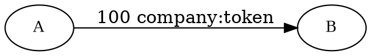

# Sending Mosaics with a Transfer Transaction

A <transfer transaction:|transfer transaction> can carry other <mosaics:> instead of, or alongside, <XEM:>.

This tutorial shows how to send a mosaic, focusing on the parts that differ from a plain
[XEM Transfer](./transfer-xem.md).



The example sends 100 units of a `company:token` mosaic that exists on testnet, using the default test account that
already owns some.
The same flow works for any other mosaic, as long as the signing account owns enough of it.

## Prerequisites

Before you start, make sure to:

* Set up your development environment.
    See [Setting Up a Development Environment](../start/setup.md).
* Create an <account:> to send the transfer transaction, either
    [from code](../accounts/create-from-private-key.md) or
    [by using a wallet](../../userbook/wallet/create-account.md).
* Obtain <XEM:> to pay for the transaction fee and transfer amount.
    See [Getting Testnet Funds from the Faucet](../accounts/testnet-faucet.md).
* Own enough of the <mosaic:> you want to transfer.

## Full Code



{{ tutorial.code_full_tagged('devbook/transactions/transfer_mosaics', ['py', 'js']) }}

## Code Explanation

Signing, announcing, and waiting for confirmation work the same as in [Transfer XEM](./transfer-xem.md) and are not
repeated here.
Only the steps that differ are explained below.

### Setting Up the Accounts

{{ tutorial.code_snippet_tagged('step-1') }}

Every mosaic transfer involves two accounts: a **sender** and a **recipient**.

The **sender** is the <account:> that signs the transaction, pays the fee, and holds the mosaic being sent.
Its private key is loaded from the `SIGNER_PRIVATE_KEY` environment variable.
If not provided, a test key is used as default.

The **recipient** is the account that receives the mosaic.
Its <address:> is loaded from the `RECIPIENT_ADDRESS` environment variable.
If not provided, a test address is used as default.

The default test account is pre-funded with `company:token`, though its balance is shared across tutorial runs and can
be exhausted.
If your transfer fails with insufficient balance, set `SIGNER_PRIVATE_KEY` to an account that holds the mosaic.

### Setting Up the Mosaic

{{ tutorial.code_snippet_tagged('step-2') }}

The mosaic to send is identified by `MOSAIC_ID`, its
[fully qualified name](../../textbook/mosaics.md#fully-qualified-name) in `<namespace>:<mosaic name>` form,
defaulting to `company:token`.
Setting it lets you point the tutorial at any other mosaic the signing account owns.

`QUANTITY` is how much of the mosaic to transfer, in whole units, defaulting to 100.

### Fetching Network Time

{{ tutorial.code_snippet_tagged('step-3') }}

Every NEM transaction needs a `timestamp` (when it was created) and a `deadline` (how long the network keeps
trying to confirm it), both in <network time:>.

The snippet fetches the current network time from <get:/time-sync/network-time>, sets `timestamp` to it, and
sets `deadline` two hours later, well within the 24-hour limit.

The endpoint returns the time in milliseconds, so the code divides by 1000 to obtain the seconds that transactions
expect.

See [Fetching Network Time](./transfer-xem.md#fetching-network-time) in Transfer XEM for more detail, including
caching strategies.

### Fetching the Mosaic Definition and Supply

{{ tutorial.code_snippet_tagged('step-4') }}

The mosaic's <divisibility:> is used to convert the transfer quantity to atomic units, and together with the
current supply it determines the fee.
Both are fetched from the node before building the transaction.

* The <get:/namespace/mosaic/definition/page> endpoint returns the mosaic definitions registered under a namespace.
    Each entry contains the mosaic's properties, including `divisibility`.
* The <get:/mosaic/supply> endpoint returns the current total supply.

### Calculating the Transaction Fee

{{ tutorial.code_snippet_tagged('step-5') }}

The snippet first converts `QUANTITY` from whole units to atomic units using the divisibility fetched in the
previous step.

!!! note "Whole to atomic units"

    A mosaic's `divisibility`, set at creation and ranging from 0 to 6, defines the conversion:
    1 whole unit equals `10^divisibility` atomic units.

    The `company:token` mosaic used here has divisibility 0, so `10^0 = 1` and `QUANTITY=100` is encoded as `100`
    atomic units.

    A mosaic with divisibility 2, by contrast, would have `10^2 = 100` atomic units per whole unit, so the same
    `QUANTITY=100` would be encoded as `10_000` atomic units.

The snippet then calculates the fee locally, since NEM's fee schedule is fixed.
For mosaics, the fee depends on each mosaic's supply, divisibility, and the quantity transferred.
See [Transfer Fees](../../textbook/transfer_transactions.md#fees) for the full rules.

The snippet handles both cases:

* For **tiny, indivisible mosaics** (supply ≤ 10'000 and divisibility 0), it sets `fee = 50_000` atomic units
    (0.05 XEM).
* For **all other mosaics**, it computes `xem_equivalent`, derives `steps` (the number of 0.05-XEM increments
    to charge, between 1 and 25), and subtracts `supply_adjustment`.
    The fee is never less than 0.05 XEM.

With the default `company:token` mosaic (supply 1'000'000, divisibility 0) and `QUANTITY=100`, the fee comes
to 0.35 XEM: the 1.25 XEM base fee at the top of the schedule minus a 0.90 XEM supply discount.

### Building the Transaction

{{ tutorial.code_snippet_tagged('step-6') }}

The snippet calls <dy:TransactionFactory.create> with a <ser:TransferTransactionV2> descriptor that has an extra
`mosaics` field, which accepts up to 10 entries.
Each entry identifies a mosaic and how much of it to send:

* The <namespace:> that owns the mosaic, as a byte string.
* The mosaic's name, also as a byte string.
* The quantity, given in the mosaic's **atomic units** (calculated in the previous step).

When mosaics are attached, the top-level `amount` is no longer the XEM amount.
It becomes a multiplier applied to every listed mosaic, where `1_000_000` represents a factor of one.
Setting `amount` to `1_000_000` sends each mosaic at the quantity given in its entry.

!!! info "Sending XEM alongside other mosaics"

    To send XEM at the same time as another mosaic, add a `nem:xem` entry to the `mosaics` array.
    Its quantity is the amount of XEM to send, in atomic units, and the top-level `amount` still acts as the
    multiplier applied to every entry.

### Signing, Announcing, and Waiting for Confirmation

These steps work the same as in [Transfer XEM](./transfer-xem.md) and are not detailed here.

!!! warning "Mosaics with a levy"

    Some mosaics carry a [levy](../../textbook/mosaics.md#levy): an additional fee paid to a third-party
    account on every transfer of that mosaic, on top of the transaction fee.
    The sender's account must hold enough of the levy mosaic (which may differ from the mosaic being transferred)
    to cover it, or the transaction is rejected.

## Output

The output shown below corresponds to a typical run of the program.

```text
--8<-- 'devbook/transactions/transfer_mosaics.log'
```

To see the transaction from the network's perspective, you can search for the transaction hash on a [NEM testnet
explorer](https://testnet.nem.fyi/).
The hash is printed in the line that says `Waiting for confirmation from /transaction/get?hash=...`.

## Conclusion

This tutorial showed how to:

| Step                                                                        | Related documentation                                              |
| --------------------------------------------------------------------------- | ------------------------------------------------------------------ |
| [Fetch a mosaic's divisibility](#fetching-the-mosaic-definition-and-supply) | <get:/namespace/mosaic/definition/page>                            |
| [Fetch a mosaic's supply](#fetching-the-mosaic-definition-and-supply)       | <get:/mosaic/supply>                                               |
| [Build a mosaic transfer](#building-the-transaction)                        | <dy:TransactionFactory.create>                                     |
