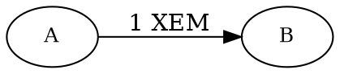

# Sending XEM with a Transfer Transaction

Sending <XEM:> from one <account:> to another is the most basic action on the NEM blockchain, and every other type of
<transaction:> follows the same general pattern.



This tutorial shows how to create, sign, and announce a <transfer transaction:> that sends 1 XEM between two accounts,
and then poll the transaction's status until it is confirmed.

## Prerequisites

Before you start, make sure to:

* Set up your development environment.
    See [Setting Up a Development Environment](../start/setup.md).
* Create an <account:> to send the transfer transaction, either
    [from code](../accounts/create-from-private-key.md) or
    [by using a wallet](../../userbook/wallet/create-account.md).
* Obtain <XEM:> to pay for the transaction fee and transfer amount.
    See [Getting Testnet Funds from the Faucet](../accounts/testnet-faucet.md).

## Full Code



{{ tutorial.code_full_tagged('devbook/transactions/transfer_xem', ['py', 'js']) }}

The whole code is wrapped in a single `try` block to provide simple error handling,
but applications will probably want to use more fine-grained control.

## Code Explanation

### Setting Up the Accounts

{{ tutorial.code_snippet_tagged('step-1') }}

Every transfer transaction involves two accounts: a **sender** and a **recipient**.

The **sender** is the <account:> that signs the transaction and pays the fee.
Its private key is loaded from the `SIGNER_PRIVATE_KEY` environment variable.
If not provided, a test key is used as default.

The **recipient** is the account that receives the XEM.
Its <address:> is loaded from the `RECIPIENT_ADDRESS` environment variable.
If not provided, a test address is used as default.

### Defining the Transfer Amount

{{ tutorial.code_snippet_tagged('step-2') }}

The snippet defines the transfer amount in the `xem` variable, loaded as a number from the `XEM_AMOUNT`
environment variable.
If not provided, a default of 1 XEM is used.

The transaction's `amount` field requires atomic units, not whole XEM.
XEM has a <divisibility:> of 6, so one XEM equals one million atomic units.
The snippet derives `amount` by multiplying `xem` by 1'000'000.

### Fetching Network Time

{{ tutorial.code_snippet_tagged('step-3') }}

Every NEM transaction contains two time fields, both expressed in <network time:>,
the number of seconds since the NEM nemesis block:

* `timestamp`: The moment the transaction is created, set here to the current network time.
* `deadline`: How long the network keeps trying to confirm the transaction before discarding it.
    It must be after the timestamp and no more than 24 hours later.
    Otherwise, the node rejects the transaction.
    This example sets it two hours after the timestamp, well within the limit.

Building a transfer therefore needs an accurate network time.

The <get:/time-sync/network-time> endpoint reports the node's current network time.
The node returns this value in milliseconds, so the code divides it by 1000 to obtain the seconds that transactions
expect.

However, applications do not need to query the network time before every transaction.
It can be fetched once and then adjusted using the local system clock when needed.
This provides a good balance between accuracy and performance.

### Calculating the Transaction Fee

{{ tutorial.code_snippet_tagged('step-4') }}

Every transaction pays a fee to the <harvester account:> that includes it in a block.

NEM uses a fixed fee schedule, so the snippet calculates the fee locally without contacting a node.
For a XEM-only transfer, the fee starts at 0.05 XEM for small amounts and grows with the XEM sent, up to a cap of
1.25 XEM.
See [Fees](../../textbook/transfer_transactions.md#fees) for the full rules, including the mosaic and message costs.

The snippet implements this schedule:

* `fee_steps` is the number of full 10'000-XEM increments in `xem`, clamped between 1 and 25.
* `fee` is `fee_steps` multiplied by 50'000 atomic units, the value of one increment (0.05 XEM).

With the default 1 XEM, the fee falls in the first increment (0.05 XEM).

### Building the Transaction

{{ tutorial.code_snippet_tagged('step-5') }}

The snippet calls <dy:TransactionFactory.create> with a descriptor that supplies every required property of
the transfer transaction:

* `type`: This tutorial uses <ser:TransferTransactionV2>, the current transfer version, which can carry both XEM and
    other <mosaics:>.
    No mosaics are attached here, so the transaction sends XEM only.

* `signer_public_key`: The signer is the account that will pay the fee.
    In a transfer transaction, it is also the source of the transferred XEM.

* `fee`: The value calculated in the previous step. For 1 XEM, this is `50_000` atomic units (0.05 XEM).

* `timestamp` and `deadline`: The values computed in the network time step.

* `recipient_address`: The address that will receive the XEM.

* `amount`: The atomic-unit value computed earlier. For 1 XEM, this is `1_000_000`.

!!! info "Sending a mosaic or a message"

    A <ser:TransferTransactionV2> can also carry other <mosaics:> instead of XEM, or include a message, with the fee
    calculated differently in each case.
    See the [Transfer Mosaics](./transfer-mosaics.md) and [Transfer with a Message](./messages.md) tutorials.

### Signing and Serializing

{{ tutorial.code_snippet_tagged('step-6') }}

Once the transaction is created, it must be signed with the signing account's private key.
Signing ensures the transaction is authentic and authorized by the sender.

<dy:NemFacade.signTransaction> returns a <signature:> encoded as a hexadecimal string.

<dy:TransactionFactory.attachSignature> adds the signature to the transaction and serializes it into a JSON payload
ready to be submitted directly to a node for announcement.

### Announcing the Transaction

{{ tutorial.code_snippet_tagged('step-7') }}

The signed payload is submitted to the <post:/transaction/announce> endpoint of any NEM <node:>.

The node validates the transaction as soon as it is announced and reports the outcome in the response.
A result of `SUCCESS` means the transaction passed this first check and was added to the <unconfirmed pool:>.
Any other result means the node did not accept it, and the response message explains why, for example that the
account does not hold enough XEM to cover the amount and the fee.

!!! warning "Do not rely on unconfirmed transactions"

    A `SUCCESS` result only means the transaction reached the unconfirmed pool.
    It is not yet guaranteed to be included in a block.
    Wait until it is [confirmed](#waiting-for-confirmation), and ideally past the <rewrite limit:>, before relying
    on it.

### Waiting for Confirmation

{{ tutorial.code_snippet_tagged('step-8') }}

The snippet above repeatedly queries the <get:/transaction/get> endpoint using the hash of the announced transaction.

!!! note "Polling vs WebSockets"

    This step uses polling to check whether the transaction has been confirmed.
    Polling is used here for illustration purposes, but it is not the recommended approach for real applications.

    [WebSockets](../websockets/listen-transaction-flow.md) provide a more responsive solution without the overhead of
    repeated API calls.

While the transaction is still unconfirmed, the endpoint responds with an error, and the code waits one second
before retrying, for up to 120 attempts (about two minutes).

Once the transaction is included in a block, the endpoint returns it together with the block height, and the loop
ends.

NEM produces a block roughly once per minute, so confirmation usually takes from a few seconds to a couple of minutes.

## Output

The output shown below corresponds to a typical run of the program.

```text
--8<-- 'devbook/transactions/transfer_xem.log'
```

The number of `pending` checks depends on how soon the next block is harvested, so it varies between runs.

To see the transaction from the network's perspective, you can search for the transaction hash on a [NEM testnet
explorer](https://testnet.nem.fyi/).
The hash is printed in the line that says `Waiting for confirmation from /transaction/get?hash=...`.

## Conclusion

This tutorial showed how to:

| Step                                                        | Related documentation                                                                                               |
| ----------------------------------------------------------- | --------------------------------------------------------------------------------------------------------------------|
| [Obtain the network time](#fetching-network-time)           | <get:/time-sync/network-time>                                                                                       |
| [Build the transaction](#building-the-transaction)          | <dy:TransactionFactory.create>                                                                                      |
| [Sign the transaction](#signing-and-serializing)            | <dy:NemFacade.signTransaction><br/><dy:TransactionFactory.attachSignature>                                          |
| [Announce the transaction](#announcing-the-transaction)     | <post:/transaction/announce>                                                                                        |
| [Wait for confirmation](#waiting-for-confirmation)          | <get:/transaction/get>                                                                                              |

Most other NEM transaction types are created, signed, and announced in the same way.
