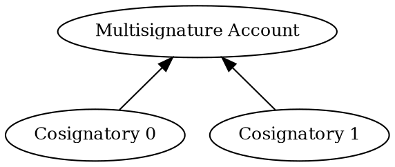

# Listening to Multisig Transaction Flow

A transaction from a <multisignature account:> follows a richer lifecycle than a regular transaction.
After being announced, it waits in the <unconfirmed pool:> while the network collects the required cosignatures from
the account's cosignatories.
Only after all cosignatures arrive is the transaction confirmed in a <block:>.

This tutorial recreates the transfer from the
[Signing a Transaction from a Multisignature Account](../transactions/sign-multisig.md) tutorial, but monitors the
full multisig lifecycle using [WebSocket](../reference/websockets/index.md) channels instead of polling.

The multisig account used in this tutorial is configured as a **2-of-2** multisig.
It has two cosignatories, and both signatures are required to approve a transaction:



Cosignatory 0 builds and announces the multisig transaction, while Cosignatory 1 subscribes to the multisig
account's WebSocket channels, cosigns, and waits for confirmation.

!!! note "Alternative: Polling"

    For a polling-based approach, where the cosignatory discovers the pending transaction by querying the node, see
    the [Signing a Transaction from a Multisignature Account](../transactions/sign-multisig.md) tutorial.

## Prerequisites

Before you start, make sure to:

* Set up your development environment.
  See [Setting Up a Development Environment](../start/setup.md).

* Complete the [Configuring a Multisignature Account](../accounts/configure-multisig.md) tutorial.

    !!! note "Configure a 2-of-2 multisig"

        The multisig configured in that tutorial is a **1-of-2**, where a single cosignatory signature is enough.
        This tutorial instead requires the stricter **2-of-2** configuration described above.

        To create it, set `min_approval_delta` to `2` instead of `1` when
        [enabling the multisig](../accounts/configure-multisig.md#enabling-the-multisig).

Additionally, NEM serves WebSockets using the [STOMP](https://stomp.github.io/) messaging protocol over
[SockJS](https://github.com/sockjs/sockjs-client), so a STOMP client and a WebSocket transport are required:

=== ":simple-python: Python"

    Install the `stomper` and `websockets` libraries:

    ```bash
    pip install stomper websockets
    ```

=== ":simple-javascript: JavaScript"

    Install the `@stomp/stompjs` and `sockjs-client` libraries:

    ```bash
    npm install @stomp/stompjs sockjs-client
    ```

See the [WebSocket reference](../reference/websockets/index.md) for details on the connection protocol.

## Full Code



{{ tutorial.code_full_tagged('devbook/websockets/listen_multisig_transaction_flow', ['py', 'js']) }}

The snippet uses the `NODE_URL` environment variable to set the NEM <node:>.
If no value is provided, a default one is used.

`WS_URL` defines the WebSocket endpoint for the same node.
It is derived from `NODE_URL` by replacing port `7890`, the default HTTP API port, with `7778`, the default NIS
WebSocket port.

!!! note "Python SockJS helpers"

    There is no SockJS client library for Python, so a few small helper methods are defined at the top of the file
    for convenience.

## Code Explanation

A multisig transaction involves two distinct roles: an **initiator** (Cosignatory 0) that builds, signs, and
announces the multisig transaction, and one or more **cosignatories** (Cosignatory 1 in this tutorial) that monitor
WebSocket channels and cosign after verifying the transaction.

In practice, each role runs as a separate program on a separate machine, holding only its own private key.
This tutorial combines both roles in a single script for simplicity.

### Setting Up the Accounts

{{ tutorial.code_snippet_tagged('step-1') }}

The tutorial requires three separate accounts, configured through environment variables.
If not set, default values are used:

| Environment Variable       | Default value | Purpose                                      |
|----------------------------|---------------|----------------------------------------------|
| `MULTISIG_PUBLIC_KEY`      | `D656..ACF2`  | 2-of-2 multisig account                      |
| `COSIGNATORY0_PRIVATE_KEY` | `0000..0002`  | First cosignatory account, the **initiator** |
| `COSIGNATORY1_PRIVATE_KEY` | `0000..0003`  | Second cosignatory account                   |

Each key is a 64-character hexadecimal string.

Unlike a regular account, the multisig account cannot initiate transactions itself.
Instead, its cosignatories sign on its behalf.
Its <private key:> is therefore never needed, and its <public key:> is enough to identify the account.

The multisig account must hold enough funds to pay the transaction fees.
If the default values are used, this account may already be funded.

The snippet above derives and stores the <key pair:> of each cosignatory, and the multisig account's <address:>,
for later use.
The WebSocket channels subscribed later are scoped to this address.

### Initiator: Building the Multisig Transaction

{{ tutorial.code_snippet_tagged('step-2') }}

Cosignatory 0 fetches the network time, builds an <inner transaction:|inner> transfer of 1 <XEM:> from the multisig
account to itself, wraps it in a <ser:MultisigTransactionV1>, and signs it.
The implementation follows the same pattern described in the
[Signing a Transaction from a Multisignature Account](../transactions/sign-multisig.md#building-the-transaction)
tutorial.

The transaction is prepared, but it is not [announced](#initiator-announcing-the-multisig-transaction) yet.
The announcement happens after the channel subscriptions are established, ensuring that the resulting notifications are
not missed.

### Cosignatory: Connecting to the WebSocket

{{ tutorial.code_snippet_tagged('step-3') }}

Cosignatory 1 opens a SockJS connection to the `/w/messages` endpoint on `WS_URL` and starts a <STOMP session:>
over it.

### Cosignatory: Subscribing to the Channels

{{ tutorial.code_snippet_tagged('step-4') }}

Cosignatory 1 subscribes to the same three address-scoped channels used in the
[Listening to Transaction Flow](./listen-transaction-flow.md) tutorial:

* <ws:account&#47;{address}>: Notifies of the account's current state when a <block:> involving the account's address is
    confirmed.
* <ws:unconfirmed&#47;{address}>: Notifies of a transaction involving the account's address when it enters the
    <unconfirmed pool:>, waiting to be included in a block.
* <ws:transactions&#47;{address}>: Notifies of a transaction involving the account's address when it is included in a
    <block:>.

The subscriptions use the IDs `id-0`, `id-1` and `id-2`, which identify them when the code unsubscribes at the end.

The difference is the address that each channel is scoped to.
For a pending multisig transaction, the node sends notifications to the initiating cosignatory and to the accounts
involved in the inner transaction.

In this example, the notified accounts are Cosignatory 0, as the initiator, and the multisig account, which is
both the sender and the recipient of the inner transfer.
Other cosignatories, such as Cosignatory 1, do not receive notifications.

As a result, a cosignatory that is waiting to approve transactions must subscribe to the **multisig account's address**,
not the cosignatory's own address.

!!! note "Message handling differences"

    In JavaScript, each channel is subscribed with a dedicated handler function, defined in the
    [cosigning](#cosignatory-cosigning-the-pending-transaction) and
    [confirmation](#cosignatory-waiting-for-confirmation) steps below.
    In Python, messages are instead read sequentially from the connection as they arrive.

All three channels stay silent until the address is registered, which the next step performs.

### Cosignatory: Registering the Multisig Account

{{ tutorial.code_snippet_tagged('step-5') }}

To receive notifications on an account's channels, the address must first be **registered** with the node.

The code sends a request to <req:w&#47;api&#47;account&#47;get>, which registers the multisig address and also forces
the node to send the account's current state on the <ws:account&#47;{address}> channel.

The code waits for this first account notification, which confirms that the registration is active.
The notification follows the [AccountMetaDataPair](../reference/rest/nem.md#model/AccountMetaDataPair) schema.

### Initiator: Announcing the Multisig Transaction

{{ tutorial.code_snippet_tagged('step-6') }}

!!! warning "Announce after subscribing to channels"

    Always announce the transaction **after** subscribing to the WebSocket channels to ensure the listener is ready.
    Otherwise, notifications could arrive before the WebSocket is listening.

    A cosignatory that misses the notification, for example by subscribing only after the announcement, can still
    discover the pending transaction by polling <get:/account/unconfirmedTransactions>.

Once Cosignatory 1 is subscribed, Cosignatory 0 announces the multisig transaction to the <post:/transaction/announce>
endpoint and checks the result.
If the node rejects it, the code prints the rejection reason and stops.

If valid, the network accepts the transaction, but it is not confirmed yet.
Since the multisig account requires two cosignatures and only one has been provided, the transaction waits in the
<unconfirmed pool:> until the missing cosignature arrives.

### Cosignatory: Cosigning the Pending Transaction

{{ tutorial.code_snippet_tagged('step-7') }}

The pending multisig transaction arrives on the <ws:unconfirmed&#47;{address}> channel as a
[TransactionMetaDataPair](../reference/rest/nem.md#model/TransactionMetaDataPair).
For multisig transactions, the `meta` field contains an additional `innerHash` field, holding the hash of the
**inner transaction**, which is the value that a cosignature must reference.

A cosignatory can have multiple pending multisig transactions awaiting approval.
In this example, the code selects the transaction issued by the multisig account.
This is sufficient for the tutorial because only one pending transaction is expected from that account.

In real applications, however, this filter is not enough if the multisig account has multiple pending transactions.
Instead, inspect the content of each pending transaction, such as its type, recipient, and amount, before selecting the
one to cosign.

!!! warning "Verify before cosigning"

    Always verify the contents of a transaction before cosigning it.
    Cosignatures are binding and cannot be undone.
    The full multisig transaction is available in the notification's `transaction` field for inspection.

{{ tutorial.code_snippet_tagged('step-8') }}

The code then builds a <ser:CosignatureV1> referencing the inner transaction hash and the multisig account
address, signs it with Cosignatory 1's key, and announces it using the <post:/transaction/announce> endpoint.

### Cosignatory: Waiting for Confirmation

{{ tutorial.code_snippet_tagged('step-9') }}

The announced cosignature does not appear in the <unconfirmed pool:> as a separate transaction, so it does not trigger
a notification of its own.
Instead, the network attaches it to the pending multisig transaction, which triggers a new notification on the
<ws:unconfirmed&#47;{address}> channel.
Since this update only reflects the addition of a cosignature, the code ignores it.

If the multisig transaction requires additional cosignatures, it remains in the unconfirmed pool until all required cosignatures have been collected.
In this tutorial, the second cosignature satisfies the multisig requirements, so the transaction leaves the unconfirmed
pool and, if valid, is confirmed in the next block.

The confirmation is notified on the <ws:transactions&#47;{address}> channel.
Since both the sender and the recipient of the inner transfer are the multisig account, this notification is delivered
twice, once for each role.
The code prints both notifications, but reports the confirmation only once.

The block that includes the transaction also triggers a final notification on the <ws:account&#47;{address}>
channel with the account's updated state.
Once this final notification arrives, the program moves on to the cleanup step.

### Cosignatory: Unsubscribing from Channels

{{ tutorial.code_snippet_tagged('step-10') }}

After confirmation, Cosignatory 1 unsubscribes from the three channels and ends the STOMP session before the connection
closes.

## Output

```text linenums="1" hl_lines="2-4 5 6 7-9 11 12 14 16 18 19"
--8<-- 'devbook/websockets/listen_multisig_transaction_flow.log'
```

The output shows:

* **Accounts** (lines 2-4): The multisig account address and the public keys of both cosignatories.
* **Build** (line 5): Cosignatory 0 builds and signs the multisig transaction.
* **Connection** (line 6): The STOMP session is established over the node's WebSocket endpoint at port `7778`.
* **Subscriptions** (lines 7-9): The three channels, all scoped to the multisig account's address, are subscribed.
* **Registration** (lines 11): The multisig account's current state arrives on the account channel, confirming
    the registration.
* **Announcement** (line 12): Cosignatory 0 announces the multisig transaction.
* **Cosigning** (lines 13-14): The pending multisig transaction arrives on the unconfirmed channel with its inner
    transaction hash, and Cosignatory 1 announces the cosignature.
* **Confirmation** (lines 15-17): The completed transaction is confirmed in a block.
    The notification arrives twice because the inner transfer's sender and recipient are both the multisig account.
* **Account update** (line 18): The block containing the transaction triggers a final account notification.
    The balance is reduced by the 0.35 XEM in [fees](../../textbook/transactions.md#fee-schedule), since the
    transferred 1 XEM returns to the sender.
* **Unsubscribe** (line 19): The code unsubscribes from the three channels.

## Conclusion

This tutorial showed how to:

| Step                                                                                          | Related documentation                                                              |
|-----------------------------------------------------------------------------------------------|------------------------------------------------------------------------------------|
| [Subscribe to the multisig account's channels](#cosignatory-subscribing-to-the-channels)      | <ws:unconfirmed&#47;{address}><br/><ws:transactions&#47;{address}>                 |
| [Register the multisig account](#cosignatory-registering-the-multisig-account)                | <req:w&#47;api&#47;account&#47;get>                                                |
| [Handle pending multisig messages](#cosignatory-cosigning-the-pending-transaction)            | [TransactionMetaDataPair](../reference/rest/nem.md#model/TransactionMetaDataPair)  |
| [Cosign on an unconfirmed notification](#cosignatory-cosigning-the-pending-transaction)       | <ser:CosignatureV1>                                                                |
