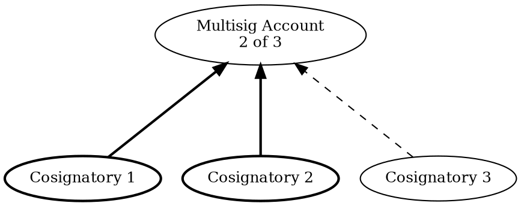

# Accounts

Account
:   A secure place where digital assets like cryptocurrencies or <NFTs:> can be stored.
    It functions similarly to a safe deposit box in traditional banking.

In the case of blockchain, accounts are secured by a <key pair:>: assets can only be **transferred out** of an account
by using its private key, but the public key can be shared freely in order to **receive** assets.

Public keys are commonly shared as an <address:> for convenience, so the terms "account" and "address" are used as
synonyms.

Besides managing digital assets, accounts also represent the ownership of a private key, and act as a form of digital
identity.
On a blockchain, accounts can authorize transactions, configure permissions, and participate in <consensus:> mechanisms.

!!! note "Account Lifecycle"

    Accounts become active the first time they interact with the blockchain, for example, by receiving assets.
    Prior to activation, no information about them is recorded on-chain and they do not appear in block explorers.

    Once activated, an account can be emptied of assets, but it cannot be deleted from the blockchain.

## Mnemonics

Mnemonic Phrase
:   A human-readable representation of a <private key:>, typically shown as a list of 12 or 24 random words.

It is also called just mnemonic, and often used when creating or restoring accounts in <HD Wallets:>.

NEM uses the [BIP-39](https://github.com/bitcoin/bips/blob/master/bip-0039.mediawiki) standard that requires
24 English words.

!!! warning "Treat mnemonics as if they were private keys"

    Access to a mnemonic phrase provides full access to all accounts generated from it.
    Never share it, and avoid storing it unencrypted in digital form.

## Wallets

Wallet
:   An application used to manage NEM accounts, initiate <transactions:> and sign them.

It stores <private keys:> or <mnemonic phrases:>, and uses them to sign transactions.
More broadly, wallets provide tools for exploring and interacting with the blockchain.

Wallets can be:

* :material-application-outline: **Software wallets**

    Applications installed on desktop or mobile devices.

    These typically offer the full range of functionality, at an increased security risk:
    the software wallet must be online in order to interact with the blockchain, exposing the stored private keys to
    potential compromise, even if protected by a password.

* :material-integrated-circuit-chip: **Hardware wallets**

    External physical devices that store keys offline.

    These are designed primarily for secure transaction signing and must be connected to a software wallet to operate.

    The private keys they contain never leave the device except when explicitly backed up, making hardware wallets
    significantly more secure.

Most wallets allow managing multiple accounts, QR code scanning (for signing and requesting transaction signatures),
and <multisignature account:|multisig> configuration.
Accounts can be also imported or exported using either <private keys:> or <mnemonic phrases:>.

## HD Wallets

HD Wallet
:   A Hierarchical Deterministic (HD) <wallet:> derives a series of <accounts:> from a single seed,
    which is more convenient than having to manage multiple <key pairs:>.

This greatly simplifies the management of multiple accounts, but extra caution must be taken to keep the seed safe
because compromising the seed compromises all the accounts derived from it.
The seed is typically a <mnemonic phrase:>.

Most wallets are HD wallets.

NEM uses the [BIP-32](https://github.com/bitcoin/bips/blob/master/bip-0032.mediawiki) standard to generate accounts from
the seed.

## Multisignature Accounts

Multisignature Account
:   An <account:> (called **multisig**) requiring signature from multiple parties (called **cosignatories**) to
    approve transactions.

Multisig accounts are configured by:

* Defining the list of cosignatories.
* Setting the **minimum number of cosignatories** (**M**) out of the total (**N**) required to authorize a transaction.
    This is known as an **M-of-N** multisig.
    Setting **M** equal to **N** (an **N-of-N** multisig) requires every cosignatory to sign.

For example, a **2-of-3** multisig has three cosignatories, any two of which must sign to authorize a transaction:

In the previous diagram, Cosignatories 1 and 2 sign, which meets the minimum of `M=2`, so the transaction is valid
without Cosignatory 3.

### Use Cases

* **Shared control over funds or functionality**.

    No action can be performed on the account without approval from the configured number of cosignatories.

    This also mitigates the risk of one of the accounts being compromised.

* **Multifactor authorization**.

    As a security measure, users can create a multisig so that they need to approve transactions from multiple devices.

* **Account ownership transfer**.

    Transferring private keys is not a viable mechanism to change ownership of an account,
    because the receiver can never be sure that the sender has deleted their copy of the keys.

    To solve this issue, the sender can configure the transferred account as a 1-of-1 multisig,
    and set the receiver account as the only cosignatory.

    The account can be transferred again by changing the single cosignatory as many times as needed.

### Constraints

Bear in mind the following when designing multisignature solutions:

* **Maximum number of cosignatories for an account**.

    A multisig account can have at most **32** cosignatories.

* **Removing cosignatories has special rules**.

    Removing a cosignatory does not require their own signature.
    For example, a removal in a **3-of-5** multisig needs at least 3 signatures from the 4 remaining cosignatories,
    but a removal in a **5-of-5** multisig needs all 4 remaining signatures.

    A single transaction can remove **at most one** cosignatory.
    Removing several requires separate transactions.

    The last remaining cosignatory can remove themselves, which dissolves the multisig.

* **No nested multisigs**.

    In NEM, a multisig account cannot itself be a cosignatory of another multisig, and a cosignatory account cannot
    be converted into a multisig.
    Multisig hierarchies are therefore **one layer deep**.

## Importance

Importance
:   A measure of an <account:>'s contribution to the network, based on its <vesting:|vested> balance and its outgoing
    transfers to other accounts.
    This score determines the account's chances of harvesting a <block:>.

Importance serves a role similar to hashrate in <PoW:> systems or stake in <PoS:> systems:
the higher the value, the greater the chance to harvest a block and earn rewards.

### Vesting

Vesting
:   The process by which an account's <XEM:> balance gradually matures from _unvested_ to _vested_.
    Only the vested portion counts toward the account's importance, so newly funded accounts do not
    start harvesting immediately.

When an account first receives XEM, the full amount is unvested.
Every 1440 blocks (about one day at the 60-second target), 10% of the unvested balance migrates to the vested portion.
The same step repeats each day, gradually moving more of the balance to vested.

For example:

* After day 1, 10% of the original balance is vested.
* After day 2, 19% is vested.
* After day 7, just over half is vested.
* The balance asymptotically approaches fully vested.

Larger holdings cross the 10'000 XEM vested threshold sooner.
An account holding 100'000 XEM, for instance, vests 10'000 XEM at its first vesting cycle (after about one day)
and becomes harvesting-eligible at that point.

??? info "Importance Calculation"

    All accounts that have at least 10'000 XEM in vested balance are eligible to harvest and participate in the
    importance calculation.

    The importance score for an eligible account combines:

    * Its **vested balance**.
    * A **[PageRank](https://en.wikipedia.org/wiki/PageRank)-like score** computed over the graph of outgoing transfer
        transactions.

        Only transfers that meet both of the following are considered:

        * The transfer occurred within the last 43200 blocks (about 30 days).
        * The recipient is itself eligible (has at least 10'000 vested XEM).

        Each qualifying transfer contributes its amount, with older transfers counting for less (10% less per day).
        If two accounts sent XEM to each other, only the difference counts.
        That difference must be at least 1'000 XEM to contribute to the score.

    The full algorithm is the _Proof-of-Importance_ (PoI) scheme described in the
    [NEM Technical Reference](site:/assets/pdfs/NEM_techRef.pdf), section 7.

!!! note
    Importance scores are recalculated every 359 blocks (roughly 6 hours), and the recalculated value applies to all
    subsequent blocks until the next recalculation.
