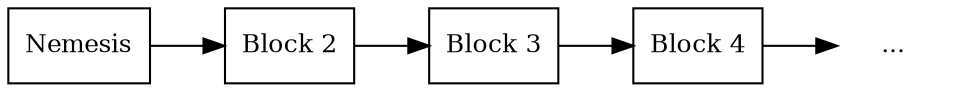

# Blocks

Block
:   A block records a set of <transactions:> confirmed at a specific point in time.

In addition to transactions, blocks contain metadata such as a timestamp, the block's height, and the
_previous block hash_ that links each block to its predecessor.
This linkage is what makes the chain a _blockchain_: tampering with any block invalidates every block that follows.

The NEM network produces one new block every 60 seconds on average.

## The Nemesis Block

Nemesis block
:   The first block in the NEM blockchain.
    Unlike all other blocks, which are created through network consensus, the nemesis block is manually generated by the
    network creators.

It defines the initial state of the blockchain.
This includes the initial distribution of mosaics, such as <XEM:>, to specific accounts, the creation of namespaces,
and other configuration parameters that set the foundation for the network.

Because it is the root of the chain, the nemesis block has no previous block hash.
All other blocks are linked back to it directly or indirectly.

This block is commonly called the _genesis block_ in other blockchain protocols.

All blocks that follow are created through a process called <harvesting:>, NEM's equivalent of mining in other
blockchains.
Harvesters validate transactions, group them into blocks, and add the blocks to the chain, receiving transaction fees as
a reward.

## Network Time

Network Time
:   NEM defines time as the number of seconds elapsed since the creation of its first block,
    known as the <Nemesis block:>.

    All timestamps are calculated relative to this origin.

UTC timestamps are obtained by adding the network time to the Nemesis block's UNIX timestamp,
which is `1427587585` (`2015-03-29T00:06:25Z`) on <mainnet:>.
For other networks, it can be retrieved from the network properties.

## Block Structure

Each block in the NEM blockchain contains a combination of metadata and transaction data, including:

| **Field**               | **Description**                                                                                                                                                                          |
| ----------------------- | -----------------------------------------------------------------------------------------------------------------------------------------------------------------------------------------|
| **Height**              | The block's position in the chain, starting from `1` for the <nemesis block:>. Each new block has a height one greater than its predecessor.                                             |
| **Timestamp**           | Seconds elapsed since the nemesis block, strictly increasing for each block. Average time between blocks is kept close to 60s.                                                           |
| **Type**                | `-1` for the nemesis block, `1` for regular blocks.                                                                                                                                      |
| **Version**             | Encodes the block format version and the network (`1744830465` on mainnet, `-1744830463` on testnet).                                                                                    |
| **Previous block hash** | <Hash:> of the previous block. If its contents were tampered with, this hash would change, breaking the chain and invalidating every successor.                                          |
| **Signature**           | Cryptographic signature produced by the harvester over the block's contents. Used by every node to verify block integrity.                                                               |
| **Signer**              | The account that signs the block, also referred to as the _harvester_. Transaction fees are credited to it, or to the lessor when the block is produced through <delegated harvesting:>. |
| **Transactions**        | A list of valid transactions included in the block. Each transaction is independently verified before being accepted into the block.                                                     |

## Derived Fields

In addition to the fields above, each node keeps the following values for every block.
They are not part of the block payload: every node computes them from earlier blocks.

| **Field**           | **Description**                                                                                                                                                                                         |
| ------------------- | --------------------------------------------------------------------------------------------------------------------------------------------------------------------------------------------------------|
| **Generation hash** | A hash carried forward from block to block, used to determine which accounts are eligible to harvest the next block. Computed from the previous block's generation hash and the harvester's public key. |
| **Difficulty**      | A network-wide measure of how hard it is to harvest the next block. Adjusted dynamically from the recent block history to keep the average block time close to 60s.                                     |
| **Lessor**          | When the block is harvested through <delegated harvesting:>, the account that delegated the harvesting rights. Resolved from the harvester's delegation state recorded earlier in the chain.            |

## Block Score

The following quantity is computed for each block, to aid in the <consensus:> process.

Block Score
:   A numerical value assigned to each block that reflects how hard it was to <harvesting:|harvest>.

$$
\textit{block score} = difficulty − \textit{time elapsed since last block}
$$

Chain Score
:   Sum of the <block scores:> of all blocks in a chain, used to choose between competing <forks:>.
    The chain with the higher score wins.
