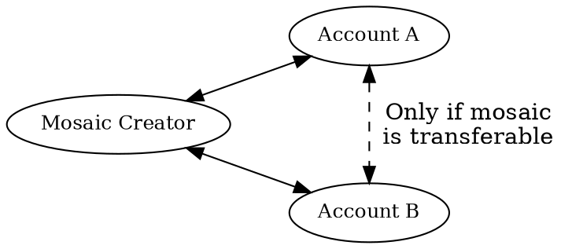

# Mosaics

Mosaic
:   A representation of an asset on the NEM blockchain, commonly called tokens on other protocols.
    For example: currencies, licenses, collectibles, access rights, or voting power.

Unlike smart contract-based tokens on other platforms, NEM mosaics are supported directly at the protocol level,
and require no additional coding to use.

Each mosaic defines a new type of asset, and the individual tokens that belong to this type are called _mosaic units_.
Mosaics can represent fungible assets, such as coins, where each unit is interchangeable, and non-fungible assets,
such as paintings or <NFTs:>, where each unit is unique.

A mosaic lives under a registered <namespace:>, is identified by a [fully qualified name](#fully-qualified-name),
and inherits its duration from its parent namespace's lease (see [Lifetime](#lifetime)).

## Name

The name identifies a mosaic within its namespace and must be unique within it.
It follows specific formatting rules:

* It can only contain lowercase letters, numbers, hyphens `-`, underscores `_`, and apostrophes `'`.
* It must start with a letter or a number.
* It can be at most **32 characters** long.

Once registered, a mosaic name cannot be changed.

## Fully Qualified Name

A mosaic's **fully qualified name** (also called its **mosaic ID**) is the unique identifier on the network.
It joins the namespace and the local mosaic name with a colon, in the form `<namespace>:<mosaic name>`:

| Part            | Definition                                                                         | Length limit                                                |
| --------------- | ---------------------------------------------------------------------------------- | ----------------------------------------------------------- |
| **Namespace**   | One root namespace and up to two subnamespaces, separated by dots, before the `:`. | 16 characters (root) and 64 characters (each subnamespace). |
| **Mosaic name** | The local name after the `:`.                                                      | 32 characters.                                              |

!!! note "The colon is just a separator"

    The colon separates the namespace from the mosaic name and is not a character in either.
    Some applications display it as `.` or `!` instead.

Examples:

* `nem:xem`: The native network currency.
* `mycompany.tokens:goldcoin`: A hypothetical company token.

## Description

Each mosaic can have a **description**: a free-text field of up to **512 characters** documenting the asset, for example
its purpose, origin, or terms of use.

## Properties

Mosaics expose behavioral properties that govern how they can be transferred and how their supply evolves.

### Divisibility

Divisibility
:   Defines how many decimal places a mosaic quantity can have.
    A mosaic with divisibility `0` is indivisible: it can only be transferred in whole units.
    Higher values allow fractional units.

For example, a divisibility of `2` means each _whole unit_ can be divided into 100 _fractional units_ (10^2^),
allowing the mosaic to be handled in increments of `0.01`.

Fractional units are also called _atomic units_, so in this example, 1 whole unit consists of 100 atomic units.

In many other protocols, this value is hardcoded.
For example, Bitcoin uses 8 decimal places, and Ethereum uses 18.
NEM allows each mosaic to define its own divisibility, depending on the needs of the asset it represents.

The maximum allowed divisibility in NEM is `6`.

### Initial Supply

Defines the total number of mosaic units created at issuance.

A mosaic's total supply cannot exceed **9 × 10^15^** atomic units, regardless of divisibility.

The supply is fixed unless [supply mutability](#supply-mutability) is enabled.

### Supply Mutability

Indicates whether the mosaic's total supply can be increased or decreased after creation.
It allows for dynamic issuance or removal of mosaic units, depending on the desired asset lifecycle.

Only the account that created the mosaic can modify its total supply.
These changes affect only the creator's balance:

* When _minting_ (increasing the supply), new units are created and added to the creator's account.
* When _burning_ (decreasing the supply), existing units are removed from the creator's account.
    If the account does not have enough balance, the operation fails.

### Transferability

Specifies whether the mosaic can be freely transferred between accounts.
If disabled, every transfer must involve the creator's account as either sender or recipient.

## Levy

Levy
:   An optional fee attached to a mosaic, paid to a designated account on every transfer of that mosaic, on top of the
    transaction fee.

A typical use of levies is funding the account behind an asset, for example by charging a commission or a royalty on
every transfer.

A levy specifies four fields:

| Field         | Description                                                                                                                                                                                                                     |
| ------------- | --------------------------------------------------------------------------------------------------------------------------------------------------------------------------------------------------------------------------------|
| **Type**      | Absolute (fixed quantity) or Percentile (proportional to the amount transferred).                                                                                                                                               |
| **Recipient** | Account that receives the levy on every transfer.                                                                                                                                                                               |
| **Mosaic ID** | The mosaic in which the levy is paid. It may differ from the mosaic being transferred.                                                                                                                                          |
| **Fee**       | Quantity of the levy mosaic. For Absolute, it is the exact quantity charged on every transfer in atomic units. For Percentile, it is interpreted in **basis points**: the levy equals `fee / 10'000` of the transferred amount. |

### How Levies Are Charged

When a transfer transaction includes a mosaic with a levy, the network charges the levy to the sender and credits it
to the levy recipient, in addition to the regular transaction fee.

The levy is paid on top of the transferred amount: the recipient receives the full quantity sent, and the sender is
debited for both the transfer and the levy.

#### Absolute Levy Calculation

For an absolute levy, the fee is the exact quantity charged on every transfer, expressed in the atomic units of the
levy mosaic.

For example, with an absolute levy of `10` atomic units paid in the transferred mosaic itself, sending `1'000`
atomic units debits the sender `1'010` in total:
`1'000` credited to the recipient and `10` credited to the levy recipient.

#### Percentile Levy Calculation

For a percentile levy, the fee is interpreted in basis points, where one basis point is one hundredth of a percent.
To charge a percentage, multiply it by 100: a fee of `100` charges 1%, and a fee of `250` charges 2.5%.

The levy is calculated from the transferred amount in **atomic units**:

$$
\text{levy} = \left\lfloor \frac{\text{fee} \cdot \text{transferred amount}}{\text{10'000}} \right\rfloor
$$

The result is the number of atomic units charged in the levy mosaic.
A levy that rounds down to zero is not charged.

!!! note "The divisibility of both mosaics affects the charge"

    If the transferred mosaic and the levy mosaic have different <divisibility:>, the charge in whole units is not
    the same percentage of the whole units sent.

    For example, consider a mosaic with divisibility 2 whose 1% levy is paid in `nem:xem`, with divisibility 6:

    * A transfer of 50 whole units moves `5'000` atomic units.
    * The levy is 1% of `5'000`: `50` atomic units, charged in the levy mosaic.
    * In `nem:xem`, with divisibility 6, those `50` atomic units are only 0.00005 XEM, far less than 1% of the 50
        whole units sent.

### Transfer Requirements

The sender must hold enough balance to cover the transferred amount and the levy in the levy mosaic, which may differ
from the one being transferred.

The levy mosaic must also still exist on the network when the transfer takes place.
If the levy mosaic is [lost](#lifetime), for example because its namespace expired and was not renewed, transfers of
the mosaic with the levy are rejected.

### Limitations

Levies are not recursive.
If the mosaic used to pay the levy carries its own levy, that second levy is not applied.

!!! warning "A levy is not a guaranteed charge"

    Because levies are not recursive, they can be sidestepped.

    For example, if mosaic `A`'s levy is paid in mosaic `B`, and another mosaic `C`'s levy is paid in `A`, transferring
    `C` moves `A` as `C`'s levy without triggering `A`'s levy.

    A levy is therefore a best-effort fee, not an enforceable guarantee on every transfer.

## Lifetime

A mosaic has no duration of its own.
Its lifetime is tied to the lifetime of its parent namespace:

* While the namespace is active, the mosaic can be transferred and its supply can be changed (subject to its
[properties](#properties)).
* When the namespace expires, the mosaic becomes inactive: transfers and supply changes are rejected, but existing
    balances are preserved.
* If the original owner renews the namespace during the [grace period](./namespaces.md#duration), the mosaic and its
    balances become usable again.

!!! warning "Mosaic loss past the grace period is permanent"
    After the grace period, the mosaic is permanently lost.
    Accounts holding the mosaic lose access to their balances and the mosaic cannot be transferred.

    Registering a mosaic with the same name later creates a new asset, not a recovery of the original.

See [Namespace duration](./namespaces.md#duration) for the namespace lease lifecycle.

## Creation Fee

Registering a new mosaic requires paying a one-time _creation fee_ of **10 XEM**.

The fee must be paid at the time of creation and is non-refundable.
It is transferred to a _sink account_, a network account that collects mosaic creation fees.
Since block 3,481,580 on <mainnet:>, the network rejects any transaction from the sink account.
As a result, the collected fees are effectively burned.

!!! note "Transaction fee vs. creation fee"
    Creating a mosaic requires announcing a transaction, which also has an associated fee.
    However, this transaction fee is typically negligible compared to the creation fee.

## Modifying a Mosaic

After creation, the original creator can modify part of a mosaic's **definition**.

Each field has its own rule:

* **Description**: can be changed at any time.
* **Transferability** and **name**: cannot be changed once set.
* **Divisibility**, **initial supply**, **supply mutability**, and **levy**: can be changed only while the creator holds
    the entire mosaic supply.

The total supply can be changed (mint or burn) if [supply mutability](#supply-mutability) is enabled.
