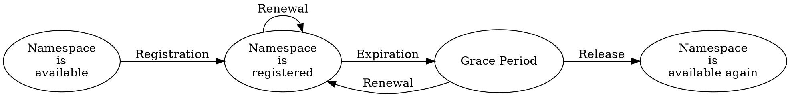

# Namespaces

Namespace
:   A registered name leased to an <account:>, used to prefix and group <mosaics:> defined under it.

Namespaces let an account group related mosaics under a meaningful prefix like `mycompany.tokens`.

The account that registers a namespace is called its _owner_.
The owner controls which mosaics can be defined under it, so namespaces provide both naming structure and
ownership scoping.

Because namespaces are a limited resource, they are leased for a fixed period rather than owned permanently,
but leases can be renewed.

## Subnamespaces

Namespaces in NEM follow a hierarchical structure, similar to internet domain names.
Each name consists of one to three parts separated by dots, for example, `foo`, `foo.bar`, or `foo.bar.baz`.

The first part is called the _root namespace_.
Any additional parts are _subnamespaces_, which must be registered separately under the root.

Root namespace
:   A namespace that has no parent.
    It can be used to group subnamespaces together in a hierarchical manner.

Subnamespace
:   A namespace that belongs to a parent namespace, either the root or another subnamespace.
    Subnamespaces expire when the root namespace expires (see [Duration](#duration)).

## Name

Each namespace has a unique name that identifies it on the network, and must follow specific formatting rules:

* Names can only contain lowercase letters, numbers, hyphens `-`, and underscores `_`.
* They must start with a letter or number.
* Root names can be at most 16 characters long.
* Subnamespace names can be at most 64 characters long.

Once registered, a name cannot be changed.

## Duration

When a root namespace is registered, it is leased for approximately one year (525600 blocks on <mainnet:>).
During this time, the owner can perform operations such as:

* Define <mosaics:> under the namespace.
* Create subnamespaces.
* Renew the root namespace.
    Subnamespaces do not need to be renewed, as they have the same duration as their root namespace.

Renewal while the namespace is registered is restricted to the **last 43200 blocks before expiration**
(approximately 30 days on <mainnet:>).
Each renewal sets the new expiry one year from the renewal block, not from the previous expiry, so a namespace cannot be
prepaid for multiple years in advance.

If the namespace is not renewed before expiration, it enters an approximately 30-day _grace period_ (43200 blocks).
During this time, the namespace is effectively disabled: mosaics defined under it become inactive
(see [Mosaic lifetime](./mosaics.md#lifetime)) and the namespace is not yet available for others to register.

Only the original owner can renew the namespace during the grace period.
Once the grace period ends, the namespace is fully released and becomes available for others to register.

The following operations are permitted depending on the state of the namespace registration:

| Operation                           | Namespace Available | Namespace Registered   | Grace Period       |
| ----------------------------------- | :-----------------: | :--------------------: | :----------------: |
| Register the namespace              | :white_check_mark:  | :material-close:       | :material-close:   |
| Register a subnamespace             | :material-close:    | :white_check_mark:     | :material-close:   |
| Define a mosaic under the namespace | :material-close:    | :white_check_mark:     | :material-close:   |
| Renew the namespace                 | :material-close:    | :white_check_mark:     | :white_check_mark: |

## Lease Fee

Registering a namespace requires paying a lease fee in the network currency (<XEM:>):

* **Root namespace:** 100 XEM per registration or renewal.
* **Subnamespace:** 10 XEM, paid once at registration.

This reflects the fact that namespaces are a limited global resource and helps prevent name squatting.

The fee must be paid at the time of registration or renewal, and is non-refundable.

!!! note "Transaction fee vs. lease fee"
    Registering or renewing any kind of namespace requires announcing a transaction, which also has an associated fee.
    However, this transaction fee is typically negligible compared to the lease fee.

## Reserved Names

The following root names are reserved by the protocol and cannot be claimed by users:

`nem`, `user`, `account`, `org`, `com`, `biz`, `net`, `edu`, `mil`, `gov`, `info`.

The `nem` namespace, in particular, hosts the native currency `nem:xem` and is permanently active.
The colon separates the namespace from the [mosaic name](./mosaics.md#fully-qualified-name).

## Ownership

A namespace is controlled by the account that registered the root namespace.

Only the owner can:

* Define mosaics under the namespace.
* Create subnamespaces.
* Renew the root namespace.

Namespace ownership cannot be transferred directly.
Instead, control must be transferred by handing over the owner account, for example, using a <multisignature account:>.

Subnamespaces always share the same owner as the root and cannot be managed separately.

## Summary

The following table summarizes the main numerical limits related to namespaces.

| Limit                                       | Value                  | Notes                                              |
| ------------------------------------------- | ---------------------- | -------------------------------------------------- |
| Maximum depth of namespace hierarchy        | 3 levels               | Root + up to 2 subnamespaces                       |
| Maximum length of a root namespace name     | 16 characters          |                                                    |
| Maximum length of a subnamespace name       | 64 characters          | Applies to each sublevel individually              |
| Allowed characters in namespace names       | `a–z`, `0–9`, `-`, `_` | Must start with a letter or number                 |
| Default root namespace duration             | 525600 blocks          | Approximately 1 year on mainnet                    |
| Namespace grace period after expiration     | 43200 blocks           | Approximately 30 days on mainnet                   |
