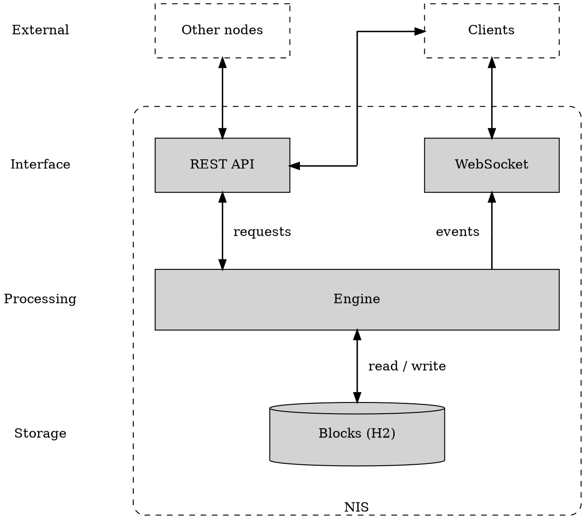
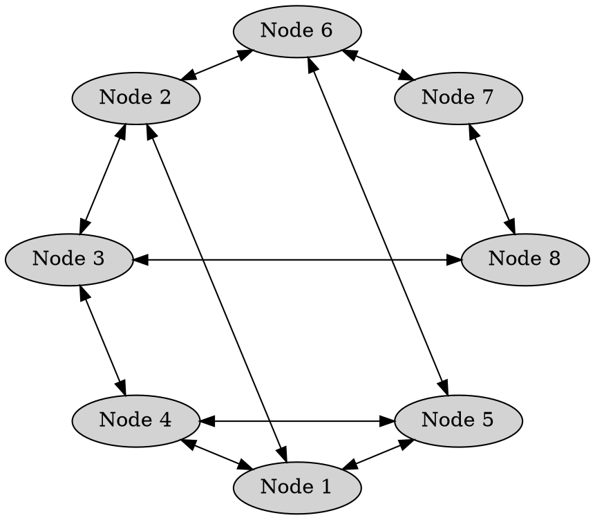

# Nodes

Node
:   A computer running the NEM software which shares information with peer nodes, validates incoming <transactions:>,
    and participates in <consensus:> and block creation.

Nodes form the backbone of the blockchain, ensuring the network remains functional as long as enough nodes are active.

Anyone can run a NEM node.
Operators do so to <harvesting:|harvest> blocks with their own account, to host <delegated harvesting:> for others,
or to qualify for the <Supernode Program:>.

## Node Structure

Every NEM node runs the same application, called _NIS_.

NIS
:   NEM Infrastructure Server.
    A single Java process that implements all node functionality.

NIS has four parts: an [engine](#engine), a [REST API](#rest-api), a [WebSocket](#websocket) service, and an embedded
[database](#database).
The engine is the core, exposed through the REST API and WebSocket service, while the database stores the blockchain.

NIS exchanges data with other nodes and with clients:

* _Other nodes_ are NIS peers on the network.
* _Clients_ are external programs such as wallets, explorers, and applications.

### Engine

The engine performs the blockchain work: it validates incoming data, runs <consensus:> and <harvesting:>, handles
[peer-to-peer networking](#peer-to-peer-communication), and maintains the
<unconfirmed pool:|unconfirmed transactions pool>.

The engine is an internal component and is not exposed directly.
Every inbound request, from a peer or from a client, arrives through the REST API described below and is then handed
to the engine.

### REST API

Both peers and clients reach NIS through a single HTTP API:

* _Peer requests_ handle block synchronization, transaction relay, and node discovery.
* _Client requests_ handle reading blockchain data and submitting <transactions:>.

The API supports two encodings, selected by the request's content type: JSON and binary.
Peers exchange data in binary, while clients typically use JSON.

### WebSocket

NIS publishes block and transaction events through a built-in
[WebSocket](https://developer.mozilla.org/en-US/docs/Web/API/WebSockets_API) service.
Subscribed clients receive notifications in real time without polling.

### Database

NIS stores the blockchain in an [H2](https://www.h2database.com) relational database that is _embedded_, meaning it runs
inside the NIS process rather than as a separate database server.

The database holds only the chain itself: every block and the transactions inside it.
It does not store the current blockchain state, such as account balances and <importance:> scores.
NIS keeps that state in memory and rebuilds it at startup by replaying the chain from the <nemesis block:> onward,
which is why a node stays unavailable for a while after it starts.

## Peer-to-Peer Communication

NEM nodes communicate directly with one another in a decentralized, peer-to-peer fashion.
There is no central coordinator: instead, each node establishes connections with a subset of other nodes, forming a
distributed network.

Nodes share their lists of known peers, allowing a newly connected node to quickly discover others and integrate into
the network.
This process ensures robust connectivity and helps the network remain resilient, even if individual nodes go offline.

To facilitate bootstrapping, an initial list of _pre-trusted_ peers is bundled with <NIS:>.
This allows a new node to make its first connections and begin discovering others.

### Node Reputation

In a decentralized network like NEM, nodes must decide which peers to trust and maintain connections with.
Rather than relying on static whitelists or manually curated connections, NEM nodes use a _reputation_ system
to dynamically score and rank their peers based on observed behavior over time.

Each node calculates reputation independently, using metrics such as communication success, response time,
and the validity of received data.
Nodes that behave correctly and respond consistently are given higher scores.
Those that send invalid data, fail to respond, or otherwise misbehave may be penalized or temporarily blacklisted.

When a node needs to establish a new connection, it selects from the available peers, prioritizing those with higher
reputation based on past interactions.

The bundled pre-trusted peers are weighted more heavily in this selection,
so they are chosen more often than other peers and act as reliable anchors for the network.
Their behavior is still scored like any other peer, so a misbehaving pre-trusted peer loses reputation accordingly.

Reputation scores are local.
Each node builds its own view of the network from its direct experience alone, and it holds that view only in memory.
After a restart, a node keeps no earned reputation and rebuilds it from new interactions.

The implementation is based on the [EigenTrust++](https://en.wikipedia.org/wiki/EigenTrust) algorithm.

### Node Rotation

To prevent the formation of isolated or stagnant node groups, a node does not always communicate with the same
peers.
Every time it selects peers to communicate with, it draws them at random, weighted by reputation.
Higher-scoring peers are more likely to be chosen, but the choice stays probabilistic.

This randomness keeps nodes cycling through different peers, avoiding network fragmentation and promoting
long-term decentralization.

## Supernodes

A supernode is a node enrolled in the _Supernode Program_.

Supernode Program
:   An off-chain, community-funded program that rewards reliable public nodes.

NEM has no block subsidy or inflation.
Nodes are paid exclusively from transaction fees, which can be small in periods of low activity.
The Supernode Program offsets this by paying daily rewards to nodes that prove themselves reliable.

!!! warning "Supernode rewards are not guaranteed"
    Reward amounts may be reduced or discontinued at any time.

The program runs entirely off-chain, and NIS itself plays no part: a separate, centrally operated service called the
_controller_ tests participating nodes and pays out the rewards.

A node qualifies for a day's reward by holding at least 10'000 <XEM:> and passing a battery of automated tests that
confirm it is in sync, up to date, and running on hardware and a network connection capable of serving peers reliably.

Testing happens in four rounds spaced six hours apart, and a node must pass every test in every round to be eligible.
Each round runs the eight tests below, several of them measured against a trusted _reference node_ that the controller
knows to be healthy:

| Test                | A node passes when                                                                                     |
| ------------------- | -------------------------------------------------------------------------------------------------------|
| **Chain height**    | Its chain is no more than 4 blocks behind the reference node.                                          |
| **Chain part**      | A random sequence of 60 to 100 recent blocks matches the reference node exactly, including signatures. |
| **Balance**         | Its main account holds at least 10'000 XEM.                                                            |
| **Computing power** | It completes 10'000 successive key derivations, round trip included, in 5 seconds or less.             |
| **Version**         | It runs a client version at least as recent as the reference node's.                                   |
| **Ping**            | Across pings to 5 random peers, at most one ping fails and the average round trip stays under 200 ms.  |
| **Bandwidth**       | A bulk hashing exchange with a peer runs at an effective transfer speed of at least 5 Mbit/s.          |
| **Responsiveness**  | It answers 10 chain-height requests in 1 second or less, with at least 9 succeeding.                   |

The ping and bandwidth tests reach out to other peers on the network, so a node's score reflects how it performs with
the wider network rather than just its exchange with the reference node.

Rewards come from a fixed daily pool of 25'500 XEM, and each qualifying node earns at most 500 XEM per day.
When 51 or fewer nodes qualify, each receives the full 500 XEM.
Beyond that, the pool is divided equally, so per-node rewards fall as the network grows.

Enrollment is optional.
Step-by-step instructions are available on the [NEM Supernode page](https://nem.io/supernode/).
