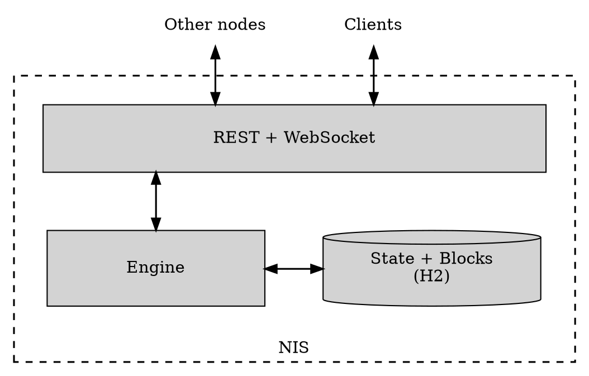
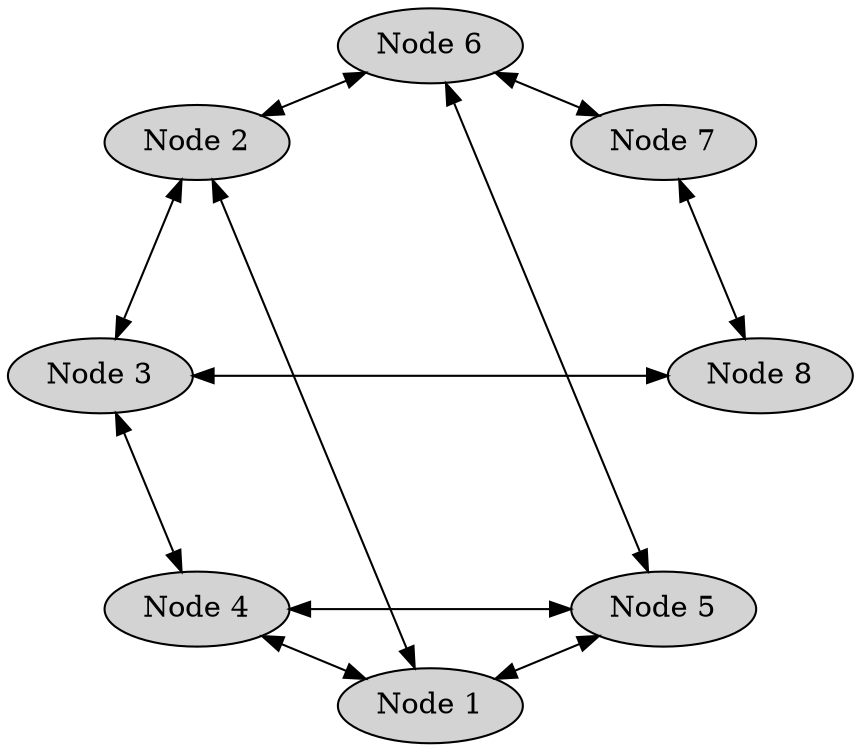

# Nodes

Node
:   A computer running the NEM software which shares information with other nodes, validates incoming <transactions:>,
    and participates in <consensus:> and block creation.

Nodes form the backbone of the blockchain, ensuring the network remains functional as long as enough nodes are active.

Anyone can run a NEM node.
Operators do so to <harvesting:|harvest> blocks with their own account, to host <delegated harvesting:> for others,
or to qualify for the <Supernode Program:>.

## Node Structure

Every NEM node runs the same application, called _NIS_.

NIS
:   NEM Infrastructure Server. A single Java process that implements everything a NEM node does.

NIS has four parts: an [engine](#engine) that does the blockchain work, a [REST API](#rest-api) and a
[WebSocket](#websocket) service that expose it, and an embedded [database](#database) that stores its data.

### Engine

The engine runs <consensus:>, <harvesting:>, [peer-to-peer networking](#peer-to-peer-communication), and the
<unconfirmed pool:|unconfirmed transactions pool>.
It does the blockchain work: validating incoming data, producing blocks, and keeping the node in sync with its peers.

The engine is not reachable from outside.
Every inbound request, from another node or from a client, arrives through the HTTP layer described below and is then
handed to the engine.

### REST API

NIS exposes a single HTTP API.
It serves two kinds of callers: other nodes, which use it for the peer-to-peer protocol, and clients such as wallets,
explorers, and applications.

Peer requests cover block synchronization, transaction relay, and node discovery.
Client requests read blockchain data and submit new <transactions:>, which NIS validates, adds to the local pool,
and propagates to its peers.

### WebSocket

NIS publishes block and transaction events through a built-in WebSocket service.
Subscribed applications receive notifications in real time without polling.

### Database

NIS persists both blocks and the current blockchain state in an embedded [H2](https://www.h2database.com) relational
database, managed through Hibernate.
Schema migrations are handled by Flyway.

The database files live under the node's data directory.

## Peer To Peer Communication

NEM nodes communicate directly with one another in a decentralized, peer-to-peer fashion.
There is no central coordinator: instead, each node establishes connections with a subset of other nodes,
forming a distributed network.

Nodes share their lists of known peers, allowing a newly connected node to quickly discover others and integrate
into the network.
This process ensures robust connectivity and helps the network remain resilient, even if individual nodes go offline.

To facilitate bootstrapping, an initial list of peers is bundled with <NIS:>.
This allows a new node to make its first connections and begin discovering others.
However, nodes on this list receive no special treatment:
once connected, all peers are treated equally by the protocol.

### Node Reputation

In a decentralized network like NEM, nodes must decide which peers to trust and maintain connections with.
Rather than relying on static whitelists or manually curated connections, NEM nodes use a _reputation_ system
to dynamically score and rank their peers based on observed behavior over time.

Each node calculates reputation independently, using metrics such as communication success, response time,
and the validity of received data.
Nodes that behave correctly and respond consistently are given higher scores.
Those that send invalid data, fail to respond, or otherwise misbehave may be penalized or temporarily blacklisted.

When a node needs to establish a new connection, it selects from the available peers, prioritizing those with higher
reputation based on past interactions.

Note that reputation scores are local: each node maintains its own view of the network,
based solely on its direct experience.

The implementation is based on the [EigenTrust++](https://en.wikipedia.org/wiki/EigenTrust) algorithm.

!!! note "Node rotation"

    To prevent the formation of isolated or stagnant node groups,
    NEM nodes periodically refresh their peer set, pulling peer lists from a sample of current peers
    and merging newly discovered nodes into the candidate pool, regardless of how well existing peers are scoring.

    This forced churn ensures that nodes continually discover and evaluate new peers,
    maintaining a well-connected and adaptive network topology.

    By balancing reputation-based stability with deliberate connection turnover,
    the protocol avoids network fragmentation and promotes long-term decentralization.

Finally, note that this reputation score is an internal metric used by nodes to decide which other nodes to connect to.
When using <delegated harvesting:>, accounts may delegate to any node they choose, based on reputation factors
that may or may not be related to the score described in this page.

## Supernodes

A supernode is a node enrolled in the _Supernode Program_.

Supernode Program
:   An off-chain, community-funded program that rewards reliable public nodes.

NEM has no block subsidy or inflation, so transaction fees alone are typically modest.
The Supernode Program offsets this by paying daily rewards to nodes that prove themselves reliable.

To qualify, a node must:

* Hold at least 10'000 <XEM:>.
* Stay in sync with the chain and run an up-to-date client.
* Run on hardware and a network connection fast enough to serve the rest of the network.

Eligibility is re-tested every day across four rounds of checks spaced six hours apart,
and a node must pass every check to earn that day's reward.

Rewards come from a fixed daily pool of 25'500 XEM, and each qualifying node earns at most 500 XEM per day.
While 51 or fewer nodes qualify, each receives the full 500 XEM.
Beyond that, the pool is divided equally, so per-node rewards fall as the network grows.

Enrollment is optional.
The program runs off-chain, with a separate, centrally operated service testing nodes and paying rewards.
NIS itself plays no part.
