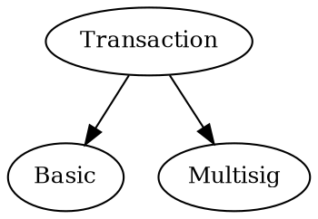
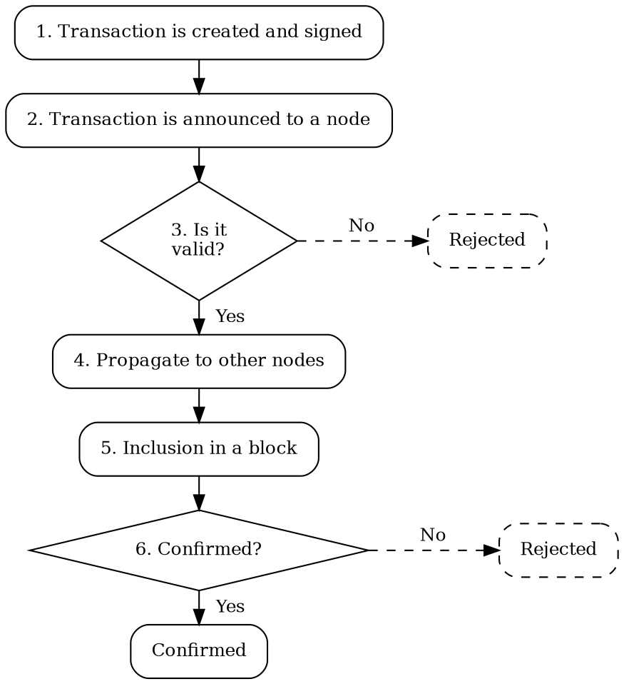

# Transactions

Transaction
:   A transaction represents an action to perform on the NEM blockchain,
    like moving funds from one <account:> to another, or registering a new mosaic.

These actions are expressed in a signed message, which is then announced to the network.
<Nodes:|Nodes> in the network validate it and, if accepted, include the transaction in a block, updating the state of
the blockchain.

## Fundamental Transaction Types

NEM supports two core transaction types: basic and multisig.



### Basic Transactions

Basic Transaction
:   A basic <transaction:> represents a single action, initiated by a single account,
    requiring only that account's <signature:>.

Examples include transferring funds from an account or registering a new <namespace:>.

### Multisig Transactions

Multisig Transaction
:   A multisig transaction wraps a single <inner transaction:> issued on behalf of a
    <multisignature account:|multisig account>, and requires signatures from the configured number of cosignatories
    before it can be included in a block.

Multisig transactions are initiated by one cosignatory, but require additional signatures from other cosignatories
to be valid.

Cosignature
:   When a transaction requires signatures from multiple accounts, the additional signatures are called _cosignatures_.

On NEM, each cosignature is delivered as its own _Multisig Cosignature_ transaction that references the
<inner transaction:> by hash, allowing cosignatories to sign independently and at different times.
Multiple coordinated actions must therefore be issued as separate multisig transactions, one per inner transaction.

These cosignatures accumulate on the pending multisig transaction in the <unconfirmed pool:>, and the transaction
can be included in a block only after it has collected enough cosignatures to meet its required threshold.
The multisig transaction and its cosignatures are then confirmed together atomically as a single unit.

When a multisig transaction is included in a block, the multisig account pays all fees associated with the
transaction: the inner transaction's fee, the multisig transaction's fee, and every cosignature's fee.
Cosignatories never spend from their own balance when cosigning.

!!! tip "Multisig Transaction Example"

    A treasury account `T` is a 2-of-3 multisig controlled by cosignatories `C1`, `C2`, and `C3`.
    To pay a supplier `S`, `C1` announces a multisig transaction wrapping a transfer from `T` to `S`.
    `C2` then submits a cosignature, meeting the 2-of-3 threshold.
    `C3` does not need to sign.
    Once the threshold is reached, the transfer executes, and `S` receives the funds.

    ```dot
    digraph {
        rankdir="LR";
        fontsize=12;
        compound=true;
        node [fontsize=12];

        C1 [label="C1"];
        C2 [label="C2"];
        C3 [label="C3"];

        subgraph clusterMultisig {
            label = "Multisig Transaction";
            fontsize = 12;
            style = dashed;
            T [label="T\nMultisig Account\n2 of 3"];
            S [label="S"];
            T -> S [label="Transfer"];
        }

        C1 -> T [label="signature" lhead=clusterMultisig minlen=2 labelfloat=true];
        C2 -> T [label="cosignature" lhead=clusterMultisig minlen=2 labelfloat=true];
        C3 -> T [style=dashed lhead=clusterMultisig minlen=2];
    }
    ```

### Inner Transactions

Inner Transaction
:   The <basic transaction:> wrapped inside a <multisig transaction:> is called the _inner transaction_.

Inner transactions behave like basic transactions, with the following differences:

* They are not individually signed.
    The multisig transaction is signed by the initiating cosignatory, and additional cosignatories provide
    their approvals through separate multisig cosignature transactions.

* They cannot themselves be multisig transactions.
    Multisig hierarchies are only one layer deep.

* They retain their own fee and deadline fields.
    Inner transaction fees are billed to the multisig account along with the multisig transaction's fee
    and each cosignature's fee.

## Transaction Lifecycle

Each NEM transaction moves through six stages, from creation by a client to confirmation by the network:



### 1. Creation and Signature

A software client, typically an app, creates the transaction and fills in all its parameters.
For example, a transfer transaction requires the source <account:>, destination account, and amount.

This step also involves signing the transaction.
Signatures prove that the signing account has authorized the transaction, since only the holder of an account's
<private key:> can produce a valid signature.

For multisig transactions, the initiating cosignatory signs the multisig transaction that wraps the inner transaction.
Other cosignatories provide their cosignatures separately, via multisig cosignature transactions.

### 2. Announcement

The client application submits the transaction to a connected <node:> on the network.

For multisig transactions, cosignatures are announced as separate multisig cosignature transactions, each submitted
independently by its signer.

### 3. Validation

The node checks that the transaction is well-formed and includes a valid signature.
For multisig transactions, the node also verifies that any referenced cosignatures come from valid
cosignatories of the multisig account.

Some transaction types require additional semantic checks.
For example, a transfer transaction verifies that the source account has enough funds.

If any of these checks fail, the transaction is rejected and not propagated further.
If all checks pass, the process continues.

### 4. Propagation

Once the node considers the transaction to be valid, it is broadcast to other peer <nodes:> in the network,
and added to every node's _unconfirmed pool_.

Unconfirmed pool
:   A list of validated transactions awaiting inclusion in a block, maintained by each node in the network.

When a peer receives a propagated transaction, it runs the full validation again before adding the transaction
to its own pool, because no node trusts another's validation.
If the transaction passes, the peer forwards it to its own peers, and propagation continues until the transaction
is distributed across the network.

!!! warning "Do not rely on unconfirmed transactions"

    A transaction in the unconfirmed pool is not yet guaranteed to be included in a block.
    Wait until it is [confirmed](#6-confirmation), and ideally past the <rewrite limit:>, before treating it as final.

For multisig transactions, the multisig transaction and its accompanying multisig cosignature transactions propagate
independently.

### 5. Harvesting

Once in the unconfirmed pool, the transaction can be included in a block by the <harvesting:> process, though inclusion
is not guaranteed.
The transaction is dropped if its deadline passes or a conflicting transaction is confirmed first.

For multisig transactions, harvesters do not include the transaction in a block until enough cosignatures have
been collected to meet the multisig account's signature threshold.
If the deadline expires first, the multisig transaction and its accumulated cosignatures are dropped from the pool.

### 6. Confirmation

Newly created blocks are propagated to other nodes that validate them and either accept or reject them.
The <consensus:> mechanism ensures that all nodes on the network ultimately agree on the same blocks.
Once the block containing a transaction is accepted by consensus, the transaction is _confirmed_.

Occasionally, a block already accepted by a node is later rejected by the majority of the network and must be
<rollback:|rolled back>.
In this case, the block's transactions are reverted and returned to the unconfirmed pool.

NEM bounds how far back a rollback can reach with the <rewrite limit:>.

If a transaction's deadline expires while it is still in the unconfirmed pool, it is dropped from the pool.
This may happen, for example, if the transaction fee offered is too low to be included by any harvester.

## Common Transaction Structure

All transaction types in NEM share a set of common attributes:

| Attribute             | Description                                                                                                                                               |
| --------------------- | --------------------------------------------------------------------------------------------------------------------------------------------------------- |
| **Signer public key** | Public key of the account that created and signed the transaction.                                                                                        |
| **Signature**         | Cryptographic proof that the signer authorized the transaction and its content.                                                                           |
| **Timestamp**         | When the transaction was created, expressed in <network time:>. It mainly serves to anchor the deadline rather than as a precise record of creation time. |
| **Deadline**          | Timestamp indicating when the transaction expires if not confirmed, no later than 24 hours after the timestamp.                                           |
| **Fee**               | Fee the signer pays to have the transaction included in a block.                                                                                          |
| **Type**              | Transaction type, which determines which additional attributes, if any, are present.                                                                      |

## Validation Details

Before a transaction is included in a block, each node independently validates it using the following checks:

| **Check**            | **Description**                                                                                                                                    |
| -------------------- | -------------------------------------------------------------------------------------------------------------------------------------------------- |
| **Signature check**  | Verifies the signature is valid and matches the signer's public key and the transaction's contents.                                                |
| **Fee check**        | Confirms the fee meets the network minimum and that the signer has enough XEM to pay it.                                                           |
| **Deadline check**   | Discards the transaction if its deadline has already passed.                                                                                       |
| **Timestamp check**  | Rejects transactions whose timestamp lies too far in the future, protecting against clock manipulation.                                            |
| **Network check**    | Rejects transactions that target a different network, for example a testnet transaction sent to mainnet.                                           |
| **Uniqueness check** | Rejects transactions whose hash already appears in the recent chain history, preventing replay.                                                    |
| **Semantic checks**  | Validates that the transaction is logically correct based on its type. Example: a transfer transaction fails if the sender lacks sufficient funds. |

Transactions that fail any of these checks are rejected and not propagated further.

## Supported Transaction Types

NEM supports the following transaction types, each tailored to a specific kind of operation.
All transaction types share the same [common structure](#common-transaction-structure) and follow the same processing
and validation steps, but differ in purpose and required fields.

<div class="subsections" markdown>

| **Transaction Type**                                                | **Description**                                                                                               |
| ------------------------------------------------------------------- | ------------------------------------------------------------------------------------------------------------- |
| **[Transfer Transactions](default:transfer transaction)**           |                                                                                                               |
| `Transfer`                                                          | Send XEM or <mosaics:> and an optional message between two <accounts:>.                                       |
| **[Harvesting](default:harvesting)**                                |                                                                                                               |
| `Account Key Link`                                                  | Activate or deactivate delegated harvesting by linking a remote account.                                      |
| **[Multisig](default:multisignature account)**                      |                                                                                                               |
| `Multisig Account Modification`                                     | Create a multisig account, add or remove cosignatories, and change the minimum number of required signatures. |
| `Multisig Cosignature`                                              | Provide a cosignature for a pending multisig transaction.                                                     |
| `Multisig`                                                          | Wrap an inner transaction issued on behalf of a multisig account.                                             |
| **[Namespaces](default:namespace)**                                 |                                                                                                               |
| `Namespace Registration`                                            | Register or renew a namespace.                                                                                |
| **[Mosaics](default:mosaic)**                                       |                                                                                                               |
| `Mosaic Definition`                                                 | Create a new mosaic.                                                                                          |
| `Mosaic Supply Change`                                              | Change the total supply of a mosaic.                                                                          |

</div>

## Transaction Fees

Every transaction pays a fee that compensates the <harvester account:> that includes it in a block.

NEM fees are not market-driven.
The network publishes a fixed schedule, so the cost of any transaction can be calculated up front without contacting a
node.

### Fee Schedule

The current schedule is:

| Transaction                       | Cost                  | Notes                                                                                                         |
| --------------------------------- | --------------------- | --------------------------------------------------------------------------------------------------------------|
| `Transfer`                        | From 0.05 XEM         | Depends on the XEM amount, attached mosaics, and message length. See [Fees](./transfer_transactions.md#fees). |
| `Account Key Link`                | 0.15 XEM              |                                                                                                               |
| `Multisig Account Modification`   | 0.5 XEM               | Paid by the multisig account (or, when converting a regular account into a multisig, by that account).        |
| `Multisig Cosignature`            | 0.15 XEM              | Paid by the multisig account, not the cosignatory.                                                            |
| `Multisig` (wrapper)              | 0.15 XEM              | Paid by the multisig account, on top of the inner transaction's fee.                                          |
| `Namespace Registration`          | 0.15 XEM              | Plus a [lease fee](./namespaces.md#lease-fee) paid to a network sink address.                                 |
| `Mosaic Definition`               | 0.15 XEM              | Plus a [creation fee](./mosaics.md#creation-fee) paid to a network sink address.                              |
| `Mosaic Supply Change`            | 0.15 XEM              |                                                                                                               |

### Floor and Bidding

The amounts in the schedule are minimums.
A transaction whose fee is below the minimum is rejected by validators.

A higher fee than the minimum is accepted and increases the chance of inclusion:

* When a harvester builds a block, it picks transactions sorted by fee, highest first.
* During network congestion, a node's spam filter ranks pending transactions by a combination of the signer's
    <importance:> and a small fee bonus, so higher-fee transactions are more likely to enter the <unconfirmed pool:>.

`Multisig Cosignature` fees are additionally capped at 1'000 XEM, which protects the multisig account from being drained
by a single cosignatory bidding an extreme fee.
