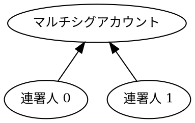

# マルチシグアカウントを設定する

[マルチシグアカウント](default:マルチシグアカウント) は _マルチシグ_ とも呼ばれ、そのアカウントだけではトランザクションを開始することはできません。
代わりに、_連署人_ アカウントがマルチシグアカウントに代わってトランザクションを作成し、署名します。

このチュートリアルでは、通常のアカウントを 2 人の連署人のうち、どちらか一方の承認を必要とするマルチシグアカウントに変換する方法を説明します。
アカウントがすでにマルチシグの場合は、連署人を削除して通常のアカウントに戻す方法を説明します。

このチュートリアルで使用するマルチシグ構成は以下の通りです。



## 前提条件 {: #prerequisites }

始める前に、次の準備をしてください。

* 開発環境をセットアップする。
    [開発環境のセットアップ](../start/setup.md) を参照してください。
* 3 つの [アカウント](default:アカウント) を作成する。1 つはマルチシグに変換し、残り 2 つは連署人として使用します。
    [コードから](./create-from-private-key.md) 作成することも、[ウォレットを使って](../../userbook/wallet/create-account.md) 作成することもできます。
* マルチシグに変換するアカウントに、トランザクション手数料を支払うための [XEM](default:XEM) を用意する。
    [フォーセットからテストネットの資金を取得する](./testnet-faucet.md) を参照してください。

さらに、トランザクションのアナウンスと承認の方法を理解するため、[XEM を送信する](../transactions/transfer-xem.md) チュートリアルを確認してください。

## 完全なコード {: #full-code }



{{ tutorial.code_full_tagged('devbook/accounts/configure_multisig', ['py', 'js']) }}

## コードの説明 {: #code-explanation }

コードでは、トランザクションをアナウンスし、その承認を待つ 2 つのヘルパー関数を定義します。
これらの動作の詳細については、[XEM を送信する](../transactions/transfer-xem.md) チュートリアルを参照してください。
残りのヘルパー関数については、以下のセクションで説明します。

次に、マルチシグアカウントに必要な [キーをセットアップ](#setting-up-the-accounts) し、
[現在のネットワーク時刻を取得](#fetching-network-time) して、
マルチシグアカウントの [現在の設定を判定](#determining-the-multisig-operation) します。

アカウントがすでにマルチシグとして設定されているかどうかに応じて、
マルチシグを [有効化](#enabling-the-multisig) または [無効化](#disabling-the-multisig) するトランザクションを作成します。
最後に、トランザクションを [アナウンスして承認](#submitting-the-transactions) します。

### アカウントをセットアップする {: #setting-up-the-accounts }

{{ tutorial.code_snippet_tagged('step-1') }}

このチュートリアルでは、3 つのアカウントが必要です。
各アカウントの [秘密鍵](default:秘密鍵) は環境変数で指定できます。
設定されていない場合は、デフォルト値を使用します。

| 環境変数 | デフォルト値 | 用途 |
| --- | --- | --- |
| `MULTISIG_PRIVATE_KEY` | `0000..0001` | マルチシグアカウント |
| `COSIGNATORY0_PRIVATE_KEY` | `0000..0002` | 1 人目の連署人アカウント |
| `COSIGNATORY1_PRIVATE_KEY` | `0000..0003` | 2 人目の連署人アカウント |

各秘密鍵は 64 文字の 16 進数文字列です。

マルチシグアカウントには、トランザクション手数料を支払うために十分な資金が必要です。
デフォルト値を使用する場合、このアカウントにはすでに資金がある可能性があります。

上記のスニペットでは、後で使用するために各アカウントの [キーペア](default:キーペア) と [アドレス](default:アドレス) を導出して保存します。

### ネットワーク時刻を取得する {: #fetching-network-time }

{{ tutorial.code_snippet_tagged('step-2') }}

ネットワーク時刻は <get:/time-sync/network-time> から取得し、[XEM を送信する](../transactions/transfer-xem.md) チュートリアルで説明されている手順に従って、トランザクションの `timestamp` と `deadline` フィールドを導出します。

### マルチシグ操作を判定する {: #determining-the-multisig-operation }

{{ tutorial.code_snippet_tagged('step-3') }}

このヘルパーは <get:/account/get> エンドポイントを使い、指定したアドレスの現在の連署人一覧を取得します。
空のリストが返された場合、そのアカウントはマルチシグアカウントとして設定されていません。

!!! warning "既存のマルチシグ設定を確認してください"

    分かりやすくするため、このチュートリアルでは、連署人のリストが _空でない_ 場合、そのアカウントはこのチュートリアルで設定されたマルチシグであると仮定します。

    連署人が異なる場合など、設定が想定したものではない場合、削除トランザクションは拒否されます。

    アプリケーションでは、変更を試みる前に、連署人の完全なリストと必要な署名の最小数を含む現在の設定を必ず確認してください。

{{ tutorial.code_snippet_tagged('step-4') }}

返された連署人によって、アカウントがマルチシグとして設定されているかどうかが決まり、マルチシグを有効化または無効化するトランザクションを作成するかどうかも決まります。

トランザクションを構築する関数と、それらが使用する差分値については、次の 2 つのセクションで説明します。

### マルチシグを有効化する {: #enabling-the-multisig }

{{ tutorial.code_snippet_tagged('step-5') }}

連署人の追加や削除を含むアカウントのマルチシグ設定変更は、すべて <ser:MultisigAccountModificationTransactionV2> を使って行います。

トランザクションでは、次の項目を指定します。

* {{ tutorial.var('type') }}: マルチシグ設定の変更では、タイプ <ser:MultisigAccountModificationTransactionV2> を使用します。

* {{ tutorial.var('signer_public_key') }}: マルチシグ設定を変更するアカウントの [公開鍵](default:公開鍵)。

* {{ tutorial.var('timestamp') }} と {{ tutorial.var('deadline') }}: ネットワーク時刻の手順で計算した値。

* {{ tutorial.var('min_approval_delta') }}: マルチシグアカウントからのトランザクションを承認するために必要な連署数の _希望値_ と _現在値_ の差分。

    この場合、アカウントは最初は通常のアカウントなので、必要な連署数の現在値は `0` です。
    連署人の 1 人からの署名を必要とするマルチシグアカウントに変換するため、差分を `1` に設定します。

    次のセクションで示すように、現在値を _減らす_ 場合は差分を負の値にします。

* {{ tutorial.var('modifications') }}: アカウントの連署人に対する変更のリスト。
    各変更では、[公開鍵](default:公開鍵) で識別される 1 人の連署人を追加または削除します。

    この場合、`add_cosignatory` 変更を 2 つ使って、[セットアップ段階](#setting-up-the-accounts) で準備した連署人を追加します。

!!! note "安全対策"

    プロトコルには、アカウントが無効な状態に固定されることを防ぐ安全機構が含まれています。
    無効なマルチシグ設定になるトランザクションはエラーで拒否されます。
    例えば、次の場合です。

    * 登録済みの連署人の数が、承認に必要な連署数に達していない
    * すでに連署人であるアカウントを追加する
    * 連署人ではないアカウントを削除する
    * 1 つのトランザクションで複数の連署人を削除する
    * マルチシグアカウントを連署人として追加する

{{ tutorial.code_snippet_tagged('step-6') }}

トランザクション手数料は <dy:FeeCalculator.calculateTransactionFee> で計算し、トランザクションに付加します。
マルチシグアカウント変更トランザクションの固定手数料は 0.5 XEM で、[手数料表](../../textbook/transactions.md#fee-schedule) に示されています。

{{ tutorial.code_snippet_tagged('step-7') }}

最後に、トランザクションに署名します。
この場合、マルチシグに変換するアカウントの署名だけが必要です。
連署人は変換トランザクションに署名しません。

!!! info "以降は連署人がトランザクションを開始します"

    アカウントでマルチシグを有効にすると、そのアカウント自身の署名は受け付けられなくなります。
    そのアカウントから送信するトランザクション（送金や、さらにマルチシグを変更するトランザクションなど）は、次のセクションに示すように、連署人が開始して署名する必要があります。

### マルチシグを無効化する {: #disabling-the-multisig }

マルチシグ設定を無効にするには、すべての連署人を削除する必要があります。
手順は有効化の場合と似ていますが、2 つの重要な違いがあります。
連署人は 1 人ずつ削除する必要があり、マルチシグアカウント自身はトランザクションに署名できません。

{{ tutorial.code_snippet_tagged('step-8') }}

このヘルパーは、連署人を削除する <ser:MultisigAccountModificationTransactionV2> を構築します。
削除する連署人と適用する承認差分をパラメーターとして受け取ります。
設定を変更する対象がマルチシグアカウントであるため、{{ tutorial.var('signer_public_key') }} にはマルチシグアカウントの公開鍵を設定します。

[マルチシグ操作を判定する](#determining-the-multisig-operation) で示したように、このヘルパーは 2 回呼び出されます。

1 回目の呼び出しでは、{{ tutorial.var('cosignatory_key_pairs[1]') }} を承認差分 `0` で削除します。これは、連署人が 1 人残るためです。

2 回目の呼び出しでは、残った連署人を承認差分 `-1` で削除し、必要な連署数を `1` から `0` に減らします。

{{ tutorial.code_snippet_tagged('step-9') }}

マルチシグアカウントは自分でトランザクションに署名できないため、それぞれの変更を <ser:MultisigTransactionV1> でラップします。

内部の変更トランザクションは <dy:TransactionFactory.toNonVerifiableTransaction> で変換し、ラップ用のマルチシグトランザクションに埋め込めるようにします。

{{ tutorial.code_snippet_tagged('step-10') }}

内部トランザクションとラッパーの両方に手数料がかかります。変更には 0.5 XEM、マルチシグラッパーには 0.15 XEM で、[手数料表](../../textbook/transactions.md#fee-schedule) に示されています。
どちらの手数料もマルチシグアカウントから差し引かれます。
マルチシグに代わってトランザクションを開始する連署人が手数料を支払うことはありません。

{{ tutorial.code_snippet_tagged('step-11') }}

最後に、それぞれのマルチシグトランザクションに、それを開始する連署人、つまりラッパーの {{ tutorial.var('signer_public_key') }} に設定された連署人が署名します。
ここでは、2 つの削除を {{ tutorial.var('cosignatory_key_pairs[0]') }} が開始して署名します。

このマルチシグでは必要な署名が 1 つだけなので、署名は 1 つで十分です。
より厳しい設定では、他のトランザクションと同様に、削除に追加の連署人の承認が必要になります。ただし、削除対象の連署人自身の署名は要件に数えられません。

最後に残った連署人の削除は特殊なケースです。
マルチシグアカウントの代わりに署名できるのは連署人だけなので、最後の連署人が 2 つ目のトランザクションで示すように、自身の削除に署名します。

連署人を逆の順序で削除することもできます。
違いは、各トランザクションを開始して署名する連署人だけです。

!!! note "その他の設定を無効化する"

    削除トランザクションが拒否された場合、このチュートリアルのデフォルトとは異なる設定、例えば **2-of-2** マルチシグになっている可能性があります。

    <get:/account/get> が返す `minCosignatories` フィールドで必要な連署数を確認し、必要に応じて削除トランザクションを調整してください。

    例えば、**2-of-2** マルチシグを無効にするには、次のようにします。

    1. Cosignatory 1 を `min_approval_delta` を `-1` に設定して削除します。連署人が 1 人残った状態で、アカウントが 2 つの署名を必要とし続けることはできないためです。
    2. 承認されたら、`min_approval_delta` を `-1` に設定して Cosignatory 0 を削除します。

    この場合、削除対象の連署人自身の署名は必要な承認に数えられないため、Cosignatory 0 は両方の削除に署名できます。

### トランザクションを送信する {: #submitting-the-transactions }

{{ tutorial.code_snippet_tagged('step-12') }}

最後の手順では、[XEM を送信する](../transactions/transfer-xem.md) チュートリアルで説明したように、トランザクションをアナウンスして承認を待ちます。

マルチシグを無効にする場合、2 つのマルチシグトランザクションを順番にアナウンスします。
2 回目の削除は 1 回目の削除が処理された後でのみ有効になるため、コードは 1 回目のトランザクションが承認されてから 2 回目をアナウンスします。

## 出力 {: #output }

以下は、プログラムの実行時の出力例です。

=== ":material-plus-thick: マルチシグを有効化する"

    ```text linenums="1" hl_lines="2-4 8 24 30 34"
    --8<-- 'devbook/accounts/configure_multisig_enable.log'
    ```

    出力の要点は次のとおりです。

    * **2～4 行目**: 関係するすべてのアカウントのアドレスと公開鍵。
    * **8 行目**（`Response: No cosignatories`）: 現在、連署人が設定されていない。
    * **24 行目と 30 行目**（`cosignatory_public_key`）: 追加される連署人の公開鍵。
    * **34 行目**（`"min_approval_delta": 1`）: 必要な署名数が 1 つ増える。

=== ":material-minus-thick: マルチシグを無効化する"

    ```text linenums="1" hl_lines="2-4 8 29-37 61-69"
    --8<-- 'devbook/accounts/configure_multisig_disable.log'
    ```

    出力の要点は次のとおりです。

    * **2～4 行目**: 関係するすべてのアカウントのアドレスと公開鍵。
    * **8 行目**（`Response: [ ... ]`）: 既存の連署人が検出された。
    * **29～37 行目**（1 つ目のマルチシグトランザクション）: 必要な署名数は変わらず、既存の連署人が 1 人削除される。
    * **61～69 行目**（2 つ目のマルチシグトランザクション）: 必要な署名数が 1 つ減り、最後に残った連署人が削除される。

出力に表示されたトランザクションハッシュを使って、[NEM テストネットエクスプローラー](https://testnet.nem.fyi/) でトランザクションを検索できます。

## まとめ {: #conclusion }

このチュートリアルでは、次の方法を説明しました。

| 手順 | 関連ドキュメント |
| --- | --- |
| [現在のマルチシグ設定を取得する](#determining-the-multisig-operation) | <get:/account/get> |
| [マルチシグアカウントを有効化する](#enabling-the-multisig) | <ser:MultisigAccountModificationTransactionV2> |
| [マルチシグアカウントを無効化する](#disabling-the-multisig) | <ser:MultisigAccountModificationTransactionV2> |
| 変更をマルチシグトランザクションでラップする | <ser:MultisigTransactionV1> |
