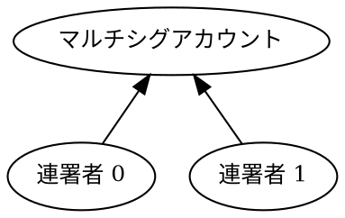

# マルチシグアカウントからトランザクションに署名する

このチュートリアルでは、[XEM](default:XEM) を 1、[アカウント](default:アカウント) からそのアカウント自身へ送信します。[XEM を送信する](../transactions/transfer-xem.md) チュートリアルと同じ流れです。

ただし今回は、送信元アカウントが [マルチシグアカウント](default:マルチシグアカウント)（_マルチシグ_ とも呼ばれます）なので、自分でトランザクションを開始したり署名したりできません。
代わりに、連署者アカウントに依存して、アカウントに代わってトランザクションを作成し、署名します。

このチュートリアルで使うマルチシグアカウントは **2-of-2** マルチシグとして設定されています。
連署者が 2 人いて、送金を承認するには両方の署名が必要です。

**連署者 0** が送金を開始し、**連署者 1** が必要な 2 つ目の連署を提供します。



!!! note "別の方法: WebSocket"

    このチュートリアルでは、連署者がノードを照会して保留中のトランザクションを見つけます。
    連署者にリアルタイムで通知する WebSocket ベースの方法については、[マルチシグトランザクションフローをリッスンする](../websockets/listen-multisig-transaction-flow.md) チュートリアルを参照してください。

## 前提条件 {: #prerequisites }

{# Early initialization so we can use the var() macro #}

{{ tutorial.code_full_tagged('devbook/transactions/sign_multisig', ['py', 'js'], show=false) }}

始める前に、次の準備をしてください。

* 開発環境をセットアップする。
    [開発環境のセットアップ](../start/setup.md) を参照してください。

* **2-of-2** マルチシグアカウントを作成する。
    作成するには、[マルチシグを設定する](../accounts/configure-multisig.md#enabling-the-multisig) チュートリアルで {{ tutorial.var('min_approval_delta') }} を `1` から `2` に変更して実行します。
    アカウントがすでに別の設定のマルチシグである場合は、まず [無効化](../accounts/configure-multisig.md#disabling-the-multisig) してください。

さらに、トランザクションのアナウンスと承認の方法を理解するため、[XEM を送信する](../transactions/transfer-xem.md) チュートリアルを確認してください。

## 完全なコード {: #full-code }

{{ tutorial.code_full_tagged('devbook/transactions/sign_multisig', ['py', 'js']) }}

## コードの説明 {: #code-explanation }

マルチシグアカウントに代わってトランザクションに署名するには、<ser:MultisigTransactionV1> にラップし、必要な連署を集めます。

このチュートリアルでは、ラップされるトランザクションは送金で、資金の出所であるマルチシグアカウントを署名者とします。
連署者 0 がラッパーに署名してアナウンスし、連署者 1 が 2 つ目の必要な連署を提供するまで、トランザクションは保留されます。

実際には、各連署者がそれぞれの秘密鍵だけを保持して、別のマシンで自分の処理を実行します。
このチュートリアルでは簡単にするため、両方の役割を 1 つのプログラムにまとめています。

コードでは、トランザクションをアナウンスして承認を待つ 2 つのヘルパー関数を定義します。
これらの動作の詳細については、[XEM を送信する](../transactions/transfer-xem.md) チュートリアルを参照してください。

### アカウントをセットアップする {: #setting-up-the-accounts }

{{ tutorial.code_snippet_tagged('step-1') }}

このチュートリアルでは、環境変数で設定する別々の 3 アカウントが必要です。
設定されていない場合は、デフォルト値を使用します。

| 環境変数 | デフォルト値 | 用途 |
| --- | --- | --- |
| `MULTISIG_PUBLIC_KEY` | `D656..ACF2` | 2-of-2 マルチシグアカウント |
| `COSIGNATORY0_PRIVATE_KEY` | `0000..0002` | 1 人目の連署者アカウント、**開始者** |
| `COSIGNATORY1_PRIVATE_KEY` | `0000..0003` | 2 人目の連署者アカウント |

各キーは 64 文字の 16 進数文字列です。

通常のアカウントとは異なり、マルチシグアカウントは自分でトランザクションを開始できません。
代わりに、連署者がアカウントに代わって署名します。
そのため、マルチシグアカウントの [秘密鍵](default:秘密鍵) は必要なく、アカウントの識別には [公開鍵](default:公開鍵) だけで十分です。

マルチシグアカウントには、トランザクション手数料を支払うために十分な資金が必要です。
デフォルト値を使用する場合、このアカウントにはすでに資金がある可能性があります。

上記のスニペットでは、後で使用するために各連署者の [キーペア](default:キーペア) と、マルチシグアカウントの [アドレス](default:アドレス) を導出して保存します。

### ネットワーク時刻を取得する {: #fetching-network-time }

{{ tutorial.code_snippet_tagged('step-2') }}

ネットワーク時刻は <get:/time-sync/network-time> から取得し、[XEM を送信する](../transactions/transfer-xem.md) チュートリアルで説明されている手順に従って、トランザクションの `timestamp` と `deadline` フィールドを導出します。

### トランザクションを構築する {: #building-the-transaction }

マルチシグトランザクションの内部にラップするトランザクションは [内部トランザクション](default:内部トランザクション) と呼ばれ、このチュートリアルで使う転送や、[マルチシグアカウントを設定する](../accounts/configure-multisig.md) で使う変更など、任意の [基本トランザクション](default:基本トランザクション) を指定できます。
マルチシグトランザクションを入れ子にすることはできません。

{{ tutorial.code_snippet_tagged('step-3') }}

内部の [転送トランザクション](default:転送トランザクション) には次のフィールドが含まれます。

* {{ tutorial.var('signer_public_key') }}: 資金を送るアカウント、つまりマルチシグアカウントの [公開鍵](default:公開鍵)。

* {{ tutorial.var('recipient_address') }}: この例では資金を送信者へ戻すため、受取人もマルチシグアカウントです。

* {{ tutorial.var('amount') }}: 1 [XEM](default:XEM) に相当する 1'000'000 原子単位。[XEM を送信する](../transactions/transfer-xem.md) チュートリアルで説明しています。

内部トランザクションには固有のトランザクション手数料があり、<dy:FeeCalculator.calculateTransactionFee> で計算します。
ここで送る 1 XEM の手数料は 0.05 XEM で、[送金手数料表](../../textbook/transfer_transactions.md#fees) に示されています。

{{ tutorial.code_snippet_tagged('step-4') }}

次に転送トランザクションを <ser:MultisigTransactionV1> にラップします。主なフィールドは次のとおりです。

* {{ tutorial.var('signer_public_key') }}: 今回は、トランザクションを開始する連署者の [公開鍵](default:公開鍵) です。

* {{ tutorial.var('inner_transaction') }}: ラップした転送トランザクション。<dy:TransactionFactory.toNonVerifiableTransaction> で変換し、独自の署名なしで埋め込めるようにします。

マルチシグラッパーにも 0.15 XEM の固有のトランザクション手数料があり、[手数料表](../../textbook/transactions.md#fee-schedule) に示されています。
トランザクションが承認されると、すべての手数料と送金額がマルチシグアカウントから差し引かれます。

### 開始者: マルチシグトランザクションをアナウンスする {: #initiator-announcing-the-multisig-transaction }

{{ tutorial.code_snippet_tagged('step-5') }}

この場合、連署者 0 がマルチシグトランザクションの開始者です。
トランザクションに署名してネットワークにアナウンスします。

有効であればネットワークはトランザクションを受け付けますが、まだ承認されていません。
マルチシグアカウントには 2 つの連署が必要なのに 1 つしか提供されていないため、不足している連署が到着するまでトランザクションは [未承認トランザクションプール](default:未承認トランザクションプール) で待機します。

!!! note "より簡単な設定"

    [マルチシグアカウントを設定する](../accounts/configure-multisig.md) チュートリアルで作成する 1-of-2 のように、連署が 1 つだけ必要なマルチシグでは、開始した連署者の署名だけで十分です。
    有効であれば、追加の手順なしでトランザクションが承認されます。

### 連署者: 保留中のトランザクションを取得する {: #cosignatory-retrieving-the-pending-transaction }

{{ tutorial.code_snippet_tagged('step-6') }}

ここで連署者 1 が処理を引き継ぎます。
連署者は <get:/account/unconfirmedTransactions> エンドポイントを使って、署名を待っている保留中のマルチシグトランザクションを見つけられます。

保留中の各マルチシグトランザクションのメタデータには **内部トランザクション** のハッシュが含まれ、連署が参照する値になります。

連署者は、承認を待っている保留中のマルチシグトランザクションを複数持つ可能性があります。
この例では、マルチシグアカウントが発行したトランザクションを選択します。
そのアカウントからの保留中トランザクションは 1 件だけであると想定し、連署者 1 はより正確に照合するための事前情報を持たないため、この方法でチュートリアルには十分です。

別の方法として、開始者がオフチェーンの経路で内部トランザクションのハッシュを他の連署者と共有できます。
連署者はそのハッシュを照合して、正確なトランザクションを選択できます。

ただし、実際のアプリケーションでは、発行アカウントだけでの絞り込みは不十分です。
保留中のトランザクションが期待したものだと保証するものはないため、連署するものを選ぶ前に、タイプ、受取人、金額など、保留中の各トランザクションの内容を確認してください。

!!! warning "連署する前に確認してください"

    連署する前に、必ずトランザクションの内容を確認してください。
    連署は拘束力があり、取り消すことはできません。

### 連署者: トランザクションに連署する {: #cosignatory-cosigning-the-transaction }

{{ tutorial.code_snippet_tagged('step-7') }}

連署者 1 は <ser:CosignatureV1> をアナウンスして、不足している署名を提供します。
連署には次の内容を指定します。

* {{ tutorial.var('signer_public_key') }}: 署名を提供する連署者の [公開鍵](default:公開鍵)。

* {{ tutorial.var('other_transaction_hash') }}: 前の手順で取得した内部転送トランザクションのハッシュ。

* {{ tutorial.var('multisig_account_address') }}: 署名が対象とするマルチシグアカウントの [アドレス](default:アドレス)。

連署の手数料は 0.15 XEM です。
マルチシグトランザクションが承認されると、この手数料もマルチシグアカウントから差し引かれます。

{{ tutorial.code_snippet_tagged('step-8') }}

次に連署者 1 が連署に署名してネットワークにアナウンスします。

アナウンスされた連署は、独立したトランザクションとして [未承認トランザクションプール](default:未承認トランザクションプール) に表示されません。
代わりに、ネットワークが保留中のマルチシグトランザクションへ付加します。

追加の連署が必要な設定では、トランザクションは保留されたままです。
もう一度 <get:/account/unconfirmedTransactions> を照会すれば、トランザクションの `signatures` フィールドで集まった署名を確認できます。

ただしこのチュートリアルでは、2 つ目の連署でトランザクションが完了します。トランザクションはプールを離れ、次のブロックで承認されます。

### 承認を待つ {: #waiting-for-confirmation }

{{ tutorial.code_snippet_tagged('step-9') }}

必要な連署がすべて集まると、マルチシグトランザクションは 1 つの単位として承認されます。

マルチシグトランザクションは、プロトコルの制約に違反すると拒否されます。
次の表に、よくあるエラーの原因をまとめます。

| エラーメッセージ | 考えられる原因 |
| --- | --- |
| `FAILURE_TRANSACTION_NOT_ALLOWED_FOR_MULTISIG` | マルチシグアカウント自身が送金をアナウンスしようとした。 |
| `FAILURE_MULTISIG_NOT_A_COSIGNER` | マルチシグトランザクションの署名者が連署者リストにない。 |
| `FAILURE_MULTISIG_NO_MATCHING_MULTISIG` | 連署が保留中のマルチシグトランザクションと一致しない、または署名者が連署者ではない。 |

## 出力 {: #output }

以下の出力は、プログラムを通常実行した場合の例です。

```text linenums="1" hl_lines="2-4 13 22 35 42 46 51"
--8<-- 'devbook/transactions/sign_multisig.log'
```

出力の要点は次のとおりです。

* **2～4 行目**: 関係するすべてのアカウントの公開鍵。
* **13 行目**（`signer_public_key`）: マルチシグトランザクションの署名者。
    連署者 0 と一致することに注意してください。
* **22 行目**（`signer_public_key`）: 内部転送トランザクションの署名者。
    マルチシグアカウントと一致することに注意してください。
* **35 行目**（`Inner transaction hash`）: ネットワークから取得した保留中の内部トランザクションのハッシュ。
* **42 行目**（`signer_public_key`）: 連署の署名者。
    連署者 1 と一致することに注意してください。
* **46 行目**（`other_transaction_hash`）: 連署が参照する内部トランザクションのハッシュ。
* **51 行目**: ネットワーク上でマルチシグトランザクションを一意に識別するハッシュ。

出力に表示されたマルチシグトランザクションのハッシュを使って、[NEM テストネットエクスプローラー](https://testnet.nem.fyi/) で承認済みトランザクションを検索できます。

## まとめ {: #conclusion }

このチュートリアルは、送信元アカウントとして [マルチシグアカウント](default:マルチシグアカウント) を使う点を除けば、[XEM を送信する](../transactions/transfer-xem.md) チュートリアルと機能的に同じです。

具体的には、次の方法を説明しました。

| 手順 | 関連ドキュメント |
| --- | --- |
| [送金をマルチシグトランザクションでラップする](#building-the-transaction) | <ser:MultisigTransactionV1>、<dy:TransactionFactory.toNonVerifiableTransaction> |
| [マルチシグトランザクションに署名する](#initiator-announcing-the-multisig-transaction) | <dy:NemFacade.signTransaction> |
| [保留中のトランザクションを見つける](#cosignatory-retrieving-the-pending-transaction) | <get:/account/unconfirmedTransactions> |
| [保留中のマルチシグトランザクションに連署する](#cosignatory-cosigning-the-transaction) | <ser:CosignatureV1> |
