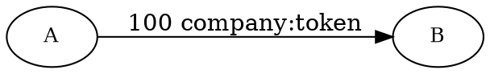

# 転送トランザクションでモザイクを送信する

[転送トランザクション](default:転送トランザクション) には、[XEM](default:XEM) の代わりに、または XEM と一緒に、他の [モザイク](default:モザイク) を含められます。

このチュートリアルでは、通常の [XEM 送信](./transfer-xem.md) と異なる部分に焦点を当て、モザイクを送信する方法を説明します。



この例では、テストネットに存在する `company:token` モザイクを 100 単位送信します。すでにいくらか保有しているデフォルトのテストアカウントを使います。
署名アカウントが十分な量を所有していれば、他のモザイクでも同じ流れを使えます。

## 前提条件 {: #prerequisites }

始める前に、次の準備をしてください。

* [開発環境をセットアップ](../start/setup.md) する。
* 転送トランザクションを送信する [アカウント](default:アカウント) を、[コード](../accounts/create-from-private-key.md) または [ウォレット](../../userbook/wallet/create-account.md) を使って作成する。
* トランザクション手数料と転送額を支払うための [XEM](default:XEM) を用意する。
    [フォーセットからテストネットの資金を取得する](../accounts/testnet-faucet.md) を参照してください。
* 送信する [モザイク](default:モザイク) を十分に保有する。

## 完全なコード {: #full-code }



{{ tutorial.code_full_tagged('devbook/transactions/transfer_mosaics', ['py', 'js']) }}

## コードの説明 {: #code-explanation }

署名、アナウンス、承認待ちは [XEM を送信する](./transfer-xem.md) チュートリアルと同じなので、ここでは説明しません。
以下では、異なる手順だけを説明します。

### アカウントをセットアップする {: #setting-up-the-accounts }

{{ tutorial.code_snippet_tagged('step-1') }}

すべてのモザイク転送には、**送信者** と **受取人** の 2 つのアカウントが関係します。

**送信者** は、トランザクションに署名して手数料を支払い、送信するモザイクを保有する [アカウント](default:アカウント) です。
秘密鍵は `SIGNER_PRIVATE_KEY` 環境変数から読み込みます。
指定されていない場合は、テスト用のキーをデフォルト値として使います。

**受取人** はモザイクを受け取るアカウントです。
その [アドレス](default:アドレス) は `RECIPIENT_ADDRESS` 環境変数から読み込みます。
指定されていない場合は、テスト用のアドレスをデフォルト値として使います。

デフォルトのテストアカウントには `company:token` があらかじめ資金提供されていますが、残高はチュートリアルの実行間で共有され、使い切る可能性があります。
残高不足で転送が失敗する場合は、`SIGNER_PRIVATE_KEY` をモザイクを保有するアカウントに設定してください。

### モザイクをセットアップする {: #setting-up-the-mosaic }

{{ tutorial.code_snippet_tagged('step-2') }}

送信するモザイクは `MOSAIC_ID` で指定します。これは `<namespace>:<mosaic_name>` 形式の [完全修飾名](../../textbook/mosaics.md#fully-qualified-name) で、デフォルト値は `company:token` です。
設定すれば、署名アカウントが所有する他のモザイクをチュートリアルで指定できます。

`QUANTITY` は、送信するモザイクの量を [全体単位](../../textbook/mosaics.md#divisibility) で指定する値で、デフォルトは 100 です。

### モザイク定義と供給量を取得する {: #fetching-the-mosaic-definition-and-supply }

{{ tutorial.code_snippet_tagged('step-3') }}

モザイクの [可分性](default:可分性) を使って転送量を [原子単位](../../textbook/mosaics.md#divisibility) に変換し、現在の供給量とともに手数料を決定します。
トランザクションを構築する前に、両方をノードから取得します。

* <get:/mosaic/definition> エンドポイントは、`divisibility` などのプロパティを含むモザイク定義を返します。
* <get:/mosaic/supply> エンドポイントは、現在の総供給量を [全体単位](../../textbook/mosaics.md#divisibility) で返します。

転送ごとにこれらの値を取得する必要はありません。
モザイクの可分性は作成時に固定され、供給量は供給量を可変として作成された場合だけ変化するため、アプリケーションは両方を一度取得してキャッシュし、必要に応じて供給量を更新できます。

### トランザクションを構築する {: #building-the-transaction }

{{ tutorial.code_snippet_tagged('step-4') }}

スニペットはまず、前の手順で取得した可分性を使って、`QUANTITY` を全体単位から原子単位へ変換します。

!!! note "全体単位から原子単位へ"

    作成時に設定され 0～6 の範囲を取るモザイクの `divisibility` は、次の変換を定義します。
    1 全体単位は 10^divisibility^ [原子単位](../../textbook/mosaics.md#divisibility) に相当します。

    ここで使う `company:token` モザイクの可分性は 0 なので、10^0^ = 1 であり、`QUANTITY` 100 は 100 原子単位としてエンコードされます。

    一方、可分性が 2 のモザイクでは、1 全体単位あたり 10^2^ = 100 原子単位です。そのため同じ `QUANTITY` 100 は 10'000 原子単位としてエンコードされます。

次にスニペットは、最大 10 件を指定できる `mosaics` フィールドを含むトランザクションのディスクリプタから <ser:TransferTransactionV2> を作成します。
各エントリでは、モザイクと送信量を指定します。

* モザイクを所有する [ネームスペース](default:ネームスペース)。
* モザイク名。
* モザイクの **原子単位** で指定する数量（上で計算済み）。

モザイクを付加すると、最上位の `amount` は [XEM の金額](../../textbook/transfer_transactions.md#xem-amount) ではなくなります。
列挙したすべてのモザイクに適用する乗数になり、`1_000_000` は係数 1 を表します。
`amount` を `1_000_000` に設定すると、各モザイクをエントリに指定した数量で送信します。
ファサードは署名者を追加し、2 時間のデッドライン期間からタイムスタンプとデッドラインを導出します。

!!! info "他のモザイクと一緒に XEM を送信する"

    最上位の `amount` は XEM を送るのではなく、乗数として機能します。
    別のモザイクと同時に XEM を送るには、`mosaics` 配列に `nem:xem` エントリを追加します。
    その数量は、送信する XEM の原子単位で指定します。

### トランザクション手数料を計算する {: #calculating-the-transaction-fee }

{{ tutorial.code_snippet_tagged('step-5') }}

モザイク転送の手数料は、各モザイクの供給量、可分性、転送する数量によって決まります。
NEM の固定手数料表を手動で実装する代わりに、スニペットは SDK の <dy:FeeCalculator.calculateTransactionFee> ヘルパーを呼び出します。

ヘルパーは前の手順で構築したトランザクションから転送数量を直接読み取り、トランザクションに保存されない値なので、各モザイクの `supply`（[全体単位](../../textbook/mosaics.md#divisibility)）と `divisibility` を 2 つ目の引数として受け取ります。

返された手数料は、署名前に `transaction.fee` へ割り当てます。

計算の完全なルールについては、[手数料](../../textbook/transfer_transactions.md#fees) セクションを参照してください。

### 署名、アナウンス、承認待ち {: #signing-announcing-and-waiting-for-confirmation }

これらの手順は [XEM を送信する](./transfer-xem.md) 場合と同じなので、ここでは詳しく説明しません。

!!! warning "徴収手数料付きモザイク"

    一部のモザイクには [徴収手数料](default:徴収手数料（levy）) があり、そのモザイクを転送するたびに、トランザクション手数料に加えて第三者アカウントへ追加手数料が支払われます。
    送信者のアカウントは、徴収手数料用モザイク（転送するモザイクとは異なる場合があります）を支払えるだけ保有していなければ、トランザクションが拒否されます。

## 出力 {: #output }

以下は、プログラムの実行時の出力例です。

```text linenums="1" hl_lines="6 16 19 20-27"
--8<-- 'devbook/transactions/transfer_mosaics.log'
```

通常の XEM 転送と異なる部分に焦点を当てた、出力の要点は次のとおりです。

* **定義と供給量**（6 行目）: 可分性（`0`）と現在の供給量（`1000000`）を持つ `company:token` モザイク。数量を原子単位へ変換し、手数料を計算するために取得します。
* **トランザクション手数料**（16 行目）: モザイクの供給量、可分性、転送量から導出した `350000` 原子単位（`0.35` XEM）。
* **乗数としての amount**（19 行目）: モザイクを付加すると、`amount` は XEM の金額ではなく `1000000`（係数 1）になります。
* **モザイク配列**（20～27 行目）: 転送に含まれるモザイク。ここでは数量 `100` のエントリ 1 件です。
    ネームスペースと名前はアドレスと同じように 16 進数でエンコードされるため、`636F6D70616E79` と `746F6B656E` は `company` と `token` にデコードされます。

ネットワーク側からトランザクションを確認するには、[NEM テストネットエクスプローラー](https://testnet.nem.fyi/) でトランザクションハッシュを検索できます。
ハッシュは `Transaction hash:` で始まる行に出力されます。

## まとめ {: #conclusion }

このチュートリアルでは、次の方法を説明しました。

| 手順 | 関連ドキュメント |
| --- | --- |
| [モザイクの可分性を取得する](#fetching-the-mosaic-definition-and-supply) | <get:/mosaic/definition> |
| [モザイクの供給量を取得する](#fetching-the-mosaic-definition-and-supply) | <get:/mosaic/supply> |
| [モザイク転送を構築する](#building-the-transaction) | <dy:NemFacade.createTransactionFromTypedDescriptor>、<ser:TransferTransactionV2> |
| [トランザクション手数料を計算する](#calculating-the-transaction-fee) | <dy:FeeCalculator.calculateTransactionFee> |
