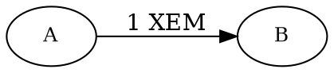

# 転送トランザクションで XEM を送信する

ある [アカウント](default:アカウント) から別のアカウントへ [XEM](default:XEM) を送信することは、NEM ブロックチェーンで最も基本的な操作です。他の種類の [トランザクション](default:トランザクション) も、同じ一般的なパターンに従います。



このチュートリアルでは、2 つのアカウント間で 1 XEM を送信する [転送トランザクション](default:転送トランザクション) を作成、署名、アナウンスし、承認されるまでトランザクションのステータスをポーリングする方法を説明します。

## 前提条件 {: #prerequisites }

始める前に、次の準備をしてください。

* [開発環境をセットアップ](../start/setup.md) する。
* 転送トランザクションを送信する [アカウント](default:アカウント) を、[コード](../accounts/create-from-private-key.md) または [ウォレット](../../userbook/wallet/create-account.md) を使って作成する。
* トランザクション手数料と転送額を支払うための [XEM](default:XEM) を用意する。
    [フォーセットからテストネットの資金を取得する](../accounts/testnet-faucet.md) を参照してください。

## 完全なコード {: #full-code }



{{ tutorial.code_full_tagged('devbook/transactions/transfer_xem', ['py', 'js']) }}

コード全体を 1 つの `try` ブロックでラップして簡単なエラー処理を行いますが、アプリケーションではより細かな制御が必要になる場合があります。

## コードの説明 {: #code-explanation }

### アカウントをセットアップする {: #setting-up-the-accounts }

{{ tutorial.code_snippet_tagged('step-1') }}

すべての転送トランザクションには、**送信者** と **受取人** の 2 つのアカウントが関係します。

**送信者** は、トランザクションに署名して手数料を支払う [アカウント](default:アカウント) です。
秘密鍵は `SIGNER_PRIVATE_KEY` 環境変数から読み込みます。
指定されていない場合は、テスト用のキーをデフォルト値として使います。

**受取人** は XEM を受け取るアカウントです。
その [アドレス](default:アドレス) は `RECIPIENT_ADDRESS` 環境変数から読み込みます。
指定されていない場合は、テスト用のアドレスをデフォルト値として使います。

### 送金額を定義する {: #defining-the-transfer-amount }

{{ tutorial.code_snippet_tagged('step-2') }}

スニペットでは、`XEM_AMOUNT` 環境変数から数値として読み込んだ送金額を、`xem` 変数に定義します。
指定されていない場合は、デフォルト値として 1 XEM を使います。

トランザクションの `amount` フィールドには、XEM 単位ではなく [原子単位](../../textbook/mosaics.md#divisibility) が必要です。
XEM の [可分性](default:可分性) は 6 なので、1 XEM は 100 万原子単位です。
スニペットでは `xem` に 1'000'000 を掛けて `amount` を導出します。

### ネットワーク時刻を取得する {: #fetching-network-time }

{{ tutorial.code_snippet_tagged('step-3') }}

NEM のすべてのトランザクションには 2 つの時刻フィールドがあり、どちらも [ネットワーク時刻](default:ネットワーク時刻) で表します。これは NEM のネメシスブロックからの経過秒数です。

* `timestamp`: トランザクションが作成された時点。ここでは現在のネットワーク時刻を設定します。
* `deadline`: トランザクションを破棄する前に、ネットワークが承認を試み続ける期間。
    タイムスタンプより後の時間で、[24 時間](../../textbook/transactions.md#common-transaction-structure) 以内でなければなりません。
    範囲外の時間を指定した場合、ノードはトランザクションを拒否します。
    この例では、範囲内であるタイムスタンプの 2 時間後に設定します。

送金のトランザクションを構築するには正確なネットワーク時刻が必要です。
<get:/time-sync/network-time> エンドポイントは、ノードの現在のネットワーク時刻を返します。
ノードはこの値をミリ秒で返すため、コードでは 1000 で割って、トランザクションが必要とする秒数を取得します。

ただし、アプリケーションがトランザクションごとにネットワーク時刻を照会する必要はありません。
一度取得した後、必要に応じてローカルシステムの時計を使って調整できます。
これにより、正確さと性能のバランスが取れます。

コードは秒数を SDK の <dy:NetworkTimestamp> クラスでラップして `timestamp` を取得し、<dy:NetworkTimestamp.addHours> ヘルパーで `deadline` を導出します。

### トランザクションを構築する {: #building-the-transaction }

{{ tutorial.code_snippet_tagged('step-4') }}

スニペットは、転送トランザクションのプロパティを指定するディスクリプタを使って <dy:TransactionFactory.create> を呼び出します。

* {{ tutorial.var('type') }}: このチュートリアルでは、現在の送金バージョンである <ser:TransferTransactionV2> を使用します。XEM と他の [モザイク](default:モザイク) の両方を送信できます。
    ここではモザイクを付加しないため、トランザクションは XEM だけを送信します。

* {{ tutorial.var('signer_public_key') }}: 署名者は手数料を支払うアカウントです。
    転送トランザクションでは、送られる XEM の送信元でもあります。

* {{ tutorial.var('timestamp') }} と {{ tutorial.var('deadline') }}: ネットワーク時刻の手順で計算した値。

* {{ tutorial.var('recipient_address') }}: XEM を受け取るアドレス。

* {{ tutorial.var('amount') }}: 前の手順で計算した原子単位の数量。1 XEM の場合は `1_000_000` です。

!!! info "モザイクまたはメッセージを送信する"

    <ser:TransferTransactionV2> は、XEM の代わりに他の [モザイク](default:モザイク) を送信したり、メッセージを含めたりできます。それぞれの場合で手数料の計算方法は異なります。
    詳細については、[モザイクを送信する](./transfer-mosaics.md) と [メッセージ付きで送信する](./messages.md) チュートリアルを参照してください。

### トランザクション手数料を計算する {: #calculating-the-transaction-fee }

{{ tutorial.code_snippet_tagged('step-5') }}

すべてのトランザクションは、ブロックに含める [ハーベスターアカウント](default:ハーベスターアカウント) に手数料を支払います。

NEM の [固定手数料表](../../textbook/transfer_transactions.md#fees) を手動で実装する代わりに、スニペットは SDK の <dy:FeeCalculator.calculateTransactionFee> ヘルパーを呼び出します。このヘルパーは、前の手順で構築したトランザクションから XEM の金額を直接読み取ります。

返された手数料は、署名前に `transaction.fee` へ割り当てます。
手数料は少額の場合 0.05 XEM から始まり、送信する XEM に応じて増加し、最大 1.25 XEM で上限になります。

### 署名してシリアライズする {: #signing-and-serializing }

{{ tutorial.code_snippet_tagged('step-6') }}

トランザクションを作成したら、署名アカウントの秘密鍵で署名する必要があります。
署名により、トランザクションが本物であり、送信者によって承認されたことを保証します。

<dy:NemFacade.signTransaction> は [署名](default:署名) を返します。
<dy:TransactionFactory.attachSignature> は署名をトランザクションに追加し、ノードへ直接送信してアナウンスできる JSON ペイロードにシリアライズします。

### トランザクションをアナウンスする {: #announcing-the-transaction }

{{ tutorial.code_snippet_tagged('step-7') }}

署名済みペイロードは、任意の NEM [ノード](default:ノード) の <post:/transaction/announce> エンドポイントに送信します。

ノードはアナウンスされるとすぐにトランザクションを検証し、結果をレスポンスで返します。
`SUCCESS` はトランザクションが最初のチェックに合格し、[未承認トランザクションプール](default:未承認トランザクションプール) に追加されたことを意味します。
それ以外の結果はノードが受け付けなかったことを意味し、例えばアカウントが金額と手数料をカバーできる XEM を保有していないなど、その理由をレスポンスメッセージで説明します。

!!! warning "未承認トランザクションを信頼しないでください"

    `SUCCESS` の結果は、トランザクションが未承認プールに到達したことだけを意味します。
    ブロックに含まれることはまだ保証されていません。
    [承認](#waiting-for-confirmation) されるまで、できれば [書き換え制限](default:書き換え制限) を過ぎるまで待ってから信頼してください。

### 承認を待つ {: #waiting-for-confirmation }

{{ tutorial.code_snippet_tagged('step-8') }}

上記のスニペットは、アナウンスしたトランザクションのハッシュを使って <get:/transaction/get> エンドポイントを繰り返し照会します。

!!! note "ポーリングと WebSocket"

    この手順ではポーリングでトランザクションが承認されたか確認します。
    ポーリングは説明のために使用していますが、実際のアプリケーションに推奨される方法ではありません。

    [WebSocket](../websockets/listen-transaction-flow.md) を使えば、API を繰り返し呼び出すオーバーヘッドなしに、より応答性の高い解決策を実現できます。

トランザクションが未承認の間、エンドポイントはエラーを返します。コードは 1 秒待ってから再試行し、最大 120 回（約 2 分）繰り返します。

トランザクションがブロックに含まれると、エンドポイントはブロックの高さとともにトランザクションを返し、ループは終了します。

NEM はおよそ 1 分に 1 ブロックを生成するため、通常、承認には数秒から数分かかります。

## 出力 {: #output }

以下は、プログラムの実行時の出力例です。

```text linenums="1" hl_lines="11 13 15 16 17 20 21 34"
--8<-- 'devbook/transactions/transfer_xem.log'
```

出力の要点は次のとおりです。

* **署名者の公開鍵**（11 行目）: トランザクションに署名して XEM を送るアカウント。
* **トランザクション手数料**（13 行目）: `50000` 原子単位（`0.05` XEM）。デフォルトの 1 XEM を送る手数料です。
* **受取人アドレス**（15 行目）: XEM を受け取るアカウント。
    これは同じ `RECIPIENT_ADDRESS` ですが、NEM のトランザクション形式では Base32 テキストの各文字を 16 進数の ASCII コードとしてエンコードするため、見た目が異なります。そのため `5442...` は `TBUL...` にデコードされます（`54` は `T`、`42` は `B` など）。
* **転送額**（16 行目）: `1000000` 原子単位で、1 XEM に相当します。
* **モザイクなし**（17 行目）: モザイク配列が空なので、トランザクションは XEM だけを送信します。
* **アナウンス結果**（20 行目）: `SUCCESS` はノードがトランザクションを未承認プールに受け入れたことを意味します。
* **トランザクションハッシュ**（21 行目）: ネットワーク上でトランザクションを一意に識別するハッシュ。
* **承認**（34 行目）: トランザクションがブロック `626588` に含まれています。

`pending` のチェック回数は、次のブロックがハーベスティングされるまでの時間によって変わるため、実行ごとに異なります。

ネットワーク側からトランザクションを確認するには、[NEM テストネットエクスプローラー](https://testnet.nem.fyi/) でトランザクションハッシュを検索できます。
ハッシュは `Waiting for confirmation from /transaction/get?hash=...` と表示される行に出力されます。

## まとめ {: #conclusion }

このチュートリアルでは、次の方法を説明しました。

| 手順 | 関連ドキュメント |
| --- | --- |
| [ネットワーク時刻を取得する](#fetching-network-time) | <get:/time-sync/network-time>、<dy:NetworkTimestamp> |
| [トランザクションを構築する](#building-the-transaction) | <dy:TransactionFactory.create>、<ser:TransferTransactionV2> |
| [トランザクション手数料を計算する](#calculating-the-transaction-fee) | <dy:FeeCalculator.calculateTransactionFee> |
| [トランザクションに署名する](#signing-and-serializing) | <dy:NemFacade.signTransaction><br/><dy:TransactionFactory.attachSignature> |
| [トランザクションをアナウンスする](#announcing-the-transaction) | <post:/transaction/announce> |
| [承認を待つ](#waiting-for-confirmation) | <get:/transaction/get> |

他のほとんどの NEM トランザクションタイプも、同じ方法で作成、署名、アナウンスします。
