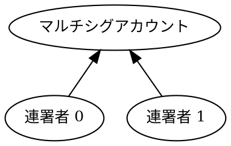

# マルチシグトランザクションフローをリッスンする

[マルチシグアカウント](default:マルチシグアカウント) からのトランザクションは、通常のトランザクションより複雑なライフサイクルをたどります。
アナウンスされた後、ネットワークがアカウントの連署者から必要な連署を集める間、[未承認トランザクションプール](default:未承認トランザクションプール) で待機します。
すべての連署が届いた後で初めて、トランザクションは [ブロック](default:ブロック) で承認されます。

このチュートリアルでは、[マルチシグアカウントからトランザクションに署名する](../transactions/sign-multisig.md) チュートリアルの送金を再現しますが、ポーリングの代わりに [WebSocket](../reference/websockets/index.md) チャネルを使って、マルチシグのライフサイクル全体を監視します。

このチュートリアルで使うマルチシグアカウントは **2-of-2** マルチシグとして設定されています。
連署者が 2 人いて、送金を承認するには両方の署名が必要です。



連署者 0 がマルチシグトランザクションを構築してアナウンスし、連署者 1 がマルチシグアカウントの WebSocket チャネルをサブスクライブして連署し、承認を待ちます。

!!! note "別の方法: ポーリング"

    連署者がノードを照会して承認待ちのトランザクションを見つけるポーリングの方法については、[マルチシグアカウントからトランザクションに署名する](../transactions/sign-multisig.md) チュートリアルを参照してください。

## 前提条件 {: #prerequisites }

{# Early initialization so we can use the var() macro #}

{{ tutorial.code_full_tagged('devbook/transactions/sign_multisig', ['py', 'js'], show=false) }}

始める前に、次の準備をしてください。

* 開発環境をセットアップする。
  [開発環境のセットアップ](../start/setup.md) を参照してください。

* **2-of-2** マルチシグアカウントを作成する。
    作成するには、[マルチシグを設定する](../accounts/configure-multisig.md#enabling-the-multisig) チュートリアルで {{ tutorial.var('min_approval_delta') }} を `1` から `2` に変更して実行します。
    アカウントがすでに別の設定のマルチシグである場合は、まず [無効化](../accounts/configure-multisig.md#disabling-the-multisig) してください。

さらに、NEM は [SockJS](https://github.com/sockjs/sockjs-client) 上で [STOMP](https://stomp.github.io/) メッセージングプロトコルを使って WebSocket を提供するため、STOMP クライアントと WebSocket トランスポートが必要です。

=== ":simple-python: Python"

    `stomper` と `websockets` ライブラリをインストールします。

    ```bash
    pip install stomper websockets
    ```

=== ":simple-javascript: JavaScript"

    `@stomp/stompjs` と `sockjs-client` ライブラリをインストールします。

    ```bash
    npm install @stomp/stompjs sockjs-client
    ```

接続プロトコルの詳細については、[WebSocket リファレンス](../reference/websockets/index.md) を参照してください。

## 完全なコード {: #full-code }



{{ tutorial.code_full_tagged('devbook/websockets/listen_multisig_transaction_flow', ['py', 'js']) }}

スニペットでは、`NODE_URL` 環境変数を使って NEM [ノード](default:ノード) を指定します。
値が指定されていない場合は、デフォルト値を使用します。

`WS_URL` は同じノードの WebSocket エンドポイントを定義します。
`NODE_URL` のポート `7890`（デフォルトの HTTP API ポート）を `7778`（デフォルトの NIS WebSocket ポート）に置き換えて導出します。

!!! note "Python の SockJS ヘルパー"

    Python 用の SockJS クライアントライブラリはないため、便宜上、ファイルの先頭に小さなヘルパーメソッドをいくつか定義しています。

## コードの説明 {: #code-explanation }

マルチシグトランザクションには 2 つの異なる役割があります。マルチシグトランザクションを構築、署名、アナウンスする **開始者**（連署者 0）と、WebSocket チャネルを監視してトランザクションを確認した後に連署する 1 人以上の **連署者**（このチュートリアルでは連署者 1）です。
マルチシグアカウントの連署者なら、どちらの役割も担当できます。

実際には、各役割を別々のマシン上の別々のプログラムで実行し、それぞれ自分の秘密鍵だけを保持します。
このチュートリアルでは簡単にするため、両方の役割を 1 つのスクリプトにまとめています。

### アカウントをセットアップする {: #setting-up-the-accounts }

{{ tutorial.code_snippet_tagged('step-1') }}

このチュートリアルでは、環境変数で設定する別々の 3 アカウントが必要です。
設定されていない場合は、デフォルト値を使用します。

| 環境変数 | デフォルト値 | 用途 |
| --- | --- | --- |
| `MULTISIG_PUBLIC_KEY` | `D656..ACF2` | 2-of-2 マルチシグアカウント |
| `COSIGNATORY0_PRIVATE_KEY` | `0000..0002` | 1 人目の連署者、**開始者** |
| `COSIGNATORY1_PRIVATE_KEY` | `0000..0003` | 2 人目の連署者 |

各キーは 64 文字の 16 進数文字列です。

通常のアカウントとは異なり、マルチシグアカウントは自分でトランザクションを開始できません。
代わりに、連署者がアカウントに代わって署名します。
そのため、マルチシグアカウントの [秘密鍵](default:秘密鍵) は必要なく、アカウントの識別には [公開鍵](default:公開鍵) だけで十分です。

マルチシグアカウントには、トランザクション手数料を支払うために十分な資金が必要です。
デフォルト値を使用する場合、このアカウントにはすでに資金がある可能性があります。

上記のスニペットでは、後で使用するために各連署者の [キーペア](default:キーペア) とマルチシグアカウントの [アドレス](default:アドレス) を導出して保存します。
後でサブスクライブする WebSocket チャネルは、このアドレスに対応付けられます。

### 開始者: マルチシグトランザクションを構築する {: #initiator-building-the-multisig-transaction }

{{ tutorial.code_snippet_tagged('step-2') }}

連署者 0 はネットワーク時刻を取得し、マルチシグアカウントから自身へ 1 [XEM](default:XEM) を送る [内部トランザクション](default:内部トランザクション) を構築し、<ser:MultisigTransactionV1> にラップして署名します。
実装は、[マルチシグアカウントからトランザクションに署名する](../transactions/sign-multisig.md#building-the-transaction) チュートリアルで説明したパターンに従います。

トランザクションは準備されますが、まだ [アナウンス](#initiator-announcing-the-multisig-transaction) されません。
チャネルのサブスクリプションを確立した後でアナウンスするため、結果の通知を取り逃しません。

### 連署者: WebSocket に接続する {: #cosignatory-connecting-to-the-websocket }

{{ tutorial.code_snippet_tagged('step-3') }}

連署者 1 は `WS_URL` の `/w/messages` エンドポイントへ SockJS 接続を開き、その上で [STOMP セッション](<default:STOMP セッション>) を開始します。

### 連署者: チャネルをサブスクライブする {: #cosignatory-subscribing-to-the-channels }

{{ tutorial.code_snippet_tagged('step-4') }}

連署者 1 は、[トランザクションフローをリッスンする](./listen-transaction-flow.md) チュートリアルで使った、アドレスに対応付けられた同じ 3 チャネルをサブスクライブします。

* <ws:account&#47;{address}>: アドレスを含む [ブロック](default:ブロック) が承認されると、アカウントの現在の状態を通知します。
* <ws:unconfirmed&#47;{address}>: アドレスに関係するトランザクションが [未承認トランザクションプール](default:未承認トランザクションプール) に入り、ブロックへの包含を待つ状態になると通知します。
* <ws:transactions&#47;{address}>: アドレスに関係するトランザクションが [ブロック](default:ブロック) に含まれると通知します。

サブスクリプションには `id-0`、`id-1`、`id-2` を使います。プログラムが最後にサブスクライブを解除するときに、それぞれを識別します。

マルチシグではない場合と異なり、チャネルは **連署者アカウント** ではなく **マルチシグアカウント** の活動を監視します。

ノードが通知するのは、開始した連署者と内部トランザクションに関係するアカウントだけだからです。この例では連署者 0 とマルチシグアカウントです。
連署者 1 のように承認を待つ連署者は、自分のアドレスでは通知を受け取らないため、代わりにマルチシグアカウントのアドレスをサブスクライブする必要があります。

!!! note "メッセージ処理の違い"

    JavaScript では、各チャネルを専用のハンドラー関数でサブスクライブします。関数は下の [連署](#cosignatory-cosigning-the-pending-transaction) と [承認](#cosignatory-waiting-for-confirmation) の手順で定義します。
    Python では、接続から到着したメッセージを順番に読み取ります。

3 つのチャネルは、次の手順でアドレスを登録するまで何も送信しません。

### 連署者: マルチシグアカウントを登録する {: #cosignatory-registering-the-multisig-account }

{{ tutorial.code_snippet_tagged('step-5') }}

アカウントのチャネルから通知を受け取るには、まずアドレスをノードに **登録** する必要があります。

コードは <req:w&#47;api&#47;account&#47;get> にリクエストを送信します。マルチシグアドレスを登録するとともに、<ws:account&#47;{address}> チャネルでアカウントの現在の状態を送信するようノードに要求します。

コードは最初のアカウント通知を待ち、登録が有効になったことを確認します。
通知は [AccountMetaDataPair](../reference/rest/nem.md#model/AccountMetaDataPair) スキーマに従います。

### 開始者: マルチシグトランザクションをアナウンスする {: #initiator-announcing-the-multisig-transaction }

{{ tutorial.code_snippet_tagged('step-6') }}

!!! warning "チャネルをサブスクライブしてからアナウンスしてください"

    リスナーの準備ができていることを確実にするため、トランザクションは必ず WebSocket チャネルをサブスクライブした**後**にアナウンスしてください。
    そうしないと、WebSocket がリッスンする前に通知が届く可能性があります。

    例えばアナウンス後にサブスクライブしたため通知を取り逃した連署者でも、<get:/account/unconfirmedTransactions> をポーリングして承認待ちのトランザクションを見つけることはできます。

連署者 1 がサブスクライブしたら、連署者 0 は <post:/transaction/announce> エンドポイントへマルチシグトランザクションをアナウンスし、結果を確認します。
ノードが拒否した場合は、拒否理由を表示して停止します。

有効であればネットワークはトランザクションを受け付けますが、まだ承認されていません。
マルチシグアカウントには 2 つの連署が必要なのに 1 つしか提供されていないため、不足している連署が到着するまでトランザクションは [未承認トランザクションプール](default:未承認トランザクションプール) で待機します。

### 連署者: 承認待ちのトランザクションに連署する {: #cosignatory-cosigning-the-pending-transaction }

{{ tutorial.code_snippet_tagged('step-7') }}

承認待ちのマルチシグトランザクションは、[TransactionMetaDataPair](../reference/rest/nem.md#model/TransactionMetaDataPair) として <ws:unconfirmed&#47;{address}> チャネルに届きます。
マルチシグトランザクションでは、`meta` フィールドに追加の `innerHash` フィールドが含まれ、**内部トランザクション** のハッシュ、つまり連署が参照する値を保持します。

連署者は、承認待ちのマルチシグトランザクションを複数持つ可能性があります。
この例では、マルチシグアカウントが発行したトランザクションを選択します。
そのアカウントからの承認待ちトランザクションは 1 件だけであると想定するため、チュートリアルにはこれで十分です。

ただし、実際のアプリケーションでは、このフィルターだけでは不十分です。
承認待ちのトランザクションが期待したものだと保証するものはないため、連署するものを選ぶ前に、タイプ、受取人、金額など、承認待ちの各トランザクションの内容を確認してください。

!!! warning "連署する前に確認してください"

    連署する前に、必ずトランザクションの内容を確認してください。
    連署は拘束力があり、取り消すことはできません。
    完全なマルチシグトランザクションは通知の `transaction` フィールドで確認できます。

{{ tutorial.code_snippet_tagged('step-8') }}

コードは次に、内部トランザクションのハッシュとマルチシグアカウントのアドレスを参照する <ser:CosignatureV1> を構築し、連署者 1 のキーで署名して、<post:/transaction/announce> エンドポイントを使ってアナウンスします。

### 連署者: 承認を待つ {: #cosignatory-waiting-for-confirmation }

{{ tutorial.code_snippet_tagged('step-9') }}

アナウンスした連署は独立したトランザクションとして [未承認トランザクションプール](default:未承認トランザクションプール) に表示されないため、独自の通知は発生しません。
代わりにネットワークが承認待ちのマルチシグトランザクションに付加し、<ws:unconfirmed&#47;{address}> チャネルで新しい通知が発生します。
この更新は連署が追加されたことだけを示すため、コードは無視します。

マルチシグトランザクションに追加の連署が必要なら、必要な連署がすべて集まるまで未承認プールに残ります。
このチュートリアルでは 2 つ目の連署で要件を満たすため、トランザクションは未承認プールを離れ、有効であれば次のブロックで承認されます。

承認は <ws:transactions&#47;{address}> チャネルに届きます。
内部送金の送信者と受取人がどちらもマルチシグアカウントなので、この通知は役割ごとに 1 回、合計 2 回配信されます。
コードは両方の通知を表示しますが、承認は 1 回だけ報告します。

トランザクションを含むブロックは、アカウントの更新後の状態を持つ <ws:account&#47;{address}> チャネルの最後の通知も発生させます。
この最後の通知が届くと、プログラムは後片付けの手順へ進みます。

### 連署者: チャネルのサブスクライブを解除する {: #cosignatory-unsubscribing-from-channels }

{{ tutorial.code_snippet_tagged('step-10') }}

承認後、連署者 1 は 3 つのチャネルのサブスクライブを解除し、接続を閉じる前に STOMP セッションを終了します。

## 出力 {: #output }

```text linenums="1" hl_lines="2-4 5 6 7-9 11 12 14 16 18 19"
--8<-- 'devbook/websockets/listen_multisig_transaction_flow.log'
```

出力には次の内容が表示されます。

* **アカウント**（2～4 行目）: マルチシグアカウントのアドレスと、両方の連署者の公開鍵。
* **構築**（5 行目）: 連署者 0 がマルチシグトランザクションを構築して署名します。
* **接続**（6 行目）: ノードのポート `7778` の WebSocket エンドポイント上で STOMP セッションが確立されます。
* **サブスクリプション**（7～9 行目）: マルチシグアカウントのアドレスに対応付けられた 3 チャネルをサブスクライブします。
* **登録**（11 行目）: マルチシグアカウントの現在の状態がアカウントチャネルに届き、登録を確認します。
* **アナウンス**（12 行目）: 連署者 0 がマルチシグトランザクションをアナウンスします。
* **連署**（13～14 行目）: 内部トランザクションハッシュを含む承認待ちのマルチシグトランザクションが未承認チャネルに届き、連署者 1 が連署をアナウンスします。
* **承認**（15～17 行目）: 完了したトランザクションがブロックで承認されます。内部送金の送信者と受取人がどちらもマルチシグアカウントなので、通知は 2 回届きます。
* **アカウント更新**（18 行目）: トランザクションを含むブロックが最後のアカウント通知を発生させます。送信した 1 XEM が送信者へ戻るため、残高は [手数料](../../textbook/transactions.md#fee-schedule) の 0.35 XEM だけ減ります。
* **サブスクライブ解除**（19 行目）: コードが 3 つのチャネルのサブスクライブを解除します。

## まとめ {: #conclusion }

このチュートリアルでは、次の方法を説明しました。

| 手順 | 関連ドキュメント |
| --- | --- |
| [マルチシグアカウントのチャネルをサブスクライブする](#cosignatory-subscribing-to-the-channels) | <ws:account&#47;{address}><br/><ws:unconfirmed&#47;{address}><br/><ws:transactions&#47;{address}> |
| [マルチシグアカウントを登録する](#cosignatory-registering-the-multisig-account) | <req:w&#47;api&#47;account&#47;get> |
| [承認待ちのマルチシグメッセージを処理する](#cosignatory-cosigning-the-pending-transaction) | [TransactionMetaDataPair](../reference/rest/nem.md#model/TransactionMetaDataPair) |
| [未承認通知に対して連署する](#cosignatory-cosigning-the-pending-transaction) | <ser:CosignatureV1> |
