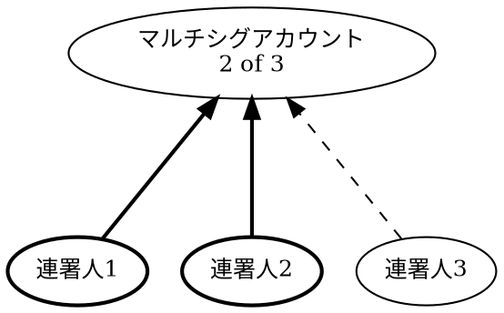

# アカウント

アカウント
:   暗号資産や [NFT](default:NFT) などのデジタル資産を安全に保管する場所です。
    従来の銀行における貸金庫に似た役割を果たします。

ブロックチェーンでは、アカウントは [キーペア](default:キーペア) によって保護されます。秘密鍵を使うことでのみアカウントから資産を **送金** でき、公開鍵を共有することで自由に **受け取る** ことができます。

公開鍵は利便性のため通常 [アドレス](default:アドレス) として共有され、「アカウント」と「アドレス」は同義語として使われます。

アカウントはデジタル資産を管理するだけでなく、秘密鍵の所有権を表し、デジタルアイデンティティとしての役割も果たします。
ブロックチェーン上では、アカウントはトランザクションの承認、権限設定、[コンセンサス](default:コンセンサス) への参加が可能です。

!!! note "アカウントのライフサイクル"

    アカウントは、たとえば資産を受け取るなど、ブロックチェーンと初めてやり取りした時点で有効になります。
    有効になる前は、アカウントに関する情報はチェーン上に記録されず、ブロックエクスプローラーにも表示されません。

    一度有効化されたアカウントは資産をすべて引き出すことはできますが、ブロックチェーンから削除することはできません。

## ニーモニック {: #mnemonics }

ニーモニックフレーズ
:   [秘密鍵](default:秘密鍵) を人間が読みやすい形で表したもので、通常は12個または24個のランダムな単語のリストとして表示されます。

一般的に「ニーモニック」とも呼ばれ、[HDウォレット](default:HDウォレット) でアカウントを作成または復元する際によく使用されます。

NEM は、24個の英単語を必要とする [BIP-39](https://github.com/bitcoin/bips/blob/master/bip-0039.mediawiki) 標準に準拠しています。

!!! warning "ニーモニックは秘密鍵と同様に扱ってください"

    ニーモニックフレーズにアクセスできると、そこから生成されたすべてのアカウントに完全にアクセスできます。
    決して共有せず、暗号化されていないデジタル形式で保存しないでください。

## ウォレット {: #wallets }

ウォレット
:   NEM アカウントを管理し、[トランザクション](default:トランザクション) を開始して署名するためのアプリケーションです。

[秘密鍵](default:秘密鍵) または [ニーモニックフレーズ](default:ニーモニックフレーズ) を保管し、それらを使ってトランザクションに署名します。
より広い意味では、ブロックチェーンを探索して操作するためのツールを提供します。

ウォレットには次の種類があります。

* :material-application-outline: **ソフトウェアウォレット**

    デスクトップまたはモバイル端末にインストールするアプリケーションです。

    通常はすべての機能を提供しますが、セキュリティリスクは高くなります。
    ブロックチェーンとやり取りするにはソフトウェアウォレットがオンラインになっている必要があり、パスワードで保護されていても、保存された秘密鍵が漏えいする可能性があります。

* :material-integrated-circuit-chip: **ハードウェアウォレット**

    鍵をオフラインで保管する外部デバイスです。

    主に安全なトランザクション署名を目的としており、操作にはソフトウェアウォレットに接続する必要があります。

    内部にある秘密鍵は、明示的にバックアップする場合を除いてデバイス外に出ないため、非常に高い安全性を持ちます。

ほとんどのウォレットでは、複数アカウントの管理、QR コードのスキャン（署名やトランザクション署名の要求）、[マルチシグアカウント](default:マルチシグアカウント) の設定が可能です。
アカウントは [秘密鍵](default:秘密鍵) または [ニーモニックフレーズ](default:ニーモニックフレーズ) を使ってインポートまたはエクスポートすることもできます。

## HDウォレット {: #hd-wallets }

HDウォレット
:   階層的決定性（HD）[ウォレット](default:ウォレット) で、単一のシードから複数の [アカウント](default:アカウント) を生成します。
    複数の [キーペア](default:キーペア) を管理するより便利です。

複数アカウントの管理が簡単になりますが、シードが侵害されるとそこから導出されたすべてのアカウントが侵害されるため、シードの保護には特に注意が必要です。
シードは通常 [ニーモニックフレーズ](default:ニーモニックフレーズ) です。

ほとんどのウォレットは HD ウォレットです。

NEM は [BIP-32](https://github.com/bitcoin/bips/blob/master/bip-0032.mediawiki) 標準を使用して、シードからアカウントを生成します。

## マルチシグアカウント {: #multisignature-accounts }

マルチシグアカウント
:   トランザクションを承認するために複数の当事者（**連署人**）からの署名を必要とする [アカウント](default:アカウント)（**マルチシグ**と呼ばれます）です。

マルチシグアカウントは次のように設定します。

* 連署人の一覧を定義する。
* トランザクションの承認に必要な、合計 **N** 人の連署人のうちの **最小人数 M** を設定する。
    これは **M-of-N** マルチシグと呼ばれます。
    **M** を **N** と同じにすると（**N-of-N** マルチシグ）、すべての連署人の署名が必要になります。

たとえば、**2-of-3** マルチシグには3人の連署人がおり、そのうち任意の2人が署名してトランザクションを承認する必要があります。

上の図では連署人1と2が署名しており、最小値 `M=2` を満たすため、連署人3の署名がなくてもトランザクションは有効です。

### 使用例 {: #use-cases }

* **資金または機能の共同管理**

    設定された人数の連署人の承認なしには、アカウント上で操作を実行できません。

    これにより、アカウントの1つが侵害されるリスクも軽減できます。

* **多要素承認**

    セキュリティ対策として、複数のデバイスからトランザクションを承認する必要があるマルチシグを作成できます。

* **アカウント所有権の移転**

    秘密鍵を移転してアカウントの所有権を変更する方法は、受信者が送信者による鍵のコピーの削除を確認できないため、実用的ではありません。

    この問題を解決するには、送信者が移転対象のアカウントを 1-of-1 マルチシグに設定し、受信者アカウントを唯一の連署人に設定します。

    必要に応じて、単一の連署人を何度でも変更することで、アカウントを再び移転できます。

### 制約 {: #constraints }

マルチシグの仕組みを設計するときは、次の点に注意してください。

* **アカウントの連署人の最大数**

    マルチシグアカウントの連署人は最大 **32** 人です。

* **連署人の削除には特別なルールがあります**

    連署人を削除するために、その連署人自身の署名は必要ありません。
    たとえば、**3-of-5** マルチシグでの削除には、残り4人の連署人から少なくとも3人の署名が必要ですが、**5-of-5** マルチシグでの削除には残り4人全員の署名が必要です。

    1つのトランザクションで削除できる連署人は **最大1人** です。
    複数人を削除するには、別々のトランザクションが必要です。

    最後に残った連署人は自分自身を削除でき、その場合マルチシグは解消されます。

* **入れ子のマルチシグはありません**

    NEM では、マルチシグアカウントを別のマルチシグの連署人にすることはできず、連署人アカウントをマルチシグに変換することもできません。
    したがって、マルチシグの階層は **1層の深さ** だけです。

## インポータンス {: #importance }

インポータンス
:   [アカウント](default:アカウント) の [ベスティング](default:ベスティング) 済み残高と、他のアカウントへの送金に基づく、ネットワークへの貢献度の指標です。
    このスコアは、アカウントがブロックをハーベストする可能性を決定します。

インポータンスは、[PoW](default:PoW) システムのハッシュレートや [PoS](default:PoS) システムのステークと似た役割を果たします。
値が高いほど、ブロックをハーベストして報酬を得る可能性が高くなります。

### ベスティング {: #vesting }

ベスティング
:   アカウントの [XEM](default:XEM) 残高が _未ベスティング_ から _ベスティング済み_ へ徐々に成熟するプロセスです。
    ベスティング済みの部分だけがアカウントのインポータンスに加算されるため、新たに資金を受け取ったアカウントはすぐにはハーベストを開始しません。

アカウントが初めて XEM を受け取った時点では、全額が未ベスティングです。
60秒の目標時間では約1日にあたる1440ブロックごとに、未ベスティング残高の10%がベスティング済みになります。
同じ処理が毎日繰り返され、残高のより多くがベスティング済みになります。

たとえば次のようになります。

* 1日後には、元の残高の10%がベスティング済みです。
* 2日後には、19%がベスティング済みです。
* 7日後には、半分を少し超える量がベスティング済みです。
* 残高は漸近的に全額ベスティングへ近づきます。

保有量が多いほど、ベスティング済み XEM 10'000 のしきい値を早く超えます。
たとえば XEM を 100'000 保有するアカウントは、最初のベスティングサイクル（約1日後）で 10'000 XEM をベスティングし、その時点でハーベスティング資格を得ます。

??? info "インポータンスの計算"

    ベスティング済み残高が XEM 10'000 以上あるすべてのアカウントは、ハーベストとインポータンス計算への参加資格を持ちます。

    資格を持つアカウントのインポータンススコアは、次の要素を組み合わせます。

    * **ベスティング済み残高**。
    * 転送トランザクションのグラフから計算した **[PageRank](https://en.wikipedia.org/wiki/PageRank) に似たスコア**。

        次の両方を満たす送金だけが考慮されます。

        * 過去43200ブロック（約30日）以内に発生した。
        * 受取人自身に参加資格がある（ベスティング済み XEM が10'000以上）。

        条件を満たす送金はそれぞれ金額を寄与しますが、古い送金ほど寄与は小さくなります（1日あたり10%減）。
        2つのアカウントが互いに XEM を送った場合は差額だけがカウントされます。
        その差額が少なくとも 1'000 XEM でなければ、スコアには寄与しません。

    完全なアルゴリズムは、[NEM Technical Reference](../devbook/reference/whitepaper/index.md) の7章で説明される _Proof-of-Importance_（PoI）方式を参照してください。

!!! note
    インポータンススコアは359ブロックごと（約6時間ごと）に再計算され、再計算値は次の再計算までのすべての後続ブロックに適用されます。
