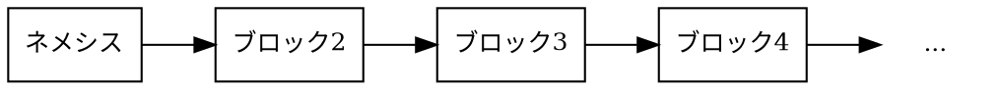

# ブロック

ブロック
:   特定の時点で承認された [トランザクション](default:トランザクション) の集合を記録します。

ブロックにはトランザクションに加えて、タイムスタンプ、ブロック高、各ブロックを前のブロックにリンクする _前ブロックハッシュ_ などのメタデータが含まれます。
このリンクがチェーンを _ブロックチェーン_ にします。どのブロックでも改ざんすると、それ以降のすべてのブロックが無効になります。

NEM ネットワークは平均して60秒ごとに新しいブロックを1つ生成します。

## ネメシスブロック {: #the-nemesis-block }

ネメシスブロック
:   NEM ブロックチェーンの最初のブロックです。
    ネットワークのコンセンサスによって作成される他のすべてのブロックと異なり、ネットワークの作成者が手動で生成します。

ネメシスブロックはブロックチェーンの初期状態を定義します。
これには、[XEM](default:XEM) などのモザイクの特定アカウントへの初期配布、ネームスペースの作成、ネットワークの基盤となるその他の構成パラメーターが含まれます。

チェーンの根本であるため、ネメシスブロックには前ブロックハッシュがありません。
他のすべてのブロックは、直接または間接的にネメシスブロックへリンクします。

このブロックは、他のブロックチェーンプロトコルでは一般に _ジェネシスブロック_ と呼ばれます。

後続のすべてのブロックは、他のブロックチェーンにおけるマイニングに相当する NEM の [ハーベスティング](default:ハーベスティング) と呼ばれるプロセスで作成されます。
ハーベスターはトランザクションを検証し、ブロックにまとめてチェーンに追加し、報酬としてトランザクション手数料を受け取ります。

## ネットワーク時刻 {: #network-time }

ネットワーク時刻
:   NEM が最初のブロック（[ネメシスブロック](default:ネメシスブロック)）の作成から経過した秒数として定義する時刻です。

    すべてのタイムスタンプはこの起点を基準に計算されます。

UTC タイムスタンプは、ネットワーク時刻をネメシスブロックの UNIX タイムスタンプに加えることで得られます。
[メインネット](default:メインネット) では `1427587585`（`2015-03-29T00:06:25Z`）です。
他のネットワークでは、ネットワークプロパティから取得できます。

## ブロック構造 {: #block-structure }

NEM ブロックチェーンの各ブロックには、メタデータとトランザクションデータの組み合わせが含まれます。

| **フィールド** | **説明** |
|-------------------------|------------------------------------------------------------------------------------------------------------------------------------------------------------------------------------------------------------------------------------------|
| **高さ** | [ネメシスブロック](default:ネメシスブロック) の `1` から始まる、チェーン内でのブロックの位置です。新しいブロックの高さは前のブロックより1つ大きくなります。 |
| **タイムスタンプ** | ネメシスブロックから経過した秒数です。各ブロックで厳密に増加します。ブロック間の平均時間は60秒に近く保たれます。 |
| **タイプ** | ネメシスブロックは `-1`、通常のブロックは `1` です。 |
| **バージョン** | ブロック形式のバージョンとネットワークをエンコードします（メインネットでは `1744830465`、テストネットでは `-1744830463`）。 |
| **前ブロックハッシュ** | 前のブロックの [ハッシュ](default:ハッシュ) です。内容が改ざんされるとこのハッシュが変わり、チェーンが破壊されて後続のすべてのブロックが無効になります。 |
| **署名** | ハーベスターがブロックの内容に対して生成する暗号学的署名です。すべてのノードがブロックの完全性を検証するために使用します。 |
| **署名者** | ブロックに署名するアカウントです。 _ハーベスター_ とも呼ばれます。トランザクション手数料はそのアカウントに入金されますが、リモートアカウントによる [リモートハーベスティング](default:リモートハーベスティング) または [委任ハーベスティング](default:委任ハーベスティング) で署名された場合はメインアカウントに入金されます。 |
| **トランザクション** | ブロックに含まれる有効なトランザクションの一覧です。各トランザクションはブロックに受け入れられる前に個別に検証されます。 |

## 派生フィールド {: #derived-fields }

上記のフィールドに加え、各ノードは各ブロックについて次の値を保持します。
これらはブロックペイロードの一部ではなく、各ノードが以前のブロックから計算します。

| **フィールド** | **説明** |
|---------------------|--------------------------------------------------------------------------------------------------------------------------------------------------------------------------------------------------------|
| **生成ハッシュ** | ブロックからブロックへ引き継がれるハッシュです。次のブロックをハーベストする資格を持つアカウントの判定に使用します。前のブロックの生成ハッシュとハーベスターの公開鍵から計算されます。 |
| **難易度** | 次のブロックをハーベストする難しさを表すネットワーク全体の指標です。平均ブロック時間を60秒に近づけるため、最近のブロック履歴から動的に調整されます。 |
| **レンタル元** | リモートアカウントによる [リモートハーベスティング](default:リモートハーベスティング) または [委任ハーベスティング](default:委任ハーベスティング) でブロックが署名された場合、インポータンスの裏付けとなり報酬を受け取るメインアカウントです。チェーンの前の部分に記録されたリモートアカウントの委任状態から解決されます。 |

## ブロックスコア {: #block-score }

コンセンサスプロセスを支援するため、各ブロックについて次の量が計算されます。

ブロックスコア
:   [ハーベスティング](default:ハーベスティング) の難しさを反映する、各ブロックに割り当てられた数値です。

$$
\textit{block score} = difficulty − \textit{time elapsed since last block}
$$

チェーンスコア
:   チェーン内のすべての [ブロックスコア](default:ブロックスコア) の合計です。競合する [フォーク](default:フォーク) の選択に使用します。
    スコアの高いチェーンが勝ちます。
