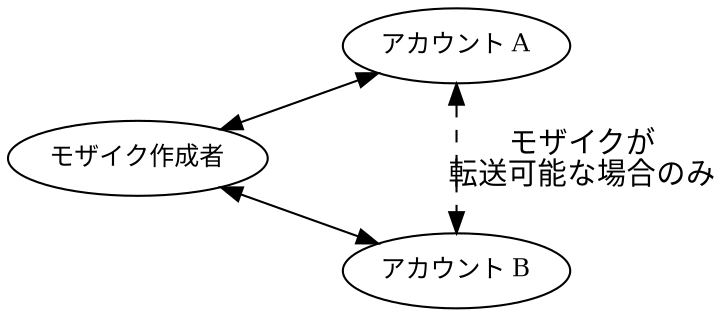

# モザイク

モザイク
:   NEM ブロックチェーン上の資産を表すもので、他のプロトコルでは一般にトークンと呼ばれます。
    例として、通貨、ライセンス、コレクション、アクセス権、投票権があります。

他のプラットフォームのスマートコントラクトベースのトークンとは異なり、NEM のモザイクはプロトコルレベルで直接サポートされ、追加のコーディングなしで使用できます。

各モザイクは新しい種類の資産を定義し、その種類に属する個々のトークンは _モザイク単位_ と呼ばれます。
モザイクは、各単位を交換できるコインのような代替可能資産や、絵画や [NFT](default:NFT) のような各単位が唯一無二である非代替性資産を表せます。

モザイクは登録済みの [ネームスペース](default:ネームスペース) の下に存在し、[完全修飾名](#fully-qualified-name) で識別され、親ネームスペースのレンタルから期間を継承します（[ライフタイム](#lifetime) を参照）。

## 名前 {: #name }

名前はネームスペース内でモザイクを識別するもので、その中で一意である必要があります。
次の形式規則に従います。

* 小文字、数字、ハイフン `-`、アンダースコア `_`、アポストロフィ `'` だけを含められます。
* 英字または数字で始める必要があります。
* 最大 **32文字** です。

一度登録したモザイク名は変更できません。

## 完全修飾名 {: #fully-qualified-name }

モザイクの **完全修飾名**（**モザイク ID** とも呼ばれます）は、ネットワーク上の一意の識別子です。
ネームスペースとローカルモザイク名をコロンで結合し、`<namespace>:<mosaic name>` の形式にします。

| 部分 | 定義 | 長さ制限 |
| --------------- | ---------------------------------------------------------------------------------- | ----------------------------------------------------------- |
| **ネームスペース** | `:` の前にある、ドットで区切られた1つのルートネームスペースと最大2つのサブネームスペース | 16文字（ルート）および64文字（各サブネームスペース） |
| **モザイク名** | `:` の後にあるローカル名。 | 32文字 |

!!! note "コロンは区切り文字にすぎません"

    コロンはネームスペースとモザイク名を区切るものであり、どちらの名前にも含まれません。
    アプリケーションによっては、代わりに `.` または `!` と表示されます。

例：

* `nem:xem`：ネットワーク固有の通貨。
* `mycompany.tokens:goldcoin`：架空の企業トークン。

## 説明 {: #description }

各モザイクには、資産の目的、由来、利用条件などを記録する最大 **512文字** の自由記述フィールド **説明** を設定できます。

## プロパティ {: #properties }

モザイクには、転送方法と供給量の変化を制御する動作プロパティがあります。

### 可分性 {: #divisibility }

可分性
:   モザイク数量に設定できる小数点以下の桁数を定義します。
    可分性 `0` のモザイクは不可分で、整数単位でのみ転送できます。
    より大きい値では小数単位を使用できます。

たとえば可分性が `2` の場合、1 _全体単位_ を100 _小数単位_（10^2^）に分けられ、`0.01` 刻みでモザイクを扱えます。

小数単位は _原子単位_ とも呼ばれます。この例では、1全体単位は100原子単位で構成されます。

他の多くのプロトコルでは、この値は固定されています。たとえば Bitcoin は小数点以下8桁、Ethereum は18桁を使用します。
NEM では、資産の用途に応じて各モザイクが独自の可分性を定義できます。

NEM で許可される可分性の最大値は `6` です。

### 初期供給量 {: #initial-supply }

発行時に作成されるモザイク単位の総数を定義します。

可分性に関係なく、モザイクの総供給量は **9 × 10^15^** 原子単位を超えられません。

[供給量の可変性](#supply-mutability) を有効にしない限り、供給量は固定されます。

### 供給量の可変性 {: #supply-mutability }

作成後にモザイクの総供給量を増減できるかどうかを示します。
目的の資産ライフサイクルに応じて、モザイク単位を動的に発行または削除できます。

総供給量を変更できるのは、モザイクを作成したアカウントだけです。
変更が影響するのは作成者の残高だけです。

* _ミント_（供給量の増加）では、新しい単位が作成され、作成者のアカウントに追加されます。
* _バーン_（供給量の減少）では、作成者のアカウントから既存の単位が削除されます。
    アカウントの残高が不足している場合、操作は失敗します。

### 転送可能性 {: #transferability }

モザイクをアカウント間で自由に転送できるかどうかを指定します。
無効にすると、すべての転送で作成者のアカウントが送信者または受信者のいずれかになる必要があります。

## 徴収手数料（levy） {: #levy }

徴収手数料（levy）
:   モザイクに付加できる任意の手数料です。そのモザイクを転送するたびに、トランザクション手数料に加えて指定アカウントへ支払われます。

徴収手数料は、たとえば転送ごとに手数料やロイヤリティを課して、資産を管理するアカウントに資金を提供するために使われます。

徴収手数料には次の4つのフィールドがあります。

| フィールド | 説明 |
| ------------- | ----------------------------------------------------------------------------------------- |
| **タイプ** | **Absolute**（固定数量）または **Percentile**（転送量に比例）。 |
| **受取人** | すべての転送で徴収手数料を受け取るアカウント。 |
| **モザイク ID** | 徴収手数料が支払われるモザイク。転送対象のモザイクとは異なる場合があります。 |
| **手数料** | すべての転送で課金される徴収手数料用モザイクの数量です。<ul><li>Absolute 徴収手数料では、原子単位で表す正確な数量です。</li><li>Percentile 徴収手数料では、[ベーシスポイント](https://en.wikipedia.org/wiki/Basis_point)（10'000ベーシスポイント = 100%）で表す転送量に対する割合です。</li></ul> |

### 徴収手数料の請求方法 {: #how-levies-are-charged }

徴収手数料付きのモザイクを転送トランザクションに含めると、ネットワークは通常のトランザクション手数料に加えて、送信者から徴収手数料を自動的に徴収し、徴収手数料の受取人に入金します。

徴収手数料は転送量に上乗せされます。受取人は送信された数量全体を受け取り、送信者は転送量と徴収手数料（およびトランザクション手数料）の両方を引き落とされます。

#### 絶対徴収手数料の計算 {: #absolute-levy-calculation }

絶対徴収手数料では、手数料は転送ごとに課金される正確な数量であり、徴収手数料用モザイクの原子単位で表します。

たとえば、転送対象のモザイク自体で原子単位 `10` の絶対徴収手数料を支払う場合、原子単位 `1'000` を送ると送信者から合計 `1'010` が引き落とされます。
受取人には `1'000` が、徴収手数料の受取人には `10` が入金されます。

#### パーセンタイル徴収手数料の計算 {: #percentile-levy-calculation }

パーセンタイル徴収手数料では、手数料をベーシスポイントで解釈します。1ベーシスポイントは1%の100分の1です。
たとえば手数料 `100` は1%、手数料 `10'000` は100%を課金します。

徴収手数料は、転送量の **原子単位** から計算します。

$$
\text{levy} = \left\lfloor \frac{\text{fee} \cdot \text{transferred amount}}{\text{10'000}} \right\rfloor
$$

結果は、徴収手数料用モザイクで課金される原子単位の数量です。
切り捨て後に0になる徴収手数料は課金されません。

!!! note "両方のモザイクの可分性が課金額に影響します"

    パーセンタイル徴収手数料では、ネットワークは割合を適用する前に、転送対象モザイクと徴収手数料用モザイクの間で変換を行いません。
    転送量の原子単位の数から徴収手数料を計算し、その結果を徴収手数料用モザイクの原子単位の数量として扱います。

    そのため、設定した割合が正確になるのは原子単位のレベルだけです。
    2つのモザイクの [可分性](default:可分性) が異なる場合、全体単位で表示される課金額は、表示された送信量に同じ割合を適用した場合よりはるかに大きく見えたり、小さく見えたりします。

    たとえば、可分性が2のモザイクで、1%の徴収手数料を可分性6の `nem:xem` で支払う場合を考えます。

    * 全体単位50を送ると、最初のモザイクの原子単位 `5'000` が転送されます。
    * 1%の徴収手数料は `5'000` の1%として計算されるため、結果は `50` です。
    * その結果は `nem:xem` の原子単位 `50` として課金されます。
    * `nem:xem` の可分性は6なので、原子単位 `50` はわずか 0.00005 XEM であり、50 XEM の1%を大きく下回ります。

### 転送要件 {: #transfer-requirements }

送信者は、転送対象モザイクの転送量を賄う残高に加え、徴収手数料用モザイクで徴収手数料を賄う残高も持つ必要があります。徴収手数料用モザイクは、転送対象モザイクと異なる場合があります。

転送時点で、徴収手数料用モザイクがネットワーク上に存在している必要もあります。
たとえばネームスペースが失効して更新されず、その結果、徴収手数料用モザイクが [失われた](#lifetime) 場合、その徴収手数料付きモザイクの転送は拒否されます。

### 制限事項 {: #limitations }

徴収手数料は再帰的ではありません。
徴収手数料の支払いに使うモザイクが独自の徴収手数料を持っていても、2つ目の徴収手数料は適用されません。

!!! warning "徴収手数料は確実な課金ではありません"

    徴収手数料は再帰的ではないため、回避できます。

    たとえば、モザイク `A` の徴収手数料がモザイク `B` で支払われ、別のモザイク `C` の徴収手数料が `A` で支払われる場合、`C` を転送すると `C` の徴収手数料として `A` が移動しますが、`A` の徴収手数料は発生しません。

    したがって徴収手数料は、すべての転送に対して強制できる保証ではなく、最善努力の手数料です。

## ライフタイム {: #lifetime }

モザイク自体には期間がありません。
そのライフタイムは親ネームスペースのライフタイムに結び付いています。

* ネームスペースがアクティブな間は、モザイクを転送でき、供給量を変更できます（[プロパティ](#properties) の制限を受けます）。
* ネームスペースが失効するとモザイクは非アクティブになり、転送と供給量の変更は拒否されますが、既存の残高は保持されます。
* 元の所有者が [猶予期間](./namespaces.md#duration) 中にネームスペースを更新すると、モザイクとその残高を再び使用できます。

!!! warning "猶予期間を過ぎたモザイクの喪失は永続的です"
    猶予期間の後、モザイクは永久に失われます。
    モザイクを保有するアカウントは残高にアクセスできなくなり、モザイクを転送できません。

    後から同じ名前でモザイクを登録しても、元の資産の復元ではなく新しい資産が作成されます。

[ネームスペースの期間](./namespaces.md#duration) で、ネームスペースのレンタルライフサイクルを説明しています。

## 作成手数料 {: #creation-fee }

新しいモザイクの登録には、一度だけ支払う **10 XEM** の _作成手数料_ が必要です。

手数料は作成時に支払う必要があり、返金されません。
モザイク作成手数料を集めるネットワークアカウントである _シンクアカウント_ に送られます。
[メインネット](default:メインネット) のブロック3,481,580以降、ネットワークはシンクアカウントからのトランザクションを拒否します。
その結果、集められた手数料は実質的にバーンされます。

!!! note "トランザクション手数料と作成手数料"
    モザイクの作成にはトランザクションのアナウンスが必要で、関連する手数料もかかります。
    ただし、このトランザクション手数料は通常、作成手数料と比べてわずかです。

## モザイクの変更 {: #modifying-a-mosaic }

作成後、元の作成者はモザイクの **定義** の一部を変更できます。

各フィールドには固有のルールがあります。

* **説明**：いつでも変更できます。
* **転送可能性** と **名前**：一度設定すると変更できません。
* **可分性**、**初期供給量**、**供給量の可変性**、**徴収手数料**：作成者がモザイクの全供給量を保有している間だけ変更できます。

[供給量の可変性](#supply-mutability) が有効なら、総供給量を変更（ミントまたはバーン）できます。
