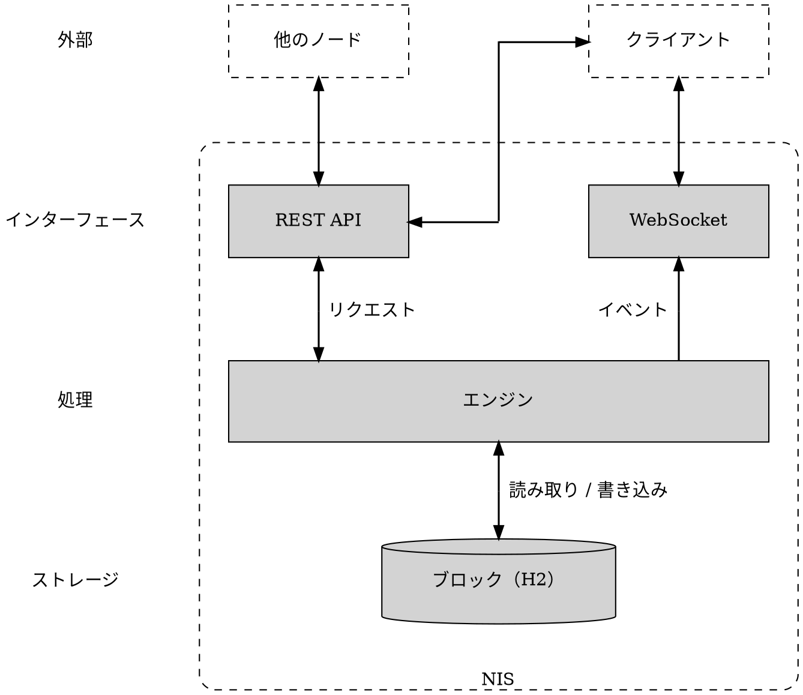
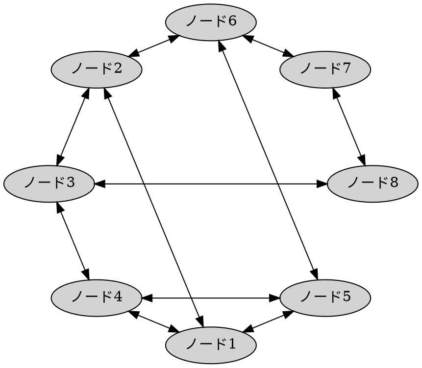

# ノード

ノード
:   NEM ソフトウェアを実行し、ピアノードと情報を共有し、受信した [トランザクション](default:トランザクション) を検証し、[コンセンサス](default:コンセンサス) とブロック作成に参加するコンピューターです。

ノードはブロックチェーンの中核を成し、十分な数のノードがアクティブである限りネットワークが機能し続けるようにします。

誰でも NEM ノードを実行できます。
オペレーターは、自分のアカウントでブロックを [ハーベスト](default:ハーベスティング) したり、他の人の [委任ハーベスティング](default:委任ハーベスティング) をホストしたり、[スーパーノードプログラム](default:スーパーノードプログラム) の資格を得たりするために実行します。

## ノード構造 {: #node-structure }

すべての NEM ノードは、_NIS_ と呼ばれる同じアプリケーションを実行します。

NIS
:   NEM Infrastructure Server です。
    ノードのすべての機能を実装する単一の Java プロセスです。

NIS は、[エンジン](#engine)、[REST API](#rest-api)、[WebSocket](#websocket) サービス、組み込み [データベース](#database) の4つのパーツで構成されています。
エンジンは REST API と WebSocket サービスを通じて公開される中核で、データベースはブロックチェーンを保存します。

NIS は他のノードやクライアントとデータを交換します。

* _他のノード_ はネットワーク上の NIS ピアです。
* _クライアント_ はウォレット、エクスプローラー、アプリケーションなどの外部プログラムです。

### エンジン {: #engine }

エンジンはブロックチェーンの処理を行います。受信データを検証し、[コンセンサス](default:コンセンサス) と [ハーベスティング](default:ハーベスティング) を実行し、[ピアツーピア通信](#peer-to-peer-communication) を処理し、[未承認トランザクションプール](default:未承認トランザクションプール) を維持します。

エンジンは内部コンポーネントであり、直接は公開されません。
ピアまたはクライアントからのすべての受信リクエストは、下記の REST API を通り、エンジンへ渡されます。

### REST API {: #rest-api }

ピアとクライアントは、単一の HTTP API を通じて NIS にアクセスします。

* _ピアリクエスト_ は、ブロック同期、トランザクション中継、ノード検出を処理します。
* _クライアントリクエスト_ は、ブロックチェーンデータの読み取りと [トランザクション](default:トランザクション) の送信を処理します。

API は、JSON とバイナリの2つのエンコードをサポートします。リクエストのコンテンツタイプで選択できます。
ピアはバイナリでデータを交換し、クライアントは通常 JSON を使います。

### WebSocket {: #websocket }

NIS は組み込みの [WebSocket](https://developer.mozilla.org/en-US/docs/Web/API/WebSockets_API) サービスを通じて、ブロックとトランザクションのイベントを公開します。
購読したクライアントはポーリングせずにリアルタイムで通知を受け取ります。

### データベース {: #database }

NIS は [H2](https://www.h2database.com) リレーショナルデータベースにブロックチェーンを保存します。_組み込み_ とは、別のデータベースサーバーではなく NIS プロセス内で実行されるという意味です。

データベースが保持するのはチェーンの全てのブロックとその中に含まれるトランザクションのみです。
アカウント残高や [インポータンス](default:インポータンス) スコアなど、現在のブロックチェーン状態は保存しません。
NIS はその状態をメモリに保持し、起動時に [ネメシスブロック](default:ネメシスブロック) からチェーンを再生して再構築します。そのため、ノードは起動後しばらく利用できません。

## ピアツーピア通信 {: #peer-to-peer-communication }

NEM ノードは分散型のピアツーピア方式で相互に直接通信します。
中央のコーディネーターはなく、各ノードが他のノードの一部と接続を確立して分散ネットワークを形成します。

ノードは既知のピア一覧を共有するため、新しく接続したノードは他のノードを素早く検出してネットワークに統合できます。
このプロセスは強固な接続性を確保し、個々のノードがオフラインになってもネットワークの回復力を保ちます。

ブートストラップを容易にするため、_事前信頼済み_ ピアの初期一覧が [NIS](default:NIS) に組み込まれています。
これにより、新しいノードは最初の接続を行い、他のノードの検出を始められます。

### ノードの評判 {: #node-reputation }

NEM のような分散型ネットワークでは、ノードはどのピアを信頼し接続を維持するかを決める必要があります。
静的なホワイトリストや手動で管理した接続に頼る代わりに、NEM ノードは _評判_ システムを使い、時間経過に伴う観測動作に基づいてピアを動的に評価し順位付けします。

各ノードは、通信の成功、応答時間、受信データの有効性などの指標を使って、独立して評判を計算します。
正しく動作し一貫して応答するノードには高いスコアが与えられます。
無効なデータを送る、応答しない、その他の不正動作をするノードは、ペナルティまたは一時的なブラックリスト登録の対象になります。

新しい接続を確立する必要がある場合、ノードは利用可能なピアから、過去のやり取りに基づく評判の高いピアを優先して選択します。

組み込みの事前信頼済みピアはこの選択で重く評価されるため、他のピアより頻繁に選ばれ、ネットワークの信頼できる基点として機能します。
ただし、その動作は他のピアと同じように評価されるため、不正動作をする事前信頼済みピアは評判を失います。

評判スコアはローカルです。
各ノードは直接的な経験だけからネットワークの独自の評価を作り、その評価をメモリだけに保持します。
再起動後、ノードは獲得した評判を保持せず、新たな相互作用から再構築します。

実装は [EigenTrust++](https://en.wikipedia.org/wiki/EigenTrust) アルゴリズムに基づきます。

### ノードのローテーション {: #node-rotation }

孤立したノードグループや停滞したノードグループの形成を防ぐため、ノードは常に同じピアと通信するわけではありません。
通信するピアを選ぶたびに、評判で重み付けしたランダムな抽出を行います。
スコアの高いピアほど選ばれやすくなりますが、選択は確率的なままです。

このランダム性により、ノードは異なるピアを循環し、ネットワークの分断を避け、長期的な分散化を促進します。

## スーパーノード {: #supernodes }

スーパーノードは _スーパーノードプログラム_ に登録されたノードです。

スーパーノードプログラム
:   信頼できる公開ノードに報酬を与える、チェーン外のコミュニティ資金によるプログラムです。

NEM にはブロック報酬もインフレーションもありません。
ノードへの報酬はトランザクション手数料からのみ支払われ、取引量が少ない時期にはその金額が少なくなってしまうことがあります。
スーパーノードプログラムは、信頼性が証明されたノードに毎日の報酬を支払うことでこれを補います。

!!! warning "スーパーノードの報酬は保証されません"
    報酬額はいつでも減額または廃止される可能性があります。

プログラムは完全にチェーン外で実行され、NIS 自体は関与しません。_コントローラー_ と呼ばれる別の中央運営サービスが参加ノードをテストし、報酬を支払います。

ノードは、最低限の [XEM](default:XEM) 残高を保有し、同期済みで最新状態にあり、他のピアから到達可能であることを確認する自動チェックに合格すると、その日の報酬資格を得ます。
これらのチェックは、オンラインであるだけでなく、ネットワークの信頼性を高めるノードに報酬を与えることを目的としています。

登録は任意です。
運用の詳細については、 [スーパーノードプログラムガイド](../userbook/node/supernode-program.md) を参照してください。
