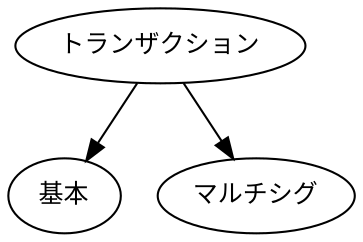
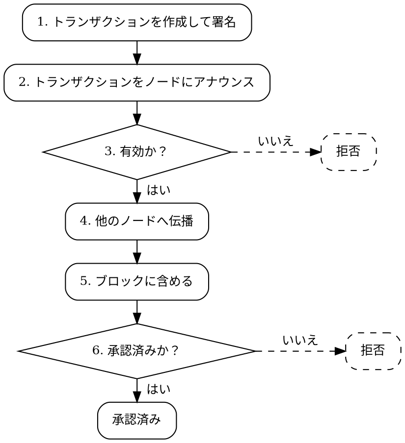

# トランザクション

トランザクション
:   トランザクションは、ある [アカウント](default:アカウント) から別のアカウントへの資金移動や、新しいモザイクの登録など、NEM ブロックチェーン上で実行する操作を表します。

これらの操作は署名済みメッセージで表現され、ネットワークにアナウンスされます。
ネットワーク内の [ノード](default:ノード) はそれを検証し、受け入れた場合はトランザクションをブロックに含め、ブロックチェーンの状態を更新します。

## 基本的なトランザクションの種類 {: #fundamental-transaction-types }

NEM は、基本トランザクションとマルチシグトランザクションという2つの中核的なトランザクション種類をサポートします。



### 基本トランザクション {: #basic-transactions }

基本トランザクション
:   基本 [トランザクション](default:トランザクション) は、単一のアカウントが開始する単一の操作を表し、そのアカウントの [署名](default:署名) だけを必要とします。

アカウントからの資金移動や新しい [ネームスペース](default:ネームスペース) の登録などが例です。

### マルチシグトランザクション {: #multisig-transactions }

マルチシグトランザクション
:   マルチシグトランザクションは、[マルチシグアカウント](default:マルチシグアカウント) に代わって発行された単一の [内部トランザクション](default:内部トランザクション) を包み、ブロックに含める前に設定された人数の連署人の署名を必要とします。

マルチシグトランザクションは1人の連署人が開始しますが、有効にするには他の連署人から追加の署名が必要です。

連署
:   トランザクションが複数アカウントの署名を必要とする場合、その追加署名を _連署_ と呼びます。

NEM では、各連署は _マルチシグ連署_ トランザクションとして個別に送られ、ハッシュによって [内部トランザクション](default:内部トランザクション) を参照します。
これにより、連署人は独立して異なるタイミングで署名できます。
そのため、複数の連携した操作は別々のマルチシグトランザクションとして、内部トランザクションごとに1つずつ発行する必要があります。

これらの連署は [未承認トランザクションプール](default:未承認トランザクションプール) 内の保留中のマルチシグトランザクションに蓄積され、必要なしきい値を満たすだけの連署を集めた後にだけブロックに取り込まれることができます。
マルチシグトランザクションと連署は、単一の単位としてアトミックにまとめて承認されます。

マルチシグトランザクションがブロックに含まれると、マルチシグアカウントがトランザクションに関係するすべての手数料を支払います。内部トランザクションの手数料、マルチシグトランザクションの手数料、各連署の手数料です。
連署人は連署時に自分の残高を使いません。

!!! tip "マルチシグトランザクションの例"

    金庫アカウント `T` は、連署人 `C1`、`C2`、`C3` が管理する 2-of-3 マルチシグです。
    供給業者 `S` に支払うため、`C1` は `T` から `S` への転送を包むマルチシグトランザクションをアナウンスします。
    `C2` が連署を送信すると、2-of-3 のしきい値を満たします。
    `C3` は署名する必要がありません。
    しきい値に達すると転送が実行され、`S` が資金を受け取ります。

    ```dot
    digraph {
        rankdir="LR";
        fontsize=12;
        compound=true;
        node [fontsize=12];

        C1 [label="C1"];
        C2 [label="C2"];
        C3 [label="C3"];

        subgraph clusterMultisig {
            label = "マルチシグトランザクション";
            fontsize = 12;
            style = dashed;
            T [label="T\nマルチシグアカウント\n2 of 3"];
            S [label="S"];
            T -> S [label="転送"];
        }

        C1 -> T [label="署名" lhead=clusterMultisig minlen=2 labelfloat=true];
        C2 -> T [label="連署" lhead=clusterMultisig minlen=2 labelfloat=true];
        C3 -> T [style=dashed lhead=clusterMultisig minlen=2];
    }
    ```

### 内部トランザクション {: #inner-transactions }

内部トランザクション
:   [マルチシグトランザクション](default:マルチシグトランザクション) に包まれた [基本トランザクション](default:基本トランザクション) を _内部トランザクション_ と呼びます。

内部トランザクションは、次の違いを除いて基本トランザクションと同じように動作します。

* 個別には署名されません。
    マルチシグトランザクションには開始した連署人が署名し、追加の連署人は別のマルチシグ連署トランザクションを通じて承認します。

* それ自体をマルチシグトランザクションにすることはできません。
    マルチシグ階層は1層だけです。

* 独自の手数料と期限フィールドを保持します。
    内部トランザクションの手数料は、マルチシグトランザクションの手数料および各連署の手数料とともにマルチシグアカウントに請求されます。

## トランザクションのライフサイクル {: #transaction-lifecycle }

NEM の各トランザクションは、クライアントによる作成からネットワークによる承認まで、6つの段階を進みます。



### 1. 作成と署名 {: #1-creation-and-signature }

通常はアプリであるソフトウェアクライアントがトランザクションを作成し、すべてのパラメーターを入力します。
たとえば、転送トランザクションには送信元 [アカウント](default:アカウント)、宛先アカウント、金額が必要です。

この段階でトランザクションへの署名も行います。
アカウントの [秘密鍵](default:秘密鍵) の保有者だけが有効な署名を生成できるため、署名は署名アカウントがトランザクションを承認したことを証明します。

マルチシグトランザクションでは、開始する連署人が内部トランザクションを包むマルチシグトランザクションに署名します。
他の連署人は、マルチシグ連署トランザクションを通じて別々に連署を提供します。

### 2. アナウンス {: #2-announcement }

クライアントアプリケーションは、ネットワーク上で接続された [ノード](default:ノード) にトランザクションを送信します。

マルチシグトランザクションの場合、連署は別のマルチシグ連署トランザクションとしてアナウンスされ、それぞれの署名者が独立して送信します。

### 3. 検証 {: #3-validation }

ノードはトランザクションの形式が正しく、有効な署名を含むことを確認します。
マルチシグトランザクションでは、参照された連署がマルチシグアカウントの有効な連署人によるものかどうかも検証します。

一部のトランザクション種類には追加の意味検証が必要です。
たとえば転送トランザクションでは、送信元アカウントに十分な資金があることを確認します。

どれかの確認に失敗すると、トランザクションは拒否され、それ以上伝播されません。
すべての確認に合格すると、処理が続きます。

### 4. 伝播 {: #4-propagation }

ノードがトランザクションを有効と判断すると、ネットワーク内の他のピア [ノード](default:ノード) にブロードキャストし、各ノードの _未承認トランザクションプール_ に追加します。

未承認トランザクションプール
:   ブロックに含まれるのを待つ検証済みトランザクションの一覧で、ネットワーク内の各ノードが保持します。

伝播されたトランザクションをピアが受信すると、他のノードの検証を信頼しないため、自分のプールに追加する前に完全な検証を再実行します。
トランザクションが検証に合格すれば、ピアは自分のピアへ転送し、伝播がネットワーク全体に広がるまで続きます。

!!! warning "未承認トランザクションを信頼しないでください"

    未承認トランザクションプール内のトランザクションは、まだブロックに含まれる保証がありません。
    [承認済み](#6-confirmation) になり、理想的には [書き換え制限](default:書き換え制限) を超えるまで、最終状態として扱わないでください。

マルチシグトランザクションの場合、マルチシグトランザクションと付随するマルチシグ連署トランザクションは独立して伝播します。

### 5. ハーベスティング {: #5-harvesting }

未承認トランザクションプールに入ったトランザクションは、[ハーベスティング](default:ハーベスティング) プロセスによってブロックに含められますが、含まれることは保証されません。
期限が切れるか、競合するトランザクションが先に承認されると、トランザクションは破棄されます。

マルチシグトランザクションの場合、ハーベスターは、マルチシグアカウントの署名しきい値を満たす数の連署が集まるまで、トランザクションをブロックに含めません。
先に期限が切れると、マルチシグトランザクションと蓄積された連署はプールから破棄されます。

### 6. 承認 {: #6-confirmation }

新しく作成されたブロックは他のノードに伝播され、検証後に受け入れまたは拒否されます。
[コンセンサス](default:コンセンサス) メカニズムにより、ネットワーク上のすべてのノードが最終的に同じブロックに合意します。
トランザクションを含むブロックがコンセンサスによって受け入れられると、そのトランザクションは _承認済み_ となります。

ノードがすでに受け入れたブロックが後にネットワークの大多数から拒否され、[ロールバック](default:ロールバック) されることがあります。
この場合、ブロックのトランザクションは元に戻され、未承認トランザクションプールに戻されます。

NEM は、ロールバックがどこまで遡れるかを [書き換え制限](default:書き換え制限) で制限します。

トランザクションが未承認トランザクションプールにある間に期限切れになると、プールから破棄されます。
たとえば、提示されたトランザクション手数料が低すぎて、どのハーベスターにも含められない場合に起こります。

## 共通トランザクション構造 {: #common-transaction-structure }

NEM のすべてのトランザクション種類には、次の共通属性があります。

| 属性 | 説明 |
| --------------------- | --------------------------------------------------------------------------------------------------------------------------------------------------------- |
| **署名者公開鍵** | トランザクションを作成して署名したアカウントの公開鍵。 |
| **署名** | 署名者がトランザクションとその内容を承認したことを示す暗号学的証明。 |
| **タイムスタンプ** | トランザクションが作成された時刻。[ネットワーク時刻](default:ネットワーク時刻) で表します。正確な作成時刻の記録というより、主に期限の起点として機能します。 |
| **期限** | 承認されなかった場合にトランザクションが失効することを示すタイムスタンプ。タイムスタンプから24時間以内です。 |
| **手数料** | トランザクションをブロックに含めるために署名者が支払う手数料。 |
| **タイプ** | トランザクションの種類。存在する追加属性を決定します。 |

## 検証の詳細 {: #validation-details }

トランザクションをブロックに含める前に、各ノードは次の確認を独立して行います。

| **確認** | **説明** |
| -------------------- | -------------------------------------------------------------------------------------------------------------------------------------------------- |
| **署名確認** | 署名が有効で、署名者の公開鍵とトランザクションの内容に一致することを確認します。 |
| **手数料確認** | 手数料がネットワークの最小値を満たし、署名者が支払うのに十分な XEM を持つことを確認します。 |
| **期限確認** | 期限がすでに過ぎている場合はトランザクションを破棄します。 |
| **タイムスタンプ確認** | クロック操作を防ぐため、タイムスタンプが未来に離れすぎたトランザクションを拒否します。 |
| **ネットワーク確認** | 異なるネットワークを対象とするトランザクションを拒否します。たとえば、メインネットに送られたテストネットトランザクションです。 |
| **一意性確認** | ハッシュが最近のチェーン履歴にすでに現れるトランザクションを拒否し、リプレイを防ぎます。 |
| **意味確認** | 種類に基づいてトランザクションが論理的に正しいことを検証します。例として、送信者の資金が不足している場合、転送トランザクションは失敗します。 |

これらの確認のいずれかに失敗したトランザクションは拒否され、それ以上伝播されません。

## サポートされるトランザクションの種類 {: #supported-transaction-types }

NEM は、特定の種類の操作に合わせた次のトランザクション種類をサポートします。
すべてのトランザクション種類は同じ [共通構造](#common-transaction-structure) を共有し、同じ処理と検証手順に従いますが、目的と必要なフィールドが異なります。

<div class="subsections" markdown>

| **トランザクションの種類** | **説明** |
| ------------------------------------------------------------------- | ------------------------------------------------------------------------------------------------------------- |
| **[転送トランザクション](default:転送トランザクション)** | |
| `Transfer` | 2つの [アカウント](default:アカウント) 間で XEM または [モザイク](default:モザイク) と任意のメッセージを送る。 |
| **[ハーベスティング](default:ハーベスティング)** | |
| `Account Key Link` | リモートアカウントをリンクして、委任ハーベスティングを有効化または無効化する。 |
| **[マルチシグ](default:マルチシグアカウント)** | |
| `Multisig Account Modification` | マルチシグアカウントを作成し、連署人を追加または削除し、必要な署名の最小数を変更する。 |
| `Multisig Cosignature` | 保留中のマルチシグトランザクションに連署を提供する。 |
| `Multisig` | マルチシグアカウントに代わって発行された内部トランザクションを包む。 |
| **[ネームスペース](default:ネームスペース)** | |
| `Namespace Registration` | ネームスペースを登録または更新する。 |
| **[モザイク](default:モザイク)** | |
| `Mosaic Definition` | 新しいモザイクを作成する。 |
| `Mosaic Supply Change` | モザイクの総供給量を変更する。 |

</div>

## トランザクション手数料 {: #transaction-fees }

すべてのトランザクションは、ブロックに含める [ハーベスターアカウント](default:ハーベスターアカウント) に報酬を与える手数料を支払います。

NEM の手数料は市場によって決まりません。
ネットワークが固定スケジュールを公開しているため、ノードに接続しなくてもトランザクションのコストを事前に計算できます。

### 手数料スケジュール {: #fee-schedule }

現在のスケジュールは次のとおりです。

| トランザクション | コスト | 注記 |
| --------------------------------- | --------------------- | --------------------------------------------------------------------------------------------------------------|
| `Transfer` | 0.05 XEM から | XEM 金額、付加モザイク、メッセージ長によって異なります。[手数料](./transfer_transactions.md#fees) を参照してください。 |
| `Account Key Link` | 0.15 XEM | |
| `Multisig Account Modification` | 0.5 XEM | マルチシグアカウントが支払います（通常のアカウントをマルチシグに変換する場合は、そのアカウントが支払います）。 |
| `Multisig Cosignature` | 0.15 XEM | 連署人ではなく、マルチシグアカウントが支払います。 |
| `Multisig`（ラッパー） | 0.15 XEM | 内部トランザクションの手数料に加えて、マルチシグアカウントが支払います。 |
| `Namespace Registration` | 0.15 XEM | ネットワークのシンクアドレスに支払う [レンタル手数料](./namespaces.md#lease-fee) が加算されます。 |
| `Mosaic Definition` | 0.15 XEM | ネットワークのシンクアドレスに支払う [作成手数料](./mosaics.md#creation-fee) が加算されます。 |
| `Mosaic Supply Change` | 0.15 XEM | |

### 下限と入札 {: #floor-and-bidding }

スケジュールの金額は最小値です。
手数料が最小値を下回るトランザクションは、検証者に拒否されます。

最小値を超える手数料は受け入れられ、含まれる可能性が高くなります。

* ハーベスターがブロックを作成するとき、手数料の高い順にトランザクションを選びます。
* ネットワークが混雑している間、ノードのスパムフィルターは署名者の [インポータンス](default:インポータンス) と小さな手数料ボーナスの組み合わせで保留中のトランザクションを順位付けします。そのため、手数料の高いトランザクションほど [未承認トランザクションプール](default:未承認トランザクションプール) に入りやすくなります。

`Multisig Cosignature` の手数料にはさらに 1'000 XEM の上限があります。これは、1人の連署人が極端な手数料を入札してマルチシグアカウントを枯渇させることを防ぎます。
